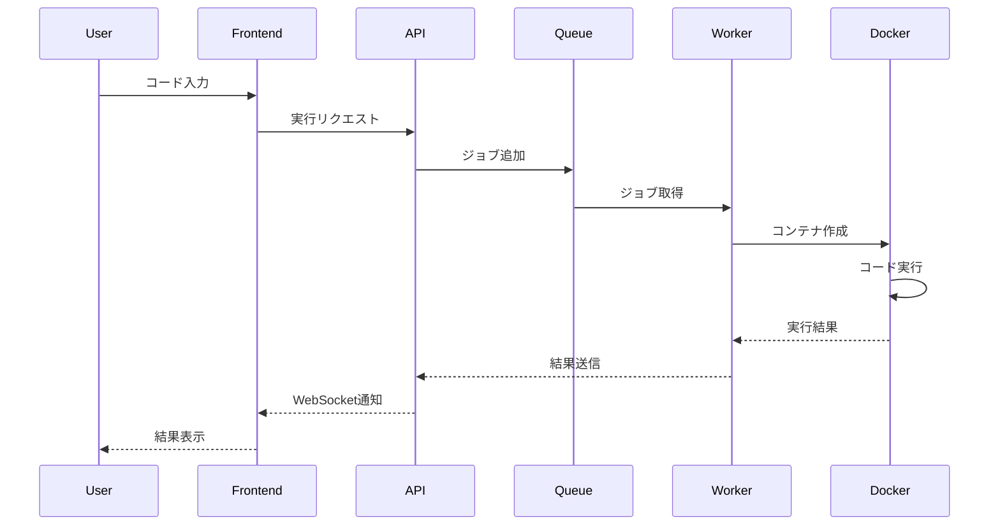

プログラミング学習において「書いたコードをすぐに実行できる」環境は非常に重要です。本記事では、Go言語の学習に特化したWebベースの学習プラットフォームの設計について詳しく解説します。

## プロジェクト概要

### ビジョン

「Go言語を段階的に、実践的に学べるインタラクティブな学習環境」を提供し、初心者から中級者まで効率的にGo言語をマスターできるプラットフォームを構築します。

### 主要機能

1. **ブラウザ上でのコード実行**: インストール不要でGo言語を実行
2. **段階的な学習パス**: 基礎から応用まで体系的なカリキュラム
3. **リアルタイムフィードバック**: コード実行結果の即座な表示
4. **進捗管理**: 学習の進行状況を可視化
5. **インタラクティブな課題**: 実践的な問題を解きながら学習

## 技術スタック

### フロントエンド

```yaml
UI Framework: Next.js 14 (App Router)
言語: TypeScript
スタイリング: Tailwind CSS + shadcn/ui
コードエディタ: Monaco Editor (VS Code エディタ)
状態管理: Zustand
認証: NextAuth.js
リアルタイム通信: WebSocket (Socket.io)
```

### バックエンド

```yaml
APIサーバー: Go (Echo or Gin framework)
コード実行環境: Docker + Kubernetes
サンドボックス: gVisor or Firecracker
キャッシュ: Redis
データベース: PostgreSQL
メッセージキュー: RabbitMQ or NATS
オブジェクトストレージ: MinIO or S3
```

### インフラストラクチャ

```yaml
コンテナオーケストレーション: Kubernetes
CI/CD: GitHub Actions + ArgoCD
モニタリング: Prometheus + Grafana
ログ管理: ELK Stack
CDN: CloudFlare
リバースプロキシ: Nginx or Traefik
```

## システムアーキテクチャ

### 全体構成図

```
┌──────────────────────────────────────────────────────┐
│                    CDN (CloudFlare)                   │
└────────────────────────┬─────────────────────────────┘
                         │
┌────────────────────────▼─────────────────────────────┐
│              Load Balancer (Nginx/Traefik)           │
└────────────────────────┬─────────────────────────────┘
                         │
        ┌────────────────┼────────────────┐
        │                │                │
┌───────▼──────┐ ┌──────▼──────┐ ┌──────▼──────┐
│  Frontend    │ │   API       │ │  WebSocket  │
│  (Next.js)   │ │  Server     │ │   Server    │
└──────────────┘ └──────┬──────┘ └──────────────┘
                        │
          ┌─────────────┼─────────────┐
          │             │             │
┌─────────▼────┐ ┌─────▼────┐ ┌─────▼─────┐
│  PostgreSQL  │ │  Redis   │ │ RabbitMQ  │
└──────────────┘ └──────────┘ └─────┬─────┘
                                     │
                              ┌──────▼──────┐
                              │  Execution  │
                              │   Workers   │
                              │  (Docker)   │
                              └─────────────┘
```

### コード実行フロー



## コア機能の実装

### 1. セキュアなコード実行環境

#### Docker設定 (Dockerfile.sandbox)

```dockerfile
FROM golang:1.21-alpine AS builder

# セキュリティ向上のための非rootユーザー作成
RUN adduser -D -g '' appuser

WORKDIR /app

# 実行環境の制限設定
RUN apk add --no-cache \
    ca-certificates \
    && rm -rf /var/cache/apk/*

FROM scratch

# 必要最小限のファイルのみコピー
COPY --from=builder /etc/passwd /etc/passwd
COPY --from=builder /etc/ssl/certs/ca-certificates.crt /etc/ssl/certs/

USER appuser

WORKDIR /sandbox

# リソース制限のデフォルト値
ENV GOMEMLIMIT=128MiB
ENV GOMAXPROCS=1

ENTRYPOINT ["/bin/sh"]
```

#### コード実行サービス (Go)

```go
package executor

import (
    "context"
    "fmt"
    "io"
    "os"
    "os/exec"
    "time"
    
    "github.com/docker/docker/api/types"
    "github.com/docker/docker/api/types/container"
    "github.com/docker/docker/client"
)

type ExecutionRequest struct {
    ID       string `json:"id"`
    Code     string `json:"code"`
    Language string `json:"language"`
    Timeout  int    `json:"timeout"`
}

type ExecutionResult struct {
    ID       string `json:"id"`
    Output   string `json:"output"`
    Error    string `json:"error"`
    ExitCode int    `json:"exit_code"`
    Duration int64  `json:"duration"`
}

type CodeExecutor struct {
    dockerClient *client.Client
    maxTimeout   time.Duration
}

func NewCodeExecutor() (*CodeExecutor, error) {
    cli, err := client.NewClientWithOpts(client.FromEnv)
    if err != nil {
        return nil, err
    }
    
    return &CodeExecutor{
        dockerClient: cli,
        maxTimeout:   30 * time.Second,
    }, nil
}

func (e *CodeExecutor) Execute(req ExecutionRequest) (*ExecutionResult, error) {
    ctx, cancel := context.WithTimeout(context.Background(), e.maxTimeout)
    defer cancel()
    
    startTime := time.Now()
    
    // コードを一時ファイルに保存
    tmpFile, err := os.CreateTemp("", "code-*.go")
    if err != nil {
        return nil, err
    }
    defer os.Remove(tmpFile.Name())
    
    if _, err := tmpFile.WriteString(req.Code); err != nil {
        return nil, err
    }
    tmpFile.Close()
    
    // Dockerコンテナの設定
    config := &container.Config{
        Image: "golang-sandbox:latest",
        Cmd:   []string{"go", "run", "/code/main.go"},
        Env: []string{
            "GOMEMLIMIT=128MiB",
            "GOMAXPROCS=1",
        },
        WorkingDir: "/code",
        
        // リソース制限
        Memory:     128 * 1024 * 1024, // 128MB
        MemorySwap: 128 * 1024 * 1024, // スワップ無効
        CpuShares:  512,                // CPU制限
    }
    
    hostConfig := &container.HostConfig{
        AutoRemove: true,
        
        // セキュリティ設定
        ReadonlyRootfs: true,
        SecurityOpt:    []string{"no-new-privileges"},
        CapDrop:        []string{"ALL"},
        NetworkMode:    "none", // ネットワーク無効
        
        // ファイルマウント
        Binds: []string{
            fmt.Sprintf("%s:/code/main.go:ro", tmpFile.Name()),
        },
    }
    
    // コンテナ作成と実行
    resp, err := e.dockerClient.ContainerCreate(
        ctx,
        config,
        hostConfig,
        nil,
        nil,
        "",
    )
    if err != nil {
        return nil, err
    }
    
    if err := e.dockerClient.ContainerStart(ctx, resp.ID, types.ContainerStartOptions{}); err != nil {
        return nil, err
    }
    
    // 実行結果の取得
    statusCh, errCh := e.dockerClient.ContainerWait(ctx, resp.ID, container.WaitConditionNotRunning)
    select {
    case err := <-errCh:
        if err != nil {
            return nil, err
        }
    case status := <-statusCh:
        // ログ取得
        logs, err := e.dockerClient.ContainerLogs(ctx, resp.ID, types.ContainerLogsOptions{
            ShowStdout: true,
            ShowStderr: true,
        })
        if err != nil {
            return nil, err
        }
        defer logs.Close()
        
        output, _ := io.ReadAll(logs)
        
        return &ExecutionResult{
            ID:       req.ID,
            Output:   string(output),
            ExitCode: int(status.StatusCode),
            Duration: time.Since(startTime).Milliseconds(),
        }, nil
    }
    
    return nil, fmt.Errorf("execution failed")
}
```

### 2. 学習コンテンツ管理システム

#### データベース設計

```sql
-- ユーザーテーブル
CREATE TABLE users (
    id UUID PRIMARY KEY DEFAULT gen_random_uuid(),
    email VARCHAR(255) UNIQUE NOT NULL,
    username VARCHAR(100) UNIQUE NOT NULL,
    password_hash VARCHAR(255) NOT NULL,
    created_at TIMESTAMP DEFAULT CURRENT_TIMESTAMP,
    updated_at TIMESTAMP DEFAULT CURRENT_TIMESTAMP
);

-- コーステーブル
CREATE TABLE courses (
    id UUID PRIMARY KEY DEFAULT gen_random_uuid(),
    title VARCHAR(255) NOT NULL,
    description TEXT,
    difficulty_level INTEGER CHECK (difficulty_level BETWEEN 1 AND 5),
    estimated_hours INTEGER,
    created_at TIMESTAMP DEFAULT CURRENT_TIMESTAMP
);

-- レッスンテーブル
CREATE TABLE lessons (
    id UUID PRIMARY KEY DEFAULT gen_random_uuid(),
    course_id UUID REFERENCES courses(id) ON DELETE CASCADE,
    title VARCHAR(255) NOT NULL,
    content TEXT NOT NULL,
    order_index INTEGER NOT NULL,
    lesson_type VARCHAR(50) CHECK (lesson_type IN ('tutorial', 'exercise', 'project')),
    created_at TIMESTAMP DEFAULT CURRENT_TIMESTAMP
);

-- 課題テーブル
CREATE TABLE challenges (
    id UUID PRIMARY KEY DEFAULT gen_random_uuid(),
    lesson_id UUID REFERENCES lessons(id) ON DELETE CASCADE,
    title VARCHAR(255) NOT NULL,
    description TEXT NOT NULL,
    starter_code TEXT,
    solution_code TEXT,
    test_cases JSONB,
    hints JSONB,
    difficulty_level INTEGER CHECK (difficulty_level BETWEEN 1 AND 5),
    created_at TIMESTAMP DEFAULT CURRENT_TIMESTAMP
);

-- 進捗管理テーブル
CREATE TABLE user_progress (
    id UUID PRIMARY KEY DEFAULT gen_random_uuid(),
    user_id UUID REFERENCES users(id) ON DELETE CASCADE,
    lesson_id UUID REFERENCES lessons(id) ON DELETE CASCADE,
    challenge_id UUID REFERENCES challenges(id) ON DELETE CASCADE,
    status VARCHAR(50) CHECK (status IN ('not_started', 'in_progress', 'completed')),
    score INTEGER,
    attempts INTEGER DEFAULT 0,
    completed_at TIMESTAMP,
    created_at TIMESTAMP DEFAULT CURRENT_TIMESTAMP,
    updated_at TIMESTAMP DEFAULT CURRENT_TIMESTAMP,
    UNIQUE(user_id, lesson_id, challenge_id)
);

-- 実行履歴テーブル
CREATE TABLE execution_history (
    id UUID PRIMARY KEY DEFAULT gen_random_uuid(),
    user_id UUID REFERENCES users(id) ON DELETE CASCADE,
    challenge_id UUID REFERENCES challenges(id) ON DELETE CASCADE,
    code TEXT NOT NULL,
    output TEXT,
    error TEXT,
    execution_time_ms INTEGER,
    success BOOLEAN,
    created_at TIMESTAMP DEFAULT CURRENT_TIMESTAMP
);

-- インデックス
CREATE INDEX idx_user_progress_user_id ON user_progress(user_id);
CREATE INDEX idx_user_progress_status ON user_progress(status);
CREATE INDEX idx_execution_history_user_id ON execution_history(user_id);
CREATE INDEX idx_execution_history_created_at ON execution_history(created_at);
```

### 3. フロントエンド実装

#### コードエディタコンポーネント (React/TypeScript)

```typescript
import React, { useState, useRef, useEffect } from 'react';
import Editor, { Monaco } from '@monaco-editor/react';
import { Button } from '@/components/ui/button';
import { Play, RotateCcw, Save } from 'lucide-react';

interface CodeEditorProps {
  initialCode?: string;
  challengeId: string;
  onExecute: (code: string) => Promise<ExecutionResult>;
  onSave?: (code: string) => void;
}

interface ExecutionResult {
  output: string;
  error?: string;
  executionTime: number;
  success: boolean;
}

export const CodeEditor: React.FC<CodeEditorProps> = ({
  initialCode = '',
  challengeId,
  onExecute,
  onSave,
}) => {
  const [code, setCode] = useState(initialCode);
  const [output, setOutput] = useState<string>('');
  const [isExecuting, setIsExecuting] = useState(false);
  const [executionTime, setExecutionTime] = useState<number>(0);
  const editorRef = useRef<any>(null);

  const defaultCode = `package main

import "fmt"

func main() {
    fmt.Println("Hello, Go!")
}`;

  useEffect(() => {
    // ローカルストレージから保存されたコードを読み込み
    const savedCode = localStorage.getItem(`challenge-${challengeId}`);
    if (savedCode) {
      setCode(savedCode);
    }
  }, [challengeId]);

  const handleEditorDidMount = (editor: any, monaco: Monaco) => {
    editorRef.current = editor;
    
    // Go言語のシンタックスハイライト設定
    monaco.languages.register({ id: 'go' });
    monaco.languages.setMonarchTokensProvider('go', {
      keywords: [
        'break', 'case', 'chan', 'const', 'continue', 'default',
        'defer', 'else', 'fallthrough', 'for', 'func', 'go',
        'goto', 'if', 'import', 'interface', 'map', 'package',
        'range', 'return', 'select', 'struct', 'switch', 'type', 'var',
      ],
      
      typeKeywords: [
        'bool', 'byte', 'complex64', 'complex128', 'error', 'float32',
        'float64', 'int', 'int8', 'int16', 'int32', 'int64', 'rune',
        'string', 'uint', 'uint8', 'uint16', 'uint32', 'uint64', 'uintptr',
      ],
      
      operators: [
        '=', '>', '<', '!', '~', '?', ':', '==', '<=', '>=', '!=',
        '&&', '||', '++', '--', '+', '-', '*', '/', '&', '|', '^',
        '%', '<<', '>>', '>>>', '+=', '-=', '*=', '/=', '&=', '|=',
        '^=', '%=', '<<=', '>>=', '>>>=',
      ],
      
      tokenizer: {
        root: [
          [/[a-z_$][\w$]*/, {
            cases: {
              '@typeKeywords': 'keyword',
              '@keywords': 'keyword',
              '@default': 'identifier',
            },
          }],
          [/[A-Z][\w$]*/, 'type.identifier'],
          { include: '@whitespace' },
          [/[{}()\[\]]/, '@brackets'],
          [/[<>](?!@symbols)/, '@brackets'],
          [/@symbols/, {
            cases: {
              '@operators': 'operator',
              '@default': '',
            },
          }],
          [/\d*\.\d+([eE][\-+]?\d+)?/, 'number.float'],
          [/0[xX][0-9a-fA-F]+/, 'number.hex'],
          [/\d+/, 'number'],
          [/[;,.]/, 'delimiter'],
          [/"([^"\\]|\\.)*$/, 'string.invalid'],
          [/"/, { token: 'string.quote', bracket: '@open', next: '@string' }],
          [/'[^\\']'/, 'string'],
          [/(')(@escapes)(')/, ['string', 'string.escape', 'string']],
          [/'/, 'string.invalid'],
        ],
        
        whitespace: [
          [/[ \t\r\n]+/, 'white'],
          [/\/\*/, 'comment', '@comment'],
          [/\/\/.*$/, 'comment'],
        ],
        
        comment: [
          [/[^\/*]+/, 'comment'],
          [/\/\*/, 'comment', '@push'],
          ['\\*/', 'comment', '@pop'],
          [/[\/*]/, 'comment'],
        ],
        
        string: [
          [/[^\\"]+/, 'string'],
          [/@escapes/, 'string.escape'],
          [/\\./, 'string.escape.invalid'],
          [/"/, { token: 'string.quote', bracket: '@close', next: '@pop' }],
        ],
      },
    });

    // ショートカットキーの設定
    editor.addAction({
      id: 'execute-code',
      label: 'Execute Code',
      keybindings: [monaco.KeyMod.CtrlCmd | monaco.KeyCode.Enter],
      run: () => handleExecute(),
    });
  };

  const handleExecute = async () => {
    setIsExecuting(true);
    setOutput('実行中...');
    
    const startTime = Date.now();
    
    try {
      const result = await onExecute(code);
      setExecutionTime(Date.now() - startTime);
      
      if (result.success) {
        setOutput(result.output);
      } else {
        setOutput(`エラー: ${result.error || '実行に失敗しました'}`);
      }
    } catch (error) {
      setOutput(`エラー: ${error}`);
    } finally {
      setIsExecuting(false);
    }
  };

  const handleSave = () => {
    localStorage.setItem(`challenge-${challengeId}`, code);
    if (onSave) {
      onSave(code);
    }
  };

  const handleReset = () => {
    setCode(defaultCode);
    setOutput('');
    setExecutionTime(0);
  };

  return (
    <div className="flex flex-col h-full">
      <div className="flex items-center justify-between p-2 bg-gray-100 dark:bg-gray-800 border-b">
        <div className="flex items-center gap-2">
          <Button
            onClick={handleExecute}
            disabled={isExecuting}
            size="sm"
            className="flex items-center gap-2"
          >
            <Play className="w-4 h-4" />
            実行 (Cmd+Enter)
          </Button>
          <Button
            onClick={handleSave}
            variant="outline"
            size="sm"
            className="flex items-center gap-2"
          >
            <Save className="w-4 h-4" />
            保存
          </Button>
          <Button
            onClick={handleReset}
            variant="outline"
            size="sm"
            className="flex items-center gap-2"
          >
            <RotateCcw className="w-4 h-4" />
            リセット
          </Button>
        </div>
        {executionTime > 0 && (
          <span className="text-sm text-gray-600">
            実行時間: {executionTime}ms
          </span>
        )}
      </div>
      
      <div className="flex-1 grid grid-cols-2 gap-2">
        <div className="border rounded-lg overflow-hidden">
          <Editor
            height="100%"
            defaultLanguage="go"
            value={code}
            onChange={(value) => setCode(value || '')}
            onMount={handleEditorDidMount}
            theme="vs-dark"
            options={{
              minimap: { enabled: false },
              fontSize: 14,
              lineNumbers: 'on',
              roundedSelection: false,
              scrollBeyondLastLine: false,
              automaticLayout: true,
              tabSize: 4,
              insertSpaces: false,
            }}
          />
        </div>
        
        <div className="border rounded-lg bg-gray-900 text-gray-100 p-4 overflow-auto">
          <div className="font-mono text-sm whitespace-pre-wrap">
            {output || 'ここに実行結果が表示されます'}
          </div>
        </div>
      </div>
    </div>
  );
};
```

### 4. APIサーバー実装 (Go/Echo)

```go
package main

import (
    "net/http"
    "time"
    
    "github.com/labstack/echo/v4"
    "github.com/labstack/echo/v4/middleware"
    "github.com/gorilla/websocket"
)

type Server struct {
    executor *CodeExecutor
    db       *sql.DB
    cache    *redis.Client
    upgrader websocket.Upgrader
}

func NewServer() (*Server, error) {
    executor, err := NewCodeExecutor()
    if err != nil {
        return nil, err
    }
    
    // データベース接続
    db, err := sql.Open("postgres", os.Getenv("DATABASE_URL"))
    if err != nil {
        return nil, err
    }
    
    // Redis接続
    cache := redis.NewClient(&redis.Options{
        Addr: os.Getenv("REDIS_URL"),
    })
    
    return &Server{
        executor: executor,
        db:       db,
        cache:    cache,
        upgrader: websocket.Upgrader{
            CheckOrigin: func(r *http.Request) bool {
                return true // 本番環境では適切に設定
            },
        },
    }, nil
}

func (s *Server) ExecuteCode(c echo.Context) error {
    var req ExecutionRequest
    if err := c.Bind(&req); err != nil {
        return c.JSON(http.StatusBadRequest, map[string]string{
            "error": "Invalid request",
        })
    }
    
    // レート制限チェック
    userID := c.Get("user_id").(string)
    if err := s.checkRateLimit(userID); err != nil {
        return c.JSON(http.StatusTooManyRequests, map[string]string{
            "error": "Rate limit exceeded",
        })
    }
    
    // コードの検証
    if err := s.validateCode(req.Code); err != nil {
        return c.JSON(http.StatusBadRequest, map[string]string{
            "error": err.Error(),
        })
    }
    
    // 実行
    result, err := s.executor.Execute(req)
    if err != nil {
        return c.JSON(http.StatusInternalServerError, map[string]string{
            "error": "Execution failed",
        })
    }
    
    // 実行履歴を保存
    go s.saveExecutionHistory(userID, req, result)
    
    return c.JSON(http.StatusOK, result)
}

func (s *Server) checkRateLimit(userID string) error {
    key := fmt.Sprintf("rate_limit:%s", userID)
    
    // 1分間に10回まで
    count, err := s.cache.Incr(ctx, key).Result()
    if err != nil {
        return err
    }
    
    if count == 1 {
        s.cache.Expire(ctx, key, time.Minute)
    }
    
    if count > 10 {
        return fmt.Errorf("rate limit exceeded")
    }
    
    return nil
}

func (s *Server) validateCode(code string) error {
    // 危険なパッケージのインポートをチェック
    dangerousPackages := []string{
        "os/exec",
        "syscall",
        "unsafe",
        "net",
        "net/http",
    }
    
    for _, pkg := range dangerousPackages {
        if strings.Contains(code, fmt.Sprintf(`import "%s"`, pkg)) ||
           strings.Contains(code, fmt.Sprintf(`import ( "%s"`, pkg)) {
            return fmt.Errorf("package %s is not allowed", pkg)
        }
    }
    
    // コードサイズ制限（10KB）
    if len(code) > 10*1024 {
        return fmt.Errorf("code size exceeds limit")
    }
    
    return nil
}

func main() {
    e := echo.New()
    
    // ミドルウェア
    e.Use(middleware.Logger())
    e.Use(middleware.Recover())
    e.Use(middleware.CORSWithConfig(middleware.CORSConfig{
        AllowOrigins: []string{"http://localhost:3000"},
        AllowMethods: []string{http.MethodGet, http.MethodPost},
    }))
    
    server, err := NewServer()
    if err != nil {
        e.Logger.Fatal(err)
    }
    
    // ルート定義
    api := e.Group("/api/v1")
    api.POST("/execute", server.ExecuteCode)
    api.GET("/challenges/:id", server.GetChallenge)
    api.POST("/challenges/:id/submit", server.SubmitSolution)
    api.GET("/progress", server.GetUserProgress)
    
    // WebSocket
    e.GET("/ws", server.HandleWebSocket)
    
    e.Logger.Fatal(e.Start(":8080"))
}
```

## 学習コンテンツの設計

### カリキュラム構成

```yaml
基礎編（Beginner）:
  1. Hello World:
    - Goの基本構文
    - パッケージとインポート
    - main関数
    
  2. 変数とデータ型:
    - 変数宣言
    - 基本データ型
    - 型推論
    
  3. 制御構造:
    - if文
    - for文
    - switch文
    
  4. 関数:
    - 関数定義
    - 引数と戻り値
    - 複数戻り値

中級編（Intermediate）:
  1. 配列とスライス:
    - 配列の基本
    - スライスの操作
    - make関数
    
  2. マップ:
    - マップの作成
    - 要素の追加・削除
    - 範囲for文
    
  3. 構造体:
    - 構造体定義
    - メソッド
    - ポインタレシーバー
    
  4. インターフェース:
    - インターフェース定義
    - 実装
    - 型アサーション

上級編（Advanced）:
  1. 並行処理:
    - goroutine
    - channel
    - select文
    
  2. エラーハンドリング:
    - error型
    - panicとrecover
    - カスタムエラー
    
  3. テスト:
    - 単体テスト
    - ベンチマーク
    - テストカバレッジ
    
  4. パッケージ管理:
    - go mod
    - 依存関係管理
    - バージョニング
```

### 課題例

```go
// レベル1: Hello World
// 課題: "Hello, [名前]!" を出力する関数を作成

package main

import "fmt"

func greet(name string) string {
    // ここにコードを書いてください
    return ""
}

func main() {
    result := greet("Gopher")
    fmt.Println(result) // 期待値: "Hello, Gopher!"
}

// テストケース
func TestGreet(t *testing.T) {
    tests := []struct {
        input    string
        expected string
    }{
        {"Gopher", "Hello, Gopher!"},
        {"World", "Hello, World!"},
        {"", "Hello, !"},
    }
    
    for _, test := range tests {
        result := greet(test.input)
        if result != test.expected {
            t.Errorf("greet(%q) = %q; want %q",
                test.input, result, test.expected)
        }
    }
}
```

## セキュリティ対策

### 1. コード実行環境の隔離

- **Dockerコンテナ**: 各実行を独立したコンテナで実行
- **リソース制限**: CPU、メモリ、実行時間の制限
- **ネットワーク隔離**: 外部ネットワークへのアクセスを遮断
- **読み取り専用ファイルシステム**: システムファイルの改変を防止

### 2. 入力検証

```go
func validateUserInput(code string) error {
    // SQLインジェクション対策
    if strings.Contains(strings.ToLower(code), "drop table") {
        return errors.New("suspicious SQL command detected")
    }
    
    // OSコマンドインジェクション対策
    dangerousCommands := []string{
        "rm ", "dd ", "mkfs", "chmod", "chown",
    }
    for _, cmd := range dangerousCommands {
        if strings.Contains(code, cmd) {
            return errors.New("dangerous system command detected")
        }
    }
    
    return nil
}
```

### 3. レート制限

```go
type RateLimiter struct {
    mu       sync.Mutex
    requests map[string][]time.Time
}

func (r *RateLimiter) Allow(userID string) bool {
    r.mu.Lock()
    defer r.mu.Unlock()
    
    now := time.Now()
    windowStart := now.Add(-time.Minute)
    
    // 古いリクエストを削除
    if requests, exists := r.requests[userID]; exists {
        var filtered []time.Time
        for _, t := range requests {
            if t.After(windowStart) {
                filtered = append(filtered, t)
            }
        }
        r.requests[userID] = filtered
    }
    
    // リクエスト数をチェック
    if len(r.requests[userID]) >= 10 {
        return false
    }
    
    // 新しいリクエストを追加
    r.requests[userID] = append(r.requests[userID], now)
    return true
}
```

## パフォーマンス最適化

### 1. コード実行のキャッシング

```go
func (s *Server) getCachedResult(codeHash string) (*ExecutionResult, error) {
    key := fmt.Sprintf("execution:%s", codeHash)
    
    val, err := s.cache.Get(ctx, key).Result()
    if err == redis.Nil {
        return nil, nil
    }
    if err != nil {
        return nil, err
    }
    
    var result ExecutionResult
    if err := json.Unmarshal([]byte(val), &result); err != nil {
        return nil, err
    }
    
    return &result, nil
}

func (s *Server) cacheResult(codeHash string, result *ExecutionResult) error {
    key := fmt.Sprintf("execution:%s", codeHash)
    
    data, err := json.Marshal(result)
    if err != nil {
        return err
    }
    
    // 1時間キャッシュ
    return s.cache.Set(ctx, key, data, time.Hour).Err()
}
```

### 2. コンテナプールの実装

```go
type ContainerPool struct {
    mu         sync.Mutex
    containers chan string
    maxSize    int
}

func NewContainerPool(size int) *ContainerPool {
    pool := &ContainerPool{
        containers: make(chan string, size),
        maxSize:    size,
    }
    
    // 事前にコンテナを作成
    for i := 0; i < size; i++ {
        go pool.createContainer()
    }
    
    return pool
}

func (p *ContainerPool) Get() (string, error) {
    select {
    case containerID := <-p.containers:
        return containerID, nil
    case <-time.After(5 * time.Second):
        // タイムアウト時は新規作成
        return p.createNewContainer()
    }
}

func (p *ContainerPool) Put(containerID string) {
    select {
    case p.containers <- containerID:
        // プールに戻す
    default:
        // プールが満杯の場合は削除
        p.removeContainer(containerID)
    }
}
```

## モニタリングとログ

### Prometheus メトリクス

```go
var (
    executionCounter = prometheus.NewCounterVec(
        prometheus.CounterOpts{
            Name: "code_executions_total",
            Help: "Total number of code executions",
        },
        []string{"status", "language"},
    )
    
    executionDuration = prometheus.NewHistogramVec(
        prometheus.HistogramOpts{
            Name:    "code_execution_duration_seconds",
            Help:    "Code execution duration in seconds",
            Buckets: prometheus.DefBuckets,
        },
        []string{"language"},
    )
)

func init() {
    prometheus.MustRegister(executionCounter)
    prometheus.MustRegister(executionDuration)
}
```

### 構造化ログ

```go
import "go.uber.org/zap"

func setupLogger() *zap.Logger {
    config := zap.NewProductionConfig()
    config.OutputPaths = []string{"stdout"}
    config.ErrorOutputPaths = []string{"stderr"}
    
    logger, _ := config.Build()
    return logger
}

// 使用例
logger.Info("Code execution started",
    zap.String("user_id", userID),
    zap.String("challenge_id", challengeID),
    zap.Int("code_length", len(code)),
)
```

## デプロイメント

### Kubernetes マニフェスト

```yaml
apiVersion: apps/v1
kind: Deployment
metadata:
  name: go-learning-api
spec:
  replicas: 3
  selector:
    matchLabels:
      app: go-learning-api
  template:
    metadata:
      labels:
        app: go-learning-api
    spec:
      containers:
      - name: api
        image: go-learning/api:latest
        ports:
        - containerPort: 8080
        env:
        - name: DATABASE_URL
          valueFrom:
            secretKeyRef:
              name: db-secret
              key: url
        - name: REDIS_URL
          value: redis-service:6379
        resources:
          requests:
            memory: "256Mi"
            cpu: "250m"
          limits:
            memory: "512Mi"
            cpu: "500m"
        livenessProbe:
          httpGet:
            path: /health
            port: 8080
          initialDelaySeconds: 30
          periodSeconds: 10
        readinessProbe:
          httpGet:
            path: /ready
            port: 8080
          initialDelaySeconds: 5
          periodSeconds: 5
---
apiVersion: v1
kind: Service
metadata:
  name: go-learning-api-service
spec:
  selector:
    app: go-learning-api
  ports:
  - port: 80
    targetPort: 8080
  type: LoadBalancer
```

### CI/CD パイプライン (GitHub Actions)

```yaml
name: Deploy

on:
  push:
    branches: [main]

jobs:
  test:
    runs-on: ubuntu-latest
    steps:
    - uses: actions/checkout@v3
    
    - name: Set up Go
      uses: actions/setup-go@v4
      with:
        go-version: '1.21'
    
    - name: Run tests
      run: |
        go test -v ./...
        go test -race -coverprofile=coverage.txt ./...
    
    - name: Upload coverage
      uses: codecov/codecov-action@v3
      with:
        file: ./coverage.txt

  build:
    needs: test
    runs-on: ubuntu-latest
    steps:
    - uses: actions/checkout@v3
    
    - name: Build Docker image
      run: |
        docker build -t go-learning/api:${{ github.sha }} .
        docker tag go-learning/api:${{ github.sha }} go-learning/api:latest
    
    - name: Push to registry
      run: |
        echo ${{ secrets.DOCKER_PASSWORD }} | docker login -u ${{ secrets.DOCKER_USERNAME }} --password-stdin
        docker push go-learning/api:${{ github.sha }}
        docker push go-learning/api:latest

  deploy:
    needs: build
    runs-on: ubuntu-latest
    steps:
    - name: Deploy to Kubernetes
      run: |
        kubectl set image deployment/go-learning-api api=go-learning/api:${{ github.sha }}
        kubectl rollout status deployment/go-learning-api
```

## まとめ

このGo言語学習プラットフォームの設計では、以下の点に重点を置きました：

1. **セキュリティ**: Dockerコンテナによる隔離、入力検証、レート制限
2. **スケーラビリティ**: Kubernetes、コンテナプール、キャッシング
3. **ユーザー体験**: リアルタイム実行、即座のフィードバック、進捗管理
4. **教育的価値**: 段階的な学習パス、実践的な課題、詳細な解説

これらの要素を組み合わせることで、安全で効率的、かつ教育効果の高い学習プラットフォームを構築できます。

## 次のステップ

1. **MVP開発**: 基本機能の実装とテスト
2. **コンテンツ作成**: 学習教材と課題の充実
3. **ユーザーテスト**: フィードバックの収集と改善
4. **機能拡張**: AI による学習支援、コードレビュー機能
5. **コミュニティ機能**: フォーラム、コード共有、メンタリング

このプラットフォームを通じて、多くの開発者がGo言語を効率的に学び、実践的なスキルを身につけることができるでしょう。