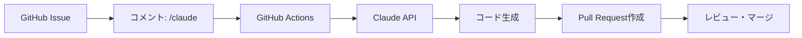

開発作業を効率化するため、GitHub Issueのコメントに`/claude`と入力するだけでAIが自動的にコードを生成し、Pull Requestを作成するシステムを構築しました。本記事では、その実装方法と活用例を詳しく解説します。

## 背景と課題

日々の開発作業において、以下のような繰り返し作業に時間を取られることがあります：

- 簡単な機能追加やバグ修正
- ボイラープレートコードの生成
- テストコードの作成
- リファクタリング作業

これらの作業を効率化するため、AIアシスタントを活用した自動開発システムを構築しました。

## システム概要

### アーキテクチャ



### 主な機能

1. **コマンドベースの実行**: Issueコメントで`/claude`を使用
2. **権限管理**: Write権限以上のユーザーのみ実行可能
3. **自動PR作成**: 生成されたコードを含むPRを自動作成
4. **エラーハンドリング**: 失敗時の詳細なフィードバック

## 実装詳細

### 1. GitHub Actionsワークフローの設計

GitHub Actionsのワークフローは、`issue_comment`イベントをトリガーとして動作します。

```yaml
name: Claude Development Bot

on:
  issue_comment:
    types: [created]

permissions:
  contents: write
  issues: write
  pull-requests: write
```

#### トリガー条件の設定

コメントが`/claude`で始まる場合のみ実行するよう条件を設定：

```yaml
jobs:
  claude-development:
    if: |
      github.event.issue.pull_request == null &&
      startsWith(github.event.comment.body, '/claude')
```

### 2. 権限チェックの実装

セキュリティを確保するため、コマンドを実行できるユーザーを制限：

```javascript
const { data: permission } = await github.rest.repos.getCollaboratorPermissionLevel({
  owner,
  repo,
  username: commenter
});

if (!['admin', 'write'].includes(permission.permission)) {
  // エラーメッセージを表示
  await github.rest.issues.createComment({
    owner,
    repo,
    issue_number: context.issue.number,
    body: '❌ 権限が不足しています'
  });
  return;
}
```

### 3. Claude APIとの連携

#### プロンプトエンジニアリング

効果的なコード生成のため、構造化されたプロンプトを作成：

```javascript
const systemPrompt = `
あなたは優秀なソフトウェアエンジニアです。
与えられたタスクを分析し、具体的なコード変更を提案してください。

出力形式:
1. 実装計画の説明
2. 具体的なコード（ファイルパスを明記）
3. テストコード（必要に応じて）
`;

const userPrompt = `
Issue #${issueNumber}: ${issueTitle}

Issue詳細: ${issueBody}
ユーザーからの指示: ${instruction}
プロジェクト情報: ${projectInfo}
`;
```

#### APIコールの実装

```javascript
const response = await anthropic.messages.create({
  model: 'claude-3-5-sonnet-20241022',
  max_tokens: 8000,
  temperature: 0,
  system: systemPrompt,
  messages: [
    {
      role: 'user',
      content: userPrompt
    }
  ]
});
```

### 4. コード変更の適用

生成されたコードを解析し、実際のファイルに適用：

```javascript
async function applyCodeChanges(response) {
  // ファイルパスとコードブロックを抽出
  const fileRegex = /### ファイル: ([^\n]+)/g;
  const codeBlockRegex = /```[\w]*\n([\s\S]*?)```/g;
  
  const filePaths = [];
  let match;
  while ((match = fileRegex.exec(response)) !== null) {
    filePaths.push(match[1].trim());
  }
  
  const codeBlocks = [];
  while ((match = codeBlockRegex.exec(response)) !== null) {
    codeBlocks.push(match[1]);
  }
  
  // ファイルを作成/更新
  for (let i = 0; i < Math.min(filePaths.length, codeBlocks.length); i++) {
    const filePath = filePaths[i];
    const code = codeBlocks[i];
    
    // ディレクトリを作成
    await fs.mkdir(path.dirname(filePath), { recursive: true });
    
    // ファイルを書き込み
    await fs.writeFile(filePath, code);
    console.log(`✅ Updated: ${filePath}`);
  }
}
```

### 5. Pull Request の自動作成

変更をコミットし、PRを作成：

```javascript
// ブランチ作成とコミット
const branchName = `claude/issue-${issueNumber}-${timestamp}`;
execSync(`git checkout -b ${branchName}`);
execSync('git add -A');
execSync(`git commit -m "feat: Implement changes for issue #${issueNumber}"`);
execSync(`git push -u origin ${branchName}`);

// PR作成
const pr = await github.rest.pulls.create({
  owner,
  repo,
  title: `🤖 [Claude Bot] ${issueTitle}`,
  body: prBody,
  head: branchName,
  base: 'main'
});
```

## 使用例

### 基本的な使い方

1. **Issueを作成**
```markdown
Title: ダークモードの実装
Body: アプリケーションにダークモード機能を追加したい
```

2. **コメントでClaudeを呼び出し**
```
/claude React Contextを使用してダークモードを実装してください。
トグルボタンも含めてください。
```

3. **自動実行される処理**
- 🚀 処理開始の通知
- 💬 Claudeの応答
- 🔀 Pull Request作成
- ✅ 完了通知

### 実際の活用例

#### 例1: 新機能の実装
```
/claude ユーザープロフィール編集機能を実装してください。
フォームバリデーションも含めてください。
```

#### 例2: バグ修正
```
/claude このエラーメッセージを分析して修正してください：
TypeError: Cannot read property 'map' of undefined
```

#### 例3: リファクタリング
```
/claude このコンポーネントをTypeScriptに変換してください
```

#### 例4: テスト作成
```
/claude UserService クラスのユニットテストを作成してください
```

## セキュリティ考慮事項

### 1. APIキーの管理

APIキーは**GitHub Secrets**で安全に管理：

```yaml
env:
  ANTHROPIC_API_KEY: ${{ secrets.ANTHROPIC_API_KEY }}
```

**重要**: APIキーを直接コードに記載しない

### 2. 権限制御

リポジトリの権限レベルでアクセスを制御：

- **Read権限**: 使用不可
- **Write権限**: 使用可能
- **Admin権限**: 使用可能

### 3. コードレビューの必要性

AIが生成したコードは必ず人間がレビュー：

- セキュリティホールの確認
- ビジネスロジックの妥当性検証
- コーディング規約の準拠確認

## パフォーマンスと制限

### 処理時間

典型的な処理時間：

| 処理内容 | 所要時間 |
|---------|---------|
| 権限チェック | 1-2秒 |
| Claude API呼び出し | 5-15秒 |
| コード生成・適用 | 2-5秒 |
| PR作成 | 3-5秒 |
| **合計** | **15-30秒** |

### API制限

- **Anthropic API**: レート制限とトークン制限あり
- **GitHub Actions**: 
  - パブリックリポジトリ: 無制限
  - プライベートリポジトリ: 月2,000分の無料枠

### コスト見積もり

月間使用量に応じたコスト目安：

| 使用回数/月 | Anthropic API | GitHub Actions | 合計 |
|------------|--------------|----------------|------|
| 100回 | $5-10 | $0（パブリック） | $5-10 |
| 500回 | $25-50 | $0（パブリック） | $25-50 |
| 1000回 | $50-100 | $0（パブリック） | $50-100 |

## トラブルシューティング

### よくある問題と解決方法

#### 1. 権限エラー
**症状**: "Permission denied"エラー
**解決策**: 
- ユーザーの権限を確認
- リポジトリのCollaboratorとして追加

#### 2. API キーエラー
**症状**: "Invalid API key"
**解決策**:
- GitHub Secretsの設定を確認
- APIキーの有効期限を確認

#### 3. PR作成失敗
**症状**: PRが作成されない
**解決策**:
- GitHub Actionsの権限設定を確認
- ワークフローのログを確認

#### 4. コード適用失敗
**症状**: 生成されたコードが適用されない
**解決策**:
- Claudeの応答形式を確認
- ファイルパスの正確性を確認

## ベストプラクティス

### 1. 明確な指示の記載

**良い例**:
```
/claude UserAuthenticationコンポーネントを作成してください。
以下の機能を含めてください：
- メールとパスワードのフォーム
- バリデーション（メール形式、パスワード8文字以上）
- エラーメッセージの表示
- TypeScriptで実装
```

**悪い例**:
```
/claude ログイン機能を作って
```

### 2. 段階的な実装

大きな機能は複数のIssueに分割：

1. Issue #1: 基本的なUIコンポーネント
2. Issue #2: ビジネスロジック
3. Issue #3: テスト
4. Issue #4: ドキュメント

### 3. レビューフローの確立


## 今後の改善案

### 1. 機能拡張

- **マルチモデル対応**: GPT-4やGeminiとの統合
- **カスタムコマンド**: `/claude-test`、`/claude-docs`など
- **インタラクティブモード**: 対話形式での開発

### 2. 品質向上

- **自動テスト強化**: 生成コードの自動テスト実行
- **静的解析**: ESLint、Prettierの自動適用
- **セキュリティスキャン**: 脆弱性の自動検出

### 3. 効率化

- **キャッシング**: 類似リクエストのキャッシュ
- **並列処理**: 複数ファイルの同時処理
- **増分更新**: 差分のみの更新

## まとめ

GitHub IssueコメントでClaudeを呼び出す自動開発システムにより、以下の効果が得られました：

1. **開発速度の向上**: 単純作業の自動化で30-50%の時間短縮
2. **品質の安定化**: AIによる一貫したコード生成
3. **知識の共有**: Issueでの開発過程の可視化

このシステムは、人間の創造性とAIの効率性を組み合わせた、次世代の開発フローの一例です。適切に活用することで、開発チームの生産性を大幅に向上させることができます。

## 参考リンク

- [GitHub Actions ドキュメント](https://docs.github.com/actions)
- [Anthropic API ドキュメント](https://docs.anthropic.com/)
- [GitHub REST API](https://docs.github.com/rest)
- [Node.js Child Process](https://nodejs.org/api/child_process.html)

## 注意事項

- 本記事で紹介したコードは簡略化されています
- 実際の運用では適切なエラーハンドリングが必要です
- APIキーなどの秘匿情報は必ず環境変数で管理してください
- AIが生成したコードは必ず人間がレビューしてください