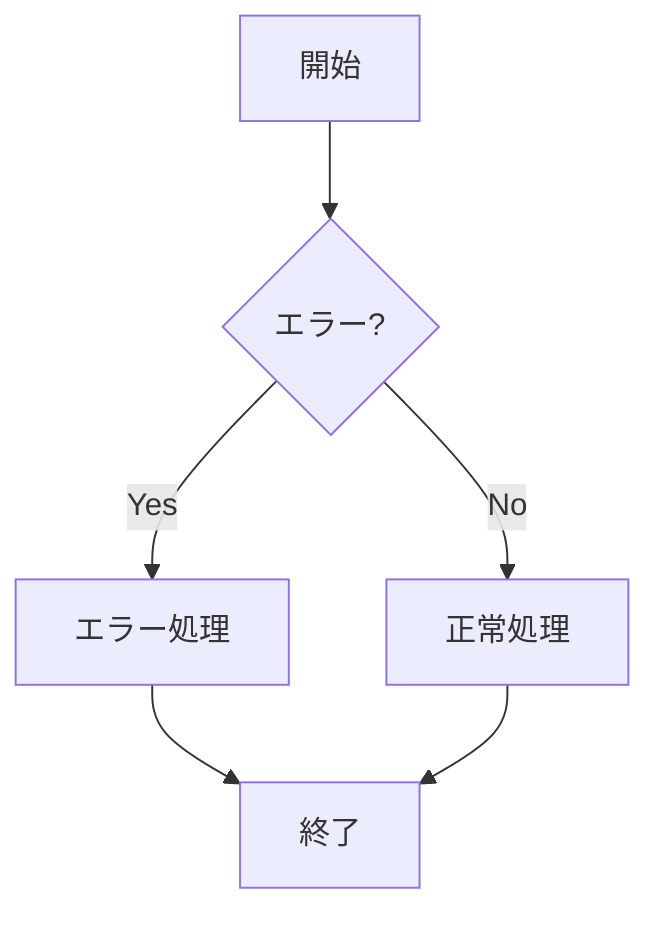
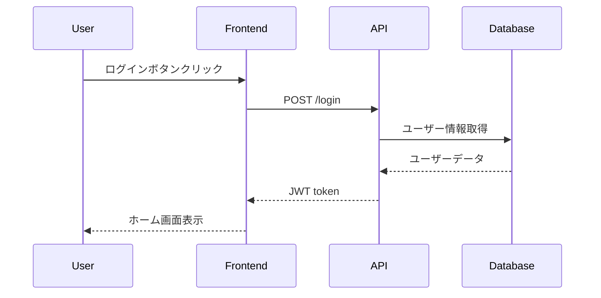
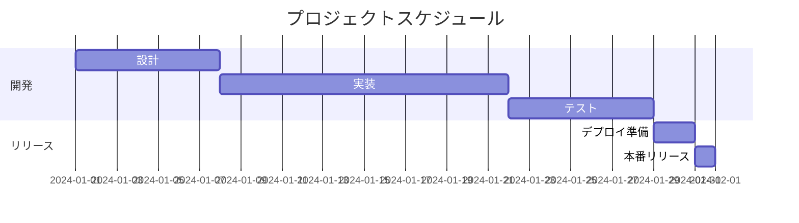
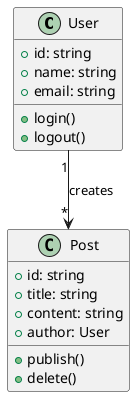
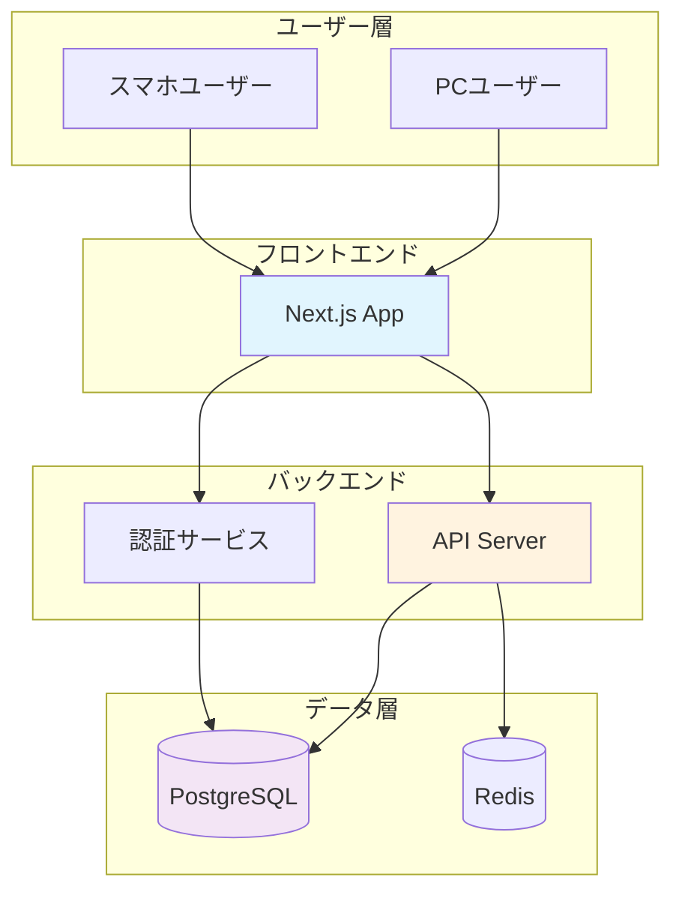
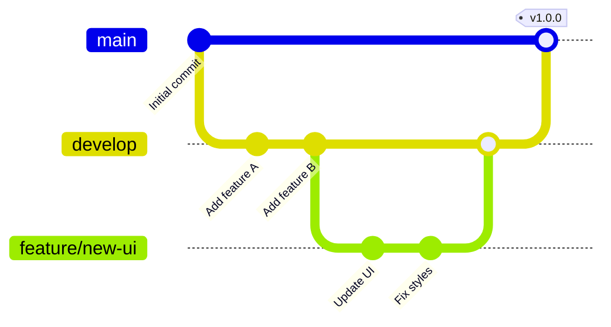
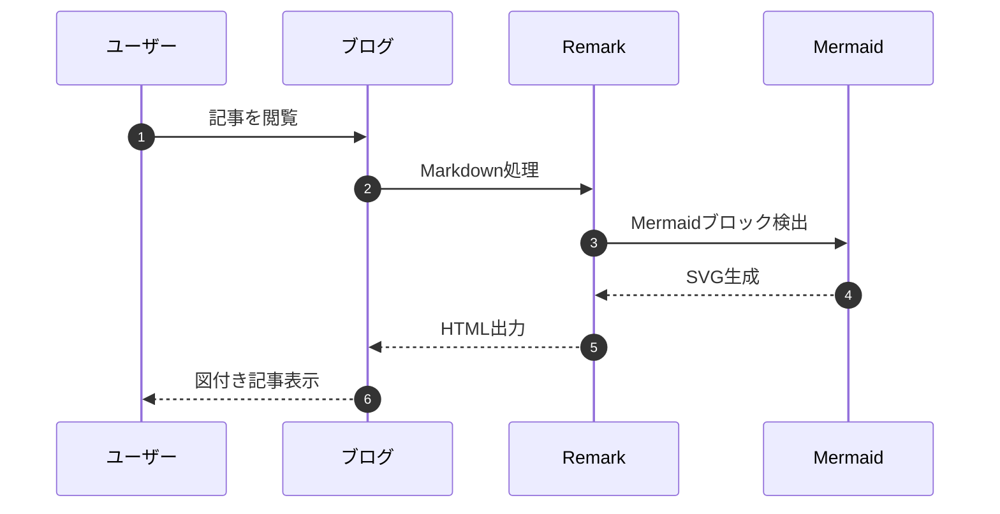
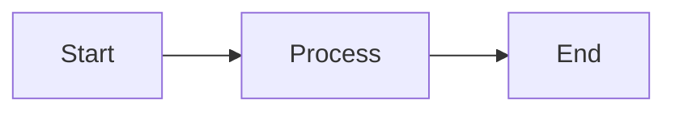
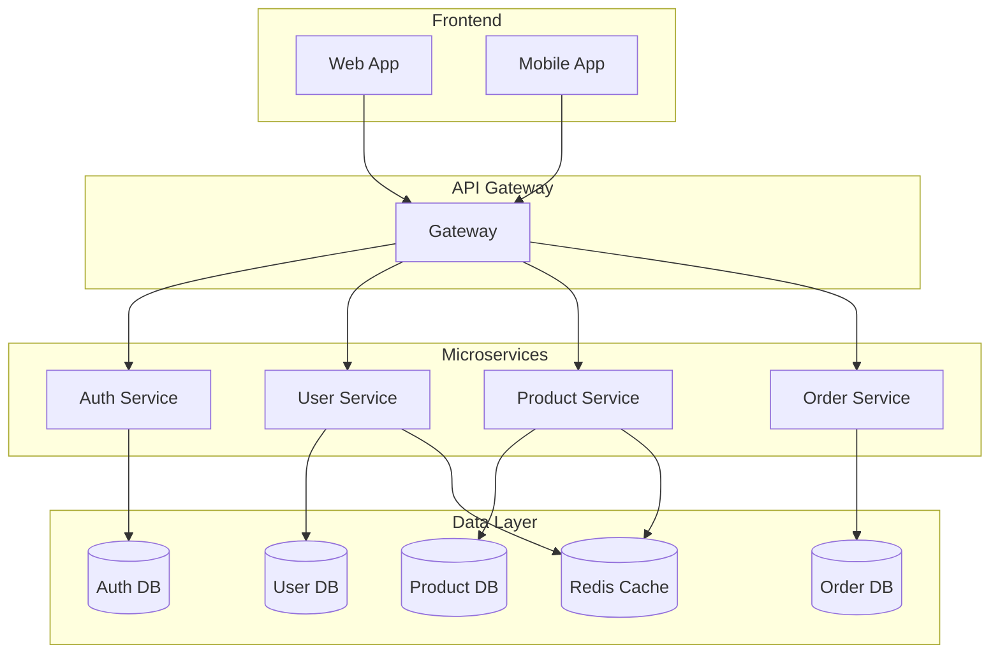
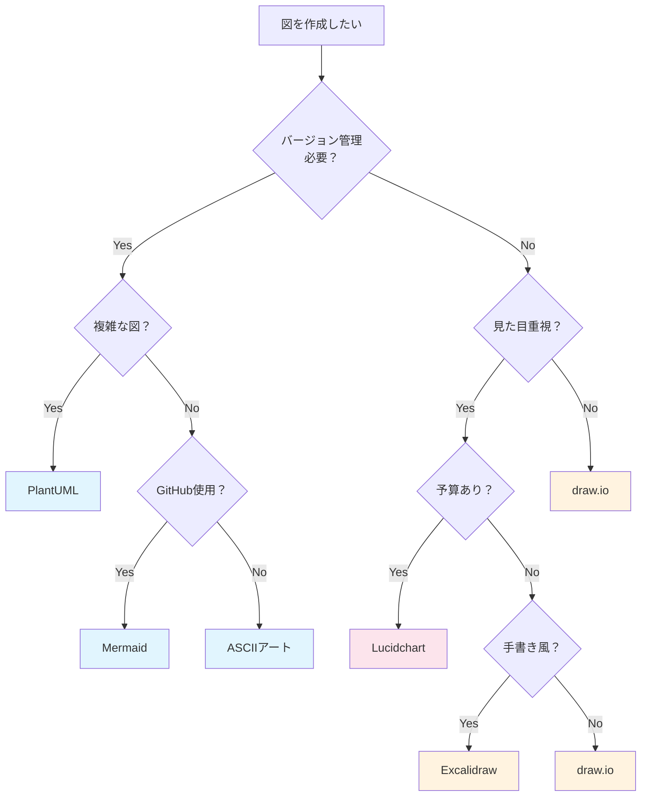

技術ドキュメントやブログ記事を書く時、「文字だけでは伝わりにくい」と感じたことはありませんか？適切な図解は、複雑な概念を一目で理解できるようにし、読者の理解度を大幅に向上させます。本記事では、READMEやブログ記事で使える図の作成方法を、初心者でも実践できるよう詳しく解説します。

## 📚 目次

- [なぜ図解が重要なのか](#なぜ図解が重要なのか)
- [図解の種類と使い分け](#図解の種類と使い分け)
- [テキストベースの図解ツール](#テキストベースの図解ツール)
- [GUIツールによる図解作成](#guiツールによる図解作成)
- [スクリーンショットとGIF動画](#スクリーンショットとgif動画)
- [図解作成のベストプラクティス](#図解作成のベストプラクティス)
- [Remarkを使用したブログでのMermaid活用](#remarkを使用したブログでのmermaid活用)
- [プラットフォーム別の実装方法](#プラットフォーム別の実装方法)
- [実例で学ぶ図解テクニック](#実例で学ぶ図解テクニック)

## なぜ図解が重要なのか

### 📊 数字で見る図解の効果

```
図解がある技術記事 vs 図解がない技術記事

読了率：      65% vs 30%
理解度：      85% vs 45%
共有率：      3.2倍
記憶定着率：   72時間後も60% vs 10%
```

### 図解が特に有効な場面

**1. システム構成の説明**
```
❌ 文章のみ：
「フロントエンドがAPIサーバーにリクエストを送り、
APIサーバーがデータベースからデータを取得して返す」

✅ 図解あり：
┌─────────┐     HTTP      ┌─────────┐     SQL      ┌─────────┐
│Frontend │────────────>│   API   │────────────>│Database │
└─────────┘<────────────└─────────┘<────────────└─────────┘
            JSON Response          Query Result
```

**2. 処理フローの説明**
```
❌ 文章のみ：
「ユーザーがログインボタンを押すと認証処理が始まり...」

✅ 図解あり：
[ユーザー] → [ログインボタン] → [認証API]
                                    ↓
[ホーム画面] ← [成功] ← [トークン発行]
     ↑
[エラー表示] ← [失敗]
```

## 図解の種類と使い分け

### 📐 図解の種類マトリックス

| 図の種類 | 適した用途 | 作成難易度 | おすすめツール |
|---------|-----------|------------|---------------|
| **フローチャート** | 処理の流れ、アルゴリズム | ★★☆☆☆ | Mermaid, draw.io |
| **シーケンス図** | API通信、時系列の処理 | ★★★☆☆ | PlantUML, Mermaid |
| **ER図** | データベース設計 | ★★★☆☆ | dbdiagram.io, PlantUML |
| **アーキテクチャ図** | システム全体像 | ★★★★☆ | draw.io, Lucidchart |
| **マインドマップ** | アイデア整理、機能一覧 | ★☆☆☆☆ | XMind, Mermaid |
| **ガントチャート** | スケジュール管理 | ★★☆☆☆ | Mermaid, Excel |
| **グラフ・チャート** | データ可視化 | ★★☆☆☆ | Chart.js, Python |
| **ワイヤーフレーム** | UI設計 | ★★★☆☆ | Figma, draw.io |

## テキストベースの図解ツール

### 🔤 ASCIIアート

**メリット：**
- 特別なツール不要
- Markdownにそのまま記載可能
- バージョン管理しやすい

**基本的な図形：**
```
箱：
┌─────────────┐
│   Content   │
└─────────────┘

矢印：
→ ← ↑ ↓ ↔ ↕

線：
─ │ ┌ ┐ └ ┘ ├ ┤ ┬ ┴ ┼

ツリー構造：
project/
├── src/
│   ├── components/
│   └── utils/
└── tests/
```

**実用例：APIの流れ**
```
┌─────────┐      ┌─────────┐      ┌─────────┐
│ Client  │─────>│  Nginx  │─────>│  Node   │
└─────────┘      └─────────┘      └─────────┘
     ↑                                  │
     │                                  ↓
     │           ┌─────────┐      ┌─────────┐
     └───────────│  Redis  │<─────│MongoDB  │
                 └─────────┘      └─────────┘
```

### 📊 Mermaid

**特徴：**
- GitHubのREADMEで直接レンダリング
- 学習コストが低い
- 様々な図に対応

**1. フローチャート**


**Markdownでの記述：**
````markdown

````

**2. シーケンス図**


**3. ガントチャート**


### 🌱 PlantUML

**特徴：**
- より詳細な図が作成可能
- UML図に特化
- VSCodeで拡張機能あり

**クラス図の例：**


## GUIツールによる図解作成

### 🎨 draw.io (diagrams.net)

**特徴：**
- 完全無料
- ブラウザで動作
- 豊富なテンプレート

**使い方：**
1. https://app.diagrams.net にアクセス
2. 保存先を選択（Google Drive、ローカルなど）
3. テンプレートを選択または新規作成
4. ドラッグ&ドロップで図形配置
5. エクスポート（PNG、SVG、PDF）

**おすすめ設定：**
```
エクスポート設定：
- 形式：PNG（ブログ用）、SVG（README用）
- 背景：透明
- 解像度：300dpi（印刷品質）
- Border：10px（余白確保）
```

### 🎯 Excalidraw

**特徴：**
- 手書き風のカジュアルな図
- リアルタイムコラボレーション
- シンプルな操作性

**使用例：**
```
アイデアスケッチ、ブレインストーミング図、
簡単なワイヤーフレーム、概念説明図
```

### 💎 有料ツール

**Lucidchart**
- 料金：$7.95/月〜
- 特徴：プロ向け機能、豊富なテンプレート

**Figma**
- 料金：無料〜$12/月
- 特徴：UI/UXデザイン、プロトタイピング

**Miro**
- 料金：無料〜$8/月
- 特徴：オンラインホワイトボード、チーム作業

## スクリーンショットとGIF動画

### 📸 効果的なスクリーンショット

**macOSの場合：**
```bash
# 全画面
Cmd + Shift + 3

# 選択範囲
Cmd + Shift + 4

# ウィンドウ単位（影付き）
Cmd + Shift + 4 → Space

# クリップボードに保存
上記 + Control
```

**Windowsの場合：**
```bash
# 全画面
Print Screen

# アクティブウィンドウ
Alt + Print Screen

# 選択範囲（Windows 10以降）
Win + Shift + S
```

**アノテーション（注釈）の追加：**
```
推奨ツール：
- Skitch（Mac）
- Greenshot（Windows）
- Flameshot（Linux）

追加すべき要素：
✅ 矢印（注目ポイント）
✅ 枠線（重要エリア）
✅ テキスト（説明）
✅ ぼかし（個人情報隠し）
```

### 🎬 GIF動画の作成

**作成ツール：**
```
Mac:
- Gifox（$4.99）
- GIPHY Capture（無料）
- Kap（無料、オープンソース）

Windows:
- ScreenToGif（無料）
- LICEcap（無料）

Web:
- CloudConvert（動画→GIF変換）
```

**最適な設定：**
```
解像度：800x600px以下
フレームレート：10-15fps
長さ：5-10秒
ファイルサイズ：5MB以下
ループ：有効
```

**使用例：**
```markdown
## デモ


### 操作手順
1. ボタンをクリック
2. フォームに入力
3. 送信ボタンを押す
```

## 図解作成のベストプラクティス

### ✅ やるべきこと

**1. 一貫性を保つ**
```yaml
色の使い分け:
  primary: "#007ACC"    # メイン要素
  secondary: "#6C757D"  # サブ要素
  success: "#28A745"    # 成功・正常
  danger: "#DC3545"     # エラー・警告
  
フォント:
  見出し: "bold 14px"
  本文: "normal 12px"
  注釈: "italic 10px"
```

**2. シンプルに保つ**
```
❌ 悪い例：
- 10色以上使用
- 情報を詰め込みすぎ
- 装飾過多

✅ 良い例：
- 3-5色に制限
- 1図1メッセージ
- 必要最小限の要素
```

**3. アクセシビリティを考慮**
```markdown
<!-- 代替テキストを必ず設定 -->


<!-- 色だけに依存しない -->
成功: ✅ 緑色 + チェックマーク
失敗: ❌ 赤色 + バツマーク
```

### ❌ 避けるべきこと

**1. 解像度の問題**
```
❌ 低解像度でぼやけた画像
❌ 巨大すぎるファイル（10MB以上）
❌ 文字が読めないほど小さい

✅ 適切な解像度（72-150dpi for web）
✅ 最適化されたファイルサイズ
✅ ズームしても読める文字サイズ
```

**2. 更新の問題**
```
❌ コードと図が不一致
❌ 古いバージョンの図を使用
❌ 更新履歴がない

✅ コードと同期して更新
✅ バージョン番号を記載
✅ 最終更新日を明記
```

## Remarkを使用したブログでのMermaid活用

### 🎯 なぜRemarkブログにはMermaidが最適なのか

Remarkベースのブログ（Next.js、Gatsby、Astroなど）では、**Mermaidが圧倒的におすすめ**です。

**理由：**
```
1. プラグインが充実
   └─ remark-mermaid
   └─ gatsby-remark-mermaid
   └─ @astrojs/markdown-remark

2. メンテナンスが楽
   └─ テキストベースでGit管理
   └─ 画像の再生成不要
   └─ 更新が即座に反映

3. パフォーマンス
   └─ 静的生成可能
   └─ SEO対応（テキストベース）
   └─ 軽量（画像より小さい）
```

### 📦 Remarkでの実装方法

**1. 必要なパッケージのインストール**
```bash
# Next.jsの場合
npm install remark-mermaid mermaid

# Gatsbyの場合
npm install gatsby-remark-mermaid

# 基本的なremark環境
npm install remark remark-html remark-mermaid
```

**2. 設定例（Next.js）**
```javascript
// next.config.js または lib/posts.ts
import remarkMermaid from 'remark-mermaid';

const processedContent = await remark()
  .use(remarkGfm)
  .use(remarkMermaid, {
    // オプション設定
    theme: 'default', // dark, forest, neutral など
    backgroundColor: 'transparent',
  })
  .use(remarkRehype)
  .use(rehypeStringify)
  .process(matterResult.content);
```

**3. 設定例（Gatsby）**
```javascript
// gatsby-config.js
module.exports = {
  plugins: [
    {
      resolve: `gatsby-transformer-remark`,
      options: {
        plugins: [
          {
            resolve: `gatsby-remark-mermaid`,
            options: {
              theme: 'default',
              viewport: {
                width: 800,
                height: 600
              }
            }
          }
        ]
      }
    }
  ]
}
```

### 🎨 実際のMermaid図例（このブログで動作）

**システムアーキテクチャ図**


**開発フロー図**


**処理シーケンス図**


### 🔧 ダークモード対応

```javascript
// Mermaidのテーマを動的に切り替え
const mermaidConfig = {
  startOnLoad: true,
  theme: window.matchMedia('(prefers-color-scheme: dark)').matches 
    ? 'dark' 
    : 'default',
  themeVariables: {
    // ブランドカラーに合わせる
    primaryColor: '#0066cc',
    primaryTextColor: '#ffffff',
    primaryBorderColor: '#004499',
    lineColor: '#5a5a5a',
    secondaryColor: '#006644',
    tertiaryColor: '#fff'
  }
};

// 初期化
mermaid.initialize(mermaidConfig);
```

### 📊 他の選択肢との比較表

| ツール | Remarkとの相性 | メリット | デメリット | おすすめ度 |
|--------|---------------|----------|------------|-----------|
| **Mermaid** | ★★★★★ | プラグイン豊富、Git管理しやすい | 細かいデザイン調整が難しい | ⭐最推奨 |
| **PlantUML** | ★★★☆☆ | 機能が豊富、詳細なUML図 | Java必要、ビルド時間長い | 特殊用途 |
| **SVGインライン** | ★★☆☆☆ | 完全なデザイン制御 | 作成・更新が大変 | デザイン重視時 |
| **ASCIIアート** | ★★★★☆ | 依存なし、超軽量 | 見た目が地味、複雑な図は困難 | シンプルな図 |
| **draw.io埋め込み** | ★★☆☆☆ | GUI操作、美しい | 画像管理が必要、更新が面倒 | 最終手段 |

### 🚀 パフォーマンス最適化

```javascript
// 遅延読み込みの実装
const LazyMermaid = dynamic(
  () => import('../components/MermaidRenderer'),
  { 
    loading: () => <div>図を読み込み中...</div>,
    ssr: false 
  }
);

// ビルド時に静的生成
export async function generateStaticParams() {
  const posts = await getAllPosts();
  
  // Mermaid図を含む記事を事前レンダリング
  return posts.map((post) => ({
    slug: post.slug,
  }));
}
```

## プラットフォーム別の実装方法

### 📝 GitHub README

**Mermaidの埋め込み：**
````markdown

````

**画像の埋め込み：**
```markdown
<!-- リポジトリ内の画像 -->


<!-- 外部URL -->


<!-- サイズ指定（HTML） -->

```

### 📰 ブログ記事（各プラットフォーム）

**Qiita/Zenn：**
```markdown
# Mermaid対応
```mermaid
（図の定義）
```

# 画像アップロード
ドラッグ&ドロップで自動アップロード
```

**はてなブログ：**
```markdown
# PlantUML対応
[plantuml]
（図の定義）
[/plantuml]
```

**WordPress：**
```html
<!-- プラグイン使用 -->
[mermaid]
graph TD
    A --> B
[/mermaid]

<!-- 画像の中央寄せ -->
<div style="text-align: center;">
  
</div>
```

### 💻 VSCode での作成

**便利な拡張機能：**
```json
{
  "recommendations": [
    "bierner.markdown-mermaid",
    "jebbs.plantuml",
    "hediet.vscode-drawio",
    "pomdtr.excalidraw-editor"
  ]
}
```

**設定例：**
```json
{
  "markdown.mermaid.theme": "dark",
  "plantuml.render": "PlantUMLServer",
  "plantuml.server": "https://www.plantuml.com/plantuml"
}
```

## 実例で学ぶ図解テクニック

### 🏗️ マイクロサービス構成図

**Mermaidでの実装：**


### 🔄 CI/CDパイプライン

**ASCIIアートでの実装：**
```
開発者
  │
  ├─[git push]──> GitHub
  │                  │
  │                  ├─[webhook]──> GitHub Actions
  │                  │                    │
  │                  │                    ├─> Build
  │                  │                    ├─> Test
  │                  │                    ├─> Lint
  │                  │                    │
  │                  │                    └─[成功]──> Deploy
  │                  │                                   │
  │                  │                                   ├─> Staging
  │                  │                                   │      │
  │                  │                                   │      └─[承認]
  │                  │                                   │           │
  │                  │                                   └─────> Production
  │
  └─[通知]<────────────────────────────────────────────────┘
```

### 📊 パフォーマンス比較

**表とグラフの組み合わせ：**
```markdown
## 処理速度比較

| 手法 | 1000件 | 10000件 | 100000件 |
|------|--------|---------|----------|
| 方法A | 10ms | 120ms | 1,500ms |
| 方法B | 8ms | 95ms | 980ms |
| 方法C | 15ms | 100ms | 850ms |

```
```
処理時間（ミリ秒）
1600 ┤
1400 ┤     ╭─ 方法A
1200 ┤    ╱
1000 ┤   ╱╱── 方法B
 800 ┤  ╱╱─── 方法C
 600 ┤ ╱╱╱
 400 ┤╱╱╱
 200 ┼──────────
     0  50K  100K
        データ件数
```
```

## ツール選択フローチャート



## よくある質問と解決策

### Q1: 図が更新されない

**原因と対策：**
```bash
# ブラウザキャッシュをクリア
Ctrl + Shift + R (Windows/Linux)
Cmd + Shift + R (Mac)

# GitHubの場合：RAW URLを使用
# ❌ https://github.com/user/repo/blob/main/image.png
# ✅ https://raw.githubusercontent.com/user/repo/main/image.png

# クエリパラメータを追加

```

### Q2: Mermaidが表示されない

**チェックリスト：**
```markdown
1. ``` の後に mermaid を記載しているか
2. GitHubの場合、READMEで使用しているか
3. 構文エラーがないか（オンラインエディタで確認）
4. ブラウザ拡張機能が干渉していないか
```

### Q3: 図のサイズが大きすぎる

**解決方法：**
```html
<!-- HTMLタグでサイズ指定 -->


<!-- 詳細はモーダルで表示 -->
<details>
<summary>クリックして拡大</summary>

</details>

<!-- リンクで別ウィンドウ -->
[拡大図を見る](./docs/detailed-diagram.png)
```

## まとめ

### 📋 図解作成チェックリスト

技術ドキュメントで図を作成する際の確認事項：

- [ ] 目的が明確（何を伝えたいか）
- [ ] 適切なツールを選択
- [ ] シンプルで分かりやすい
- [ ] 色使いが統一されている
- [ ] 文字が読みやすいサイズ
- [ ] 代替テキストを設定
- [ ] ファイルサイズが適切
- [ ] バージョン管理できる形式
- [ ] 更新しやすい構造
- [ ] モバイルでも見やすい

### 🎯 使い分けの指針

```
クイック作成 → ASCIIアート
GitHub README → Mermaid
詳細なUML → PlantUML
美しい図 → draw.io
手書き風 → Excalidraw
プロ仕様 → Lucidchart/Figma
操作説明 → GIF動画
```

### 💡 最後のアドバイス

1. **まずは簡単な図から始める** - ASCIIアートやMermaidから
2. **テンプレートを活用** - 毎回ゼロから作らない
3. **フィードバックを得る** - 読者に伝わっているか確認
4. **継続的に改善** - より良い表現方法を探求

図解は技術を伝える強力なツールです。この記事で紹介した方法を活用して、より分かりやすく魅力的なドキュメントを作成してください。

## 参考リンク

- [Mermaid公式ドキュメント](https://mermaid.js.org/)
- [PlantUML公式](https://plantuml.com/)
- [draw.io](https://app.diagrams.net/)
- [Excalidraw](https://excalidraw.com/)
- [GitHub Mermaidサポート](https://github.blog/2022-02-14-include-diagrams-markdown-files-mermaid/)
- [ASCIIアート生成ツール](https://asciiflow.com/)