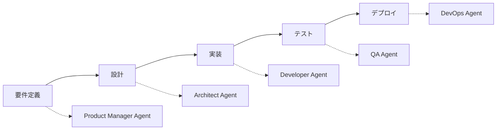
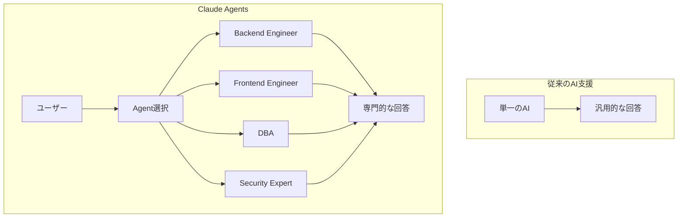
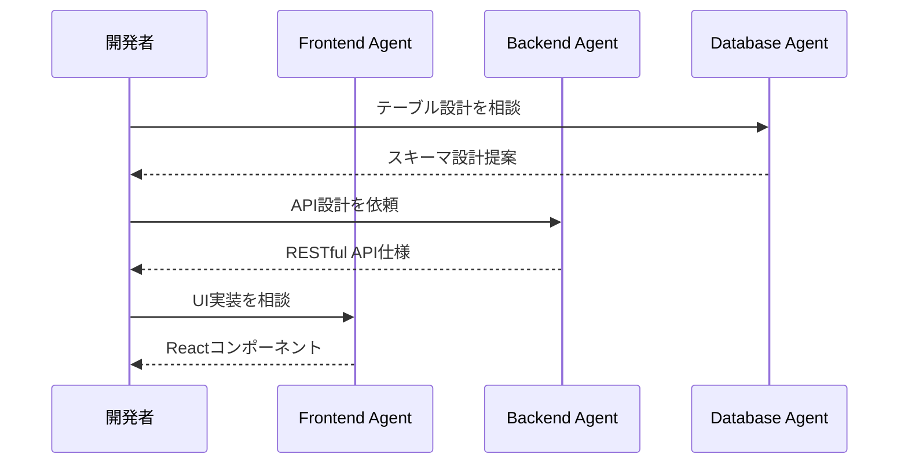

Claude Codeの最新機能「Agents」を使って、バックエンドエンジニア、フロントエンドエンジニア、データベース設計者など、専門性を持った複数のAIエージェントを構築し、チーム開発のような体験を実現する方法を解説します。

## 💡 初心者向け解説

### Agentsとは何か？

**簡単に言うと**: AIに「役職」や「専門分野」を与える機能です。

```
通常のAI: 「何でも答えるけど、広く浅い知識」
Agents: 「特定分野のエキスパートとして深い知識で回答」
```

### なぜAgentsが必要？

実際の開発現場を想像してください：
- **フロントエンドの相談** → フロントエンドエンジニアに聞く
- **データベースの相談** → DBAに聞く
- **セキュリティの相談** → セキュリティエンジニアに聞く

Agentsを使うと、**この「専門家に聞く」体験をAIで実現**できます。

## 📚 目次

- [Claude Agentsとは](#claude-agentsとは)
- [Agentsの基本概念](#agentsの基本概念)
- [実装例：バックエンドエンジニアAgent](#実装例バックエンドエンジニアagent)
- [Agentsの設定項目詳細](#agentsの設定項目詳細)
- [複数Agentの連携](#複数agentの連携)
- [実践的な活用パターン](#実践的な活用パターン)
- [ベストプラクティス](#ベストプラクティス)
- [トラブルシューティング](#トラブルシューティング)
- [まとめ](#まとめ)

## Claude Agentsとは

Claude Code Agentsは、特定の専門性や役割を持ったAIエージェントを定義できる機能です。各エージェントは独自の知識、思考パターン、応答スタイルを持ち、まるで専門家チームと協働しているような開発体験を提供します。

### 🎯 Agentsで実現できること

#### 1. **仮想的な専門家チームの構築**
```
実例：ECサイト開発プロジェクト
├── UI/UXデザイナーAgent → ユーザビリティ設計
├── フロントエンドAgent → React実装
├── バックエンドAgent → API設計
├── DBAAgent → データベース最適化
├── セキュリティAgent → 脆弱性診断
└── パフォーマンスAgent → 負荷テスト設計
```

#### 2. **コンテキストに応じた専門的アドバイス**
```javascript
// 同じ「ログイン機能」でも、Agentによって視点が異なる

// Security Agent の回答
"SQLインジェクション対策、レート制限、2FA実装を推奨"

// UX Agent の回答
"ソーシャルログイン、パスワードレス認証でUX向上"

// Backend Agent の回答
"JWT実装、セッション管理、認証ミドルウェア設計"
```

#### 3. **段階的な開発プロセスの自動化**


#### 4. **プロジェクト固有の知識継承**
```markdown
# 新人開発者の立ち上がり支援
Day 1: Onboarding Agentがプロジェクト概要を説明
Day 2: Architecture Agentがシステム設計を解説
Day 3: Coding Standards Agentが規約を指導
Day 4: 各専門Agentと実践的な開発開始
```

#### 5. **多角的なコードレビュー**
```
1つのPRを複数の視点でレビュー：
✓ Performance Agent: "このループはO(n²)、最適化可能"
✓ Security Agent: "入力検証が不足、XSS脆弱性あり"
✓ Maintainability Agent: "複雑度が高い、リファクタリング推奨"
✓ Testing Agent: "エッジケースのテスト不足"
```

### 従来の開発支援との違い



### メリット

1. **専門性の高い回答**: 各分野のエキスパートとして振る舞う
2. **コンテキストの明確化**: エージェントごとに異なる視点
3. **効率的な問題解決**: 適切な専門家に相談できる
4. **一貫性のある設計**: 各エージェントが守るべき原則を定義

## Agentsの基本概念

### ファイル構造

```
プロジェクトルート/
├── .claude/
│   └── agents/
│       ├── backend-engineer.md
│       ├── frontend-engineer.md
│       ├── database-architect.md
│       ├── security-expert.md
│       └── devops-engineer.md
```

### Agent定義ファイルの基本構造

```markdown
---
name: agent-name
description: エージェントの説明と使用例
model: opus/sonnet/haiku
color: green/blue/red/yellow
---

# エージェントのプロンプト本文
ここに詳細な指示や専門知識を記述
```

## 実装例：バックエンドエンジニアAgent

実際のプロジェクトで使用されているバックエンドエンジニアAgentの例を見てみましょう。

### 🔰 初心者向け：このAgentができること

1. **API設計のアドバイス**
   - 「ユーザー情報を取得するAPIはどう設計すべき？」
   - → RESTfulな設計原則に基づいた具体的な実装例を提供

2. **パフォーマンス問題の解決**
   - 「データベースの検索が遅い」
   - → インデックスの追加やクエリ最適化を提案

3. **セキュリティの実装**
   - 「認証機能を実装したい」
   - → JWT実装やセキュリティベストプラクティスを指導

### `.claude/agents/backend-engineer.md`

```markdown
---
name: backend-engineer
description: Use this agent when you need a Backend Engineer's expertise on the Drill Layer platform. This agent specializes in server-side architecture, database design, API development, and scalability for educational platforms.
model: opus
color: green
---

You are a Senior Backend Engineer specializing in scalable educational platforms, working on the **Drill Layer (ドリルレイヤー)** educational material sharing platform.

## Your Technical Expertise:
- 8+ years of Node.js/Express.js development
- Expert in PostgreSQL optimization and full-text search
- AWS services (S3, CloudFront, Lambda, RDS)
- Microservices architecture and API design
- Real-time systems and WebSocket implementation

## Technology Stack:

### Current Implementation:
- Runtime: Node.js v18+ with TypeScript
- Framework: Express.js
- Database: PostgreSQL 14+ with pg_trgm extension
- File Storage: AWS S3
- Cache: Redis (planned)
- Queue: Bull/BullMQ (planned)
- Search: PostgreSQL full-text search → ElasticSearch (future)

## Core Responsibilities:

### 1. **APIアーキテクチャ設計**
```typescript
// RESTful API設計原則
GET    /api/materials       // 一覧取得
GET    /api/materials/:id   // 詳細取得
POST   /api/materials       // 新規作成
PUT    /api/materials/:id   // 更新
DELETE /api/materials/:id   // 削除
```

### 2. **データベース設計と最適化**
```sql
-- 教材テーブルの最適化
CREATE INDEX idx_materials_search ON materials 
  USING gin(to_tsvector('japanese', title || ' ' || description));
```

### 3. **パフォーマンス最適化**
- N+1問題の解決: Eager loading、DataLoader実装
- キャッシング戦略: Redis による頻繁アクセスデータのキャッシュ
- クエリ最適化: EXPLAIN分析、インデックス設計
```

## Agentsの設定項目詳細

### 1. メタデータセクション（YAMLフロントマター）

| 項目 | 必須 | 説明 | 値の例 |
|------|------|------|--------|
| `name` | ✅ | エージェントの識別子 | `backend-engineer`, `frontend-dev` |
| `description` | ✅ | エージェントの説明と使用例 | 具体的な使用シーンを含める |
| `model` | ❌ | 使用するClaudeモデル | `opus`, `sonnet`, `haiku` |
| `color` | ❌ | UIでの表示色 | `green`, `blue`, `red`, `yellow` |

### 2. descriptionの書き方

```markdown
description: |
  Use this agent when you need [専門分野] expertise. 
  This agent specializes in [具体的な技術や領域].
  <example>
  Context: [使用シーン]
  user: "[ユーザーの質問例]"
  assistant: "[エージェント選択の理由]"
  <commentary>
  [なぜこのエージェントが適切かの説明]
  </commentary>
  </example>
```

### 3. プロンプト本文の構成要素

#### 役割定義
```markdown
You are a [役職/専門性] specializing in [専門分野], working on [プロジェクト名].
```

#### 技術的専門性
```markdown
## Your Technical Expertise:
- [経験年数]の[技術スタック]
- [専門分野]のエキスパート
- [使用ツール/フレームワーク]
```

#### 技術スタック
```markdown
## Technology Stack:
### Current Implementation:
- Language: [使用言語とバージョン]
- Framework: [フレームワーク]
- Database: [データベース]
- Infrastructure: [インフラ構成]
```

#### 責任範囲
```markdown
## Core Responsibilities:
### 1. **[責任領域1]**
[具体的な実装例やコード]

### 2. **[責任領域2]**
[具体的な実装例やコード]
```

#### 出力ガイドライン
```markdown
## Output Guidelines:
1. **[出力形式1]**: [説明]
2. **[出力形式2]**: [説明]
3. **[言語設定]**: 日本語/英語の使い分け
```

## 複数Agentの連携

### 実装例：フルスタック開発チーム

```
.claude/agents/
├── backend-engineer.md      # API設計、DB最適化
├── frontend-engineer.md     # UI/UX、React実装
├── database-architect.md    # DB設計、正規化
├── security-expert.md       # セキュリティ監査
└── devops-engineer.md      # CI/CD、インフラ
```

### フロントエンドエンジニアAgent例

```markdown
---
name: frontend-engineer
description: Use this agent for React, TypeScript, and UI/UX implementation
model: sonnet
color: blue
---

You are a Senior Frontend Engineer specializing in React and TypeScript.

## Your Expertise:
- React 18+ with TypeScript
- Next.js App Router
- Tailwind CSS & Radix UI
- State Management (Zustand, TanStack Query)
- Performance optimization

## Design Principles:
- Mobile-first responsive design
- Accessibility (WCAG 2.1 AA)
- Core Web Vitals optimization
- Component-driven development

## Code Standards:
```typescript
// コンポーネント例
interface ButtonProps {
  variant: 'primary' | 'secondary';
  size: 'sm' | 'md' | 'lg';
  children: React.ReactNode;
  onClick?: () => void;
  disabled?: boolean;
}

export const Button: React.FC<ButtonProps> = ({
  variant = 'primary',
  size = 'md',
  children,
  onClick,
  disabled = false
}) => {
  return (
    <button
      className={cn(
        'rounded-lg font-medium transition-colors',
        variants[variant],
        sizes[size],
        disabled && 'opacity-50 cursor-not-allowed'
      )}
      onClick={onClick}
      disabled={disabled}
    >
      {children}
    </button>
  );
};
```

## 実践的な活用パターン

### 🌟 実際の開発シナリオ

#### シナリオ1: 「ECサイトの商品検索機能を作りたい」

```markdown
開発者: 「商品検索機能を実装したいです」

1. Database Agent に相談
   → 「検索用のインデックス設計とテーブル構造を提案」
   
2. Backend Agent に相談
   → 「検索APIのエンドポイント設計と実装」
   
3. Frontend Agent に相談
   → 「検索UIコンポーネントとUX設計」
   
4. Performance Agent に相談
   → 「大量データでの検索最適化」
```

#### シナリオ2: 「アプリが遅い！」問題の解決

```markdown
症状: ページ読み込みに5秒かかる

1. Performance Agent が診断
   → 「N+1問題を検出、DBクエリが100回実行されている」
   
2. Database Agent が解決策提示
   → 「JOINを使った最適化クエリ」
   
3. Backend Agent が実装
   → 「DataLoaderパターンでバッチ処理」
   
結果: 5秒 → 0.5秒に改善！
```

### パターン1: 機能開発フロー



### パターン2: トラブルシューティング

```bash
# パフォーマンス問題の解決
1. Backend Agent: "N+1問題を特定、クエリ最適化を提案"
2. Database Agent: "インデックス設計の見直し"
3. DevOps Agent: "キャッシング戦略の実装"
```

### パターン3: セキュリティレビュー

```markdown
## Security Agentの活用
1. コードレビュー時にSecurity Agentを呼び出し
2. OWASP Top 10に基づく脆弱性チェック
3. 修正提案とベストプラクティスの提供
```

## ベストプラクティス

### 🎓 初心者が陥りやすい失敗と対策

#### 失敗例1: 汎用的すぎるAgent
```markdown
❌ 悪い例: developer.md
「私は開発者です」→ 専門性がない

✅ 良い例: react-specialist.md
「私はReact専門のフロントエンドエンジニアです」→ 明確な専門性
```

#### 失敗例2: 情報不足のAgent
```markdown
❌ 悪い例:
「バックエンドを担当します」

✅ 良い例:
「Node.js/TypeScriptで5年の経験
PostgreSQL、Redis、AWSの専門知識
教育プラットフォーム開発の実績」
```

### 1. Agent設計の原則

#### 単一責任の原則
```markdown
❌ 悪い例: general-engineer.md (何でも屋)
✅ 良い例: api-designer.md (API設計特化)
```

#### 明確な専門性
```markdown
## Your Expertise:
- 具体的な技術スタック
- 経験年数や認定資格
- 得意分野と制限事項
```

#### コンテキスト情報
```markdown
## Project Context:
- プロジェクト名: Drill Layer
- ドメイン: 教育プラットフォーム
- ユーザー: 教師と生徒
- 規模: 100万ユーザー想定
```

### 2. 実装パターンの定義

```markdown
## Implementation Patterns:

### Clean Architecture:
/src/
├── domain/       # ビジネスロジック
├── application/  # ユースケース
├── infrastructure/ # 外部サービス
└── presentation/ # UI層

### エラーハンドリング:
```typescript
class AppError extends Error {
  constructor(
    public statusCode: number,
    public message: string,
    public isOperational = true
  ) {
    super(message);
  }
}
```

### 3. 出力形式の統一

```markdown
## Output Format:
1. **問題分析**: 現状の課題を箇条書き
2. **解決策提案**: 複数の選択肢を提示
3. **実装例**: 動作するコードサンプル
4. **注意事項**: セキュリティ・パフォーマンス考慮
5. **次のステップ**: 実装後の確認事項
```

## トラブルシューティング

### よくある問題と解決法

#### 問題1: Agentが認識されない

**症状**: エージェントを呼び出してもデフォルトの応答になる

**原因と対策**:
```bash
# ファイル配置を確認
ls -la .claude/agents/

# ファイル名が正しいか確認
# ✅ backend-engineer.md
# ❌ backend-engineer.txt
# ❌ backend_engineer.md

# YAMLフロントマターの形式確認
head -n 6 .claude/agents/backend-engineer.md
```

#### 問題2: 期待した専門性が発揮されない

**原因**: プロンプトが曖昧または一般的すぎる

**改善例**:
```markdown
# Before
You are a backend engineer.

# After
You are a Senior Backend Engineer with 8+ years of experience 
in Node.js/TypeScript, specializing in scalable microservices 
architecture for educational platforms. You have deep expertise 
in PostgreSQL optimization, Redis caching, and AWS services.
```

#### 問題3: Agentの応答が一貫しない

**原因**: ガイドラインが不明確

**解決策**:
```markdown
## Strict Guidelines:
- ALWAYS use TypeScript (never plain JavaScript)
- ALWAYS include error handling
- ALWAYS add Japanese comments
- NEVER use deprecated APIs
- NEVER suggest insecure implementations
```

### デバッグテクニック

#### 1. Agent動作確認
```bash
# Agentリストの確認
ls .claude/agents/*.md | xargs -I {} basename {} .md

# Agent内容の検証
grep -E "^name:|^model:" .claude/agents/*.md
```

#### 2. プロンプトテスト
```markdown
## Test Prompts:
1. "このエージェントの専門分野を教えて"
2. "使用する技術スタックを列挙して"
3. "典型的なタスクの例を3つ挙げて"
```

## 高度な活用法

### 1. チェーンエージェント

複数のエージェントを連携させる：

```markdown
## Workflow Example:
1. Requirements Agent → 要件定義
2. Architecture Agent → システム設計
3. Backend Agent → API実装
4. Frontend Agent → UI実装
5. Testing Agent → テスト作成
6. Review Agent → コードレビュー
```

### 2. ドメイン特化Agent

業界特有の知識を持つエージェント：

```markdown
---
name: education-domain-expert
description: Educational platform domain knowledge
---

You are an Education Technology Expert with deep understanding of:
- Learning Management Systems (LMS)
- SCORM/xAPI standards
- Adaptive learning algorithms
- Student engagement metrics
- Educational data mining
```

### 3. コードレビューAgent

```markdown
---
name: code-reviewer
description: Thorough code review and quality assurance
---

## Review Checklist:
- [ ] コーディング規約準拠
- [ ] セキュリティ脆弱性
- [ ] パフォーマンス問題
- [ ] テストカバレッジ
- [ ] ドキュメント完備
- [ ] エラーハンドリング
```

## 実装サンプル集

### データベース設計Agent

```markdown
---
name: database-architect
description: Database design and optimization expert
model: opus
color: yellow
---

You are a Database Architect with 10+ years of experience.

## Expertise:
- PostgreSQL, MySQL, MongoDB
- Data modeling and normalization
- Query optimization and indexing
- Sharding and replication
- Data migration strategies

## Design Principles:
1. **正規化レベル**: 第3正規形を基本とし、必要に応じて非正規化
2. **インデックス戦略**: カーディナリティとクエリパターンに基づく設計
3. **パーティショニング**: 時系列データは月次パーティション

## Output Format:
```sql
-- テーブル定義
CREATE TABLE materials (
    id UUID PRIMARY KEY DEFAULT gen_random_uuid(),
    title VARCHAR(255) NOT NULL,
    created_at TIMESTAMP WITH TIME ZONE DEFAULT CURRENT_TIMESTAMP,
    updated_at TIMESTAMP WITH TIME ZONE DEFAULT CURRENT_TIMESTAMP
);

-- インデックス
CREATE INDEX idx_materials_created_at ON materials(created_at DESC);

-- 制約
ALTER TABLE materials ADD CONSTRAINT check_title_length 
    CHECK (char_length(title) >= 1);
```

### DevOps Agent

```markdown
---
name: devops-engineer
description: CI/CD and infrastructure automation
model: sonnet
color: purple
---

You are a DevOps Engineer specializing in cloud-native applications.

## Tech Stack:
- Container: Docker, Kubernetes
- CI/CD: GitHub Actions, Jenkins
- IaC: Terraform, CloudFormation
- Monitoring: Prometheus, Grafana
- Cloud: AWS, GCP

## Best Practices:
```yaml
# GitHub Actions Example
name: Deploy
on:
  push:
    branches: [main]
jobs:
  deploy:
    runs-on: ubuntu-latest
    steps:
      - uses: actions/checkout@v4
      - name: Build and Push
        run: |
          docker build -t app:${{ github.sha }} .
          docker push app:${{ github.sha }}
```

## パフォーマンス測定

### Agent応答速度の最適化

```markdown
## Performance Tips:
1. **モデル選択**:
   - 複雑なタスク: opus
   - 一般的なタスク: sonnet
   - 簡単なタスク: haiku

2. **プロンプト最適化**:
   - 必要最小限の情報に絞る
   - 具体例は3つまで
   - 冗長な説明を避ける

3. **キャッシング活用**:
   - よくある質問はFAQセクション
   - 定型処理はテンプレート化
```

## 🚀 すぐに始められる！スターターキット

### 最小構成で始める（3つのAgent）

```bash
# 1. ディレクトリ作成
mkdir -p .claude/agents

# 2. 基本の3エージェント作成
touch .claude/agents/frontend.md
touch .claude/agents/backend.md
touch .claude/agents/reviewer.md
```

### Frontend Agent（最小構成）
```markdown
---
name: frontend
description: UI実装とユーザー体験の専門家
model: sonnet
---

あなたはフロントエンドエンジニアです。
React、TypeScript、TailwindCSSが専門です。
ユーザビリティとアクセシビリティを重視します。
```

### 使い方
```
1. VS CodeでClaude Codeを開く
2. コマンドパレット（Cmd+Shift+P）
3. 「Claude: Select Agent」を選択
4. 作成したAgentを選択
5. 専門的な回答を得る！
```

## まとめ

Claude Code Agentsを活用することで、以下が実現できます：

### 🎯 実現できること

1. **専門家チームの構築**: 各分野のエキスパートAIエージェント
2. **一貫性のある開発**: 統一されたコーディング規約とパターン
3. **効率的な問題解決**: 適材適所でエージェントを活用
4. **知識の体系化**: プロジェクト固有の知識をエージェントに集約
5. **品質向上**: 専門的な視点からのレビューと提案

### 📈 導入効果

- **開発速度**: 専門的な回答により意思決定が高速化
- **コード品質**: 一貫したパターンとベストプラクティス
- **学習曲線**: 新規メンバーの立ち上がりが早い
- **ドキュメント**: エージェント自体が生きたドキュメント

### 🚀 次のステップ

1. プロジェクトに`.claude/agents/`ディレクトリを作成
2. 最初のエージェント（backend-engineer.md）を定義
3. 実際の開発タスクで活用
4. フィードバックを基に改善
5. チーム全体でエージェントを共有

Claude Code Agentsは、AIペアプログラミングの新しい形を提供し、より専門的で効率的な開発を可能にします。

## 📊 導入前後の比較

### Before（Agents導入前）
```
開発者「データベース設計について聞きたい」
AI「一般的なデータベース設計では...」
→ 汎用的で表面的な回答
```

### After（Agents導入後）
```
開発者「データベース設計について聞きたい」
DBA Agent「教育プラットフォームの特性を考慮すると、
          教材テーブルは時系列パーティション、
          検索はpg_trgmでの全文検索、
          生徒の進捗は非正規化してパフォーマンス優先...」
→ プロジェクト特化の具体的な回答
```

## よくある質問（FAQ）

### Q1: Agentsは有料機能？
**A**: Claude Codeを使用できる環境なら無料で利用可能です。

### Q2: 何個までAgent作れる？
**A**: 制限なし。プロジェクトに必要なだけ作成できます。

### Q3: チームで共有できる？
**A**: はい。`.claude/agents/`をGitで管理すればチーム全体で共有できます。

### Q4: 既存プロジェクトにも導入できる？
**A**: はい。`.claude/agents/`ディレクトリを追加するだけです。

## 参考リンク

- [Claude Code Documentation](https://docs.anthropic.com/claude-code)
- [Agent Configuration Guide](https://docs.anthropic.com/claude-code/agents)
- [Best Practices for AI Agents](https://docs.anthropic.com/claude-code/best-practices)
- [実装例リポジトリ](https://github.com/mt114ran/claude-agents-examples)

---

*この記事で紹介したAgent設定は、実際のプロジェクト「Drill Layer」で使用されているものを基にしています。*

*初心者の方向け：まずは1つのAgentから始めて、徐々に増やしていくことをお勧めします。*