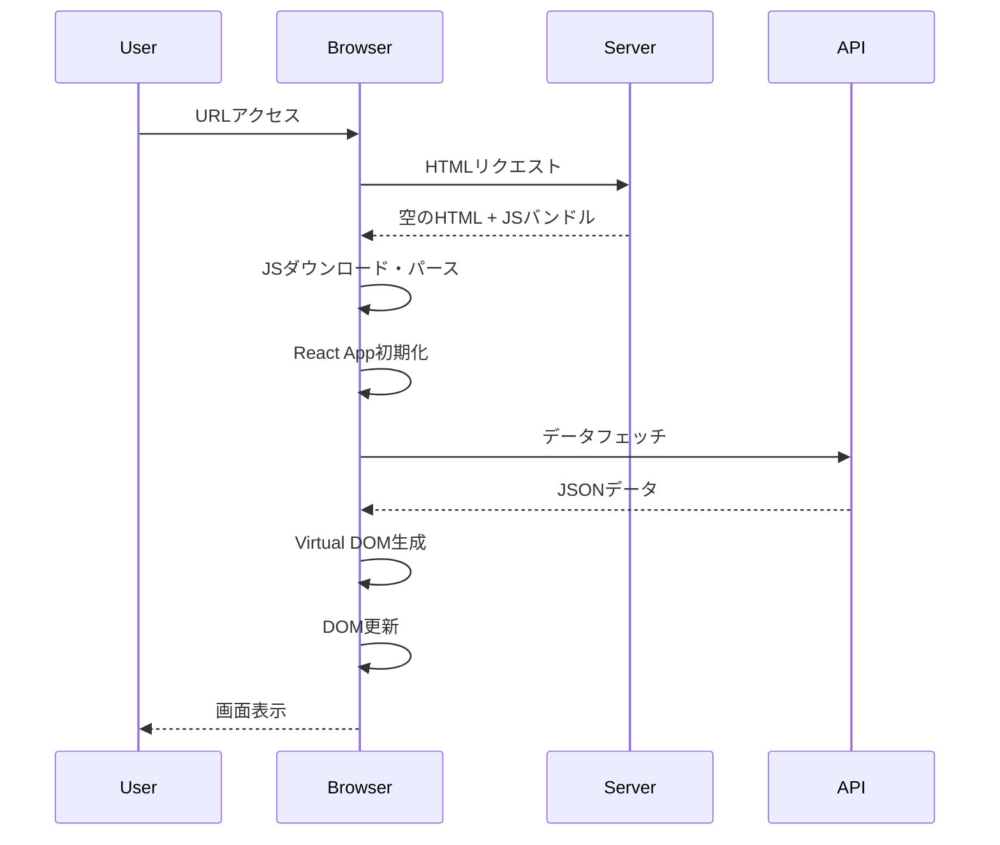
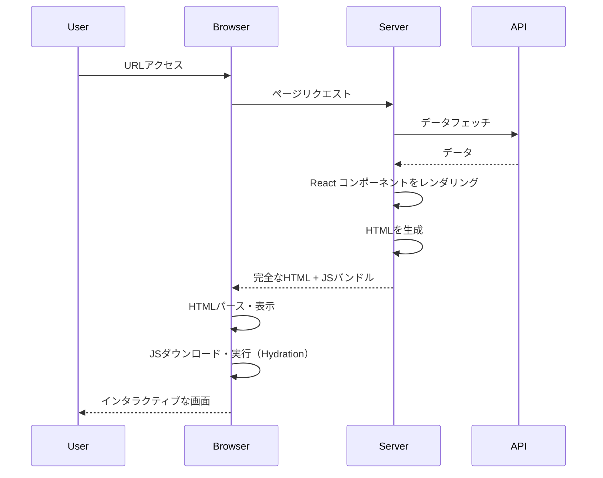
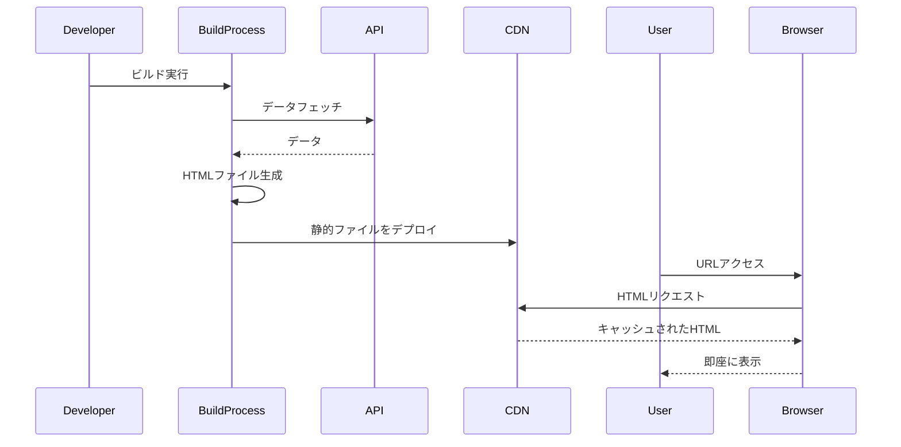
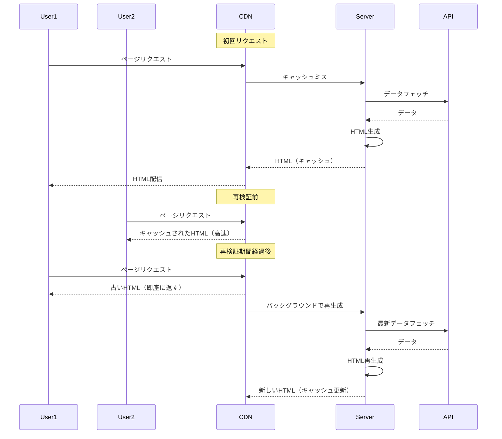
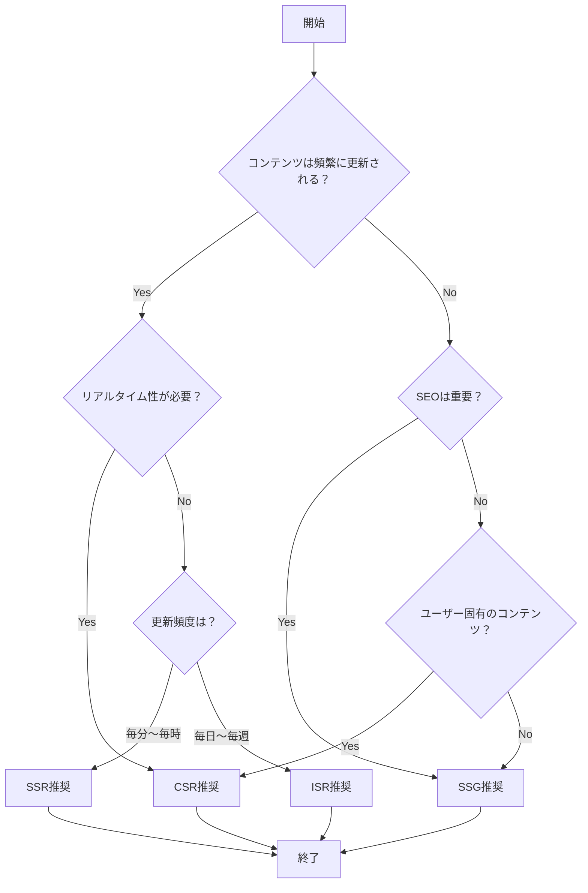

React開発において「CSRとSSRの違いを説明してください」という質問は、面接で必ず聞かれる定番の質問です。しかし、単に「クライアントサイドレンダリング」「サーバーサイドレンダリング」と答えるだけでは、3年以上の経験を持つエンジニアとしては不十分です。本記事では、各レンダリング戦略の本質的な理解から、実装の詳細、パフォーマンス最適化まで、実務で必要な知識を網羅的に解説します。

## 💡 初心者向け解説

### レンダリングとは？

**簡単に言うと**: ブラウザに表示されるHTMLを生成するプロセスです。

```
例：レストランの料理提供
CSR：お客様のテーブルで調理（ブラウザで生成）
SSR：厨房で調理して配膳（サーバーで生成）
SSG：作り置き料理（事前に生成）
ISR：人気メニューは作り置き、注文があれば新しく作る（ハイブリッド）
```

## 📚 目次

- [レンダリング戦略の基礎](#レンダリング戦略の基礎)
- [CSR（Client-Side Rendering）の深掘り](#csrclient-side-renderingの深掘り)
- [SSR（Server-Side Rendering）の深掘り](#ssrserver-side-renderingの深掘り)
- [SSG（Static Site Generation）の深掘り](#ssgstatic-site-generationの深掘り)
- [ISR（Incremental Static Regeneration）の深掘り](#isrincremental-static-regenerationの深掘り)
- [実装パターンと最適化テクニック](#実装パターンと最適化テクニック)
- [パフォーマンス測定と改善](#パフォーマンス測定と改善)
- [実践的な選択基準](#実践的な選択基準)
- [高度なトピック](#高度なトピック)

## レンダリング戦略の基礎

### 各戦略の概要と特徴

| 戦略 | HTML生成場所 | データ取得タイミング | SEO | 初期表示速度 | インタラクティブ性 | 適用場面 |
|------|-------------|-------------------|-----|-------------|------------------|----------|
| **CSR** | ブラウザ | ランタイム | △ | 遅い | 高い | 管理画面、SPA |
| **SSR** | サーバー | リクエスト時 | ◎ | 中間 | 中間 | ECサイト、ニュース |
| **SSG** | ビルド時 | ビルド時 | ◎ | 速い | 中間 | ブログ、LP |
| **ISR** | ビルド時+α | ビルド時+再検証時 | ◎ | 速い | 中間 | 大規模ECサイト |

### Webパフォーマンスメトリクス

理解すべき重要な指標：

```typescript
// Core Web Vitals
interface WebVitals {
  LCP: number;  // Largest Contentful Paint（最大コンテンツの描画）
  FID: number;  // First Input Delay（初回入力遅延） ※INPに置き換わりつつある
  CLS: number;  // Cumulative Layout Shift（累積レイアウトシフト）
  FCP: number;  // First Contentful Paint（初回コンテンツ描画）
  TTFB: number; // Time to First Byte（最初のバイトまでの時間）
  TTI: number;  // Time to Interactive（インタラクティブになるまでの時間）
  INP: number;  // Interaction to Next Paint（2024年3月からFIDに代わる新指標）
}
```

## CSR（Client-Side Rendering）の深掘り

### CSRの仕組み



### CSRの実装例

```tsx
// pages/products.tsx (CSR実装)
import { useState, useEffect } from 'react';
import { Product } from '@/types';

export default function ProductsPage() {
  const [products, setProducts] = useState<Product[]>([]);
  const [loading, setLoading] = useState(true);
  const [error, setError] = useState<string | null>(null);

  useEffect(() => {
    fetchProducts();
  }, []);

  const fetchProducts = async () => {
    try {
      setLoading(true);
      const response = await fetch('/api/products');
      
      if (!response.ok) {
        throw new Error(`HTTP error! status: ${response.status}`);
      }
      
      const data = await response.json();
      setProducts(data);
    } catch (err) {
      setError(err instanceof Error ? err.message : 'エラーが発生しました');
    } finally {
      setLoading(false);
    }
  };

  if (loading) {
    return (
      <div className="skeleton-container">
        {/* スケルトンスクリーン実装 */}
        {[...Array(6)].map((_, i) => (
          <div key={i} className="skeleton-card">
            <div className="skeleton-image" />
            <div className="skeleton-text" />
            <div className="skeleton-text short" />
          </div>
        ))}
      </div>
    );
  }

  if (error) {
    return (
      <div className="error-container">
        <h2>エラーが発生しました</h2>
        <p>{error}</p>
        <button onClick={fetchProducts}>再試行</button>
      </div>
    );
  }

  return (
    <div className="products-grid">
      {products.map((product) => (
        <ProductCard key={product.id} product={product} />
      ))}
    </div>
  );
}
```

### CSRの最適化テクニック

#### 1. Code Splitting（コード分割）

```tsx
// 動的インポートによるコード分割
import dynamic from 'next/dynamic';
import { Suspense } from 'react';

// 重いコンポーネントを遅延ロード
const HeavyChart = dynamic(
  () => import('@/components/HeavyChart'),
  {
    loading: () => <div>グラフを読み込み中...</div>,
    ssr: false // CSRのみで動作
  }
);

export default function Dashboard() {
  return (
    <div>
      <h1>ダッシュボード</h1>
      <Suspense fallback={<div>Loading...</div>}>
        <HeavyChart />
      </Suspense>
    </div>
  );
}
```

#### 2. データフェッチの最適化

```tsx
// React Query (TanStack Query)を使用した高度なデータ管理
import { useQuery, useMutation, useQueryClient } from '@tanstack/react-query';

interface Product {
  id: string;
  name: string;
  price: number;
}

// カスタムフックでデータフェッチロジックを抽象化
export function useProducts(options?: { 
  enabled?: boolean; 
  staleTime?: number; 
}) {
  return useQuery<Product[]>({
    queryKey: ['products'],
    queryFn: async () => {
      const response = await fetch('/api/products');
      if (!response.ok) throw new Error('Network response was not ok');
      return response.json();
    },
    staleTime: options?.staleTime ?? 5 * 60 * 1000, // 5分間キャッシュ
    enabled: options?.enabled ?? true,
    retry: 3, // 3回までリトライ
    retryDelay: (attemptIndex) => Math.min(1000 * 2 ** attemptIndex, 30000),
  });
}

// Optimistic Update実装
export function useUpdateProduct() {
  const queryClient = useQueryClient();
  
  return useMutation({
    mutationFn: async (product: Product) => {
      const response = await fetch(`/api/products/${product.id}`, {
        method: 'PUT',
        headers: { 'Content-Type': 'application/json' },
        body: JSON.stringify(product),
      });
      if (!response.ok) throw new Error('Update failed');
      return response.json();
    },
    onMutate: async (newProduct) => {
      // 楽観的更新
      await queryClient.cancelQueries({ queryKey: ['products'] });
      const previousProducts = queryClient.getQueryData(['products']);
      
      queryClient.setQueryData(['products'], (old: Product[]) => 
        old.map(p => p.id === newProduct.id ? newProduct : p)
      );
      
      return { previousProducts };
    },
    onError: (err, newProduct, context) => {
      // エラー時はロールバック
      queryClient.setQueryData(['products'], context?.previousProducts);
    },
    onSettled: () => {
      // 最終的にサーバーと同期
      queryClient.invalidateQueries({ queryKey: ['products'] });
    },
  });
}
```

### CSRのメリット・デメリット

**メリット**:
- 🚀 高いインタラクティブ性
- 💾 サーバー負荷が低い
- 📱 SPAとして動作可能
- 🔄 リアルタイム更新が容易

**デメリット**:
- 🐌 初期表示が遅い
- 🔍 SEOに不利
- 📦 大きなJSバンドルサイズ
- 📱 低スペックデバイスで性能問題

## SSR（Server-Side Rendering）の深掘り

### SSRの仕組み



### SSRの実装例（Next.js App Router）

```tsx
// app/products/page.tsx (SSR with App Router)
import { Suspense } from 'react';
import { headers } from 'next/headers';

// データフェッチング関数
async function getProducts() {
  const host = headers().get('host');
  const protocol = process.env.NODE_ENV === 'production' ? 'https' : 'http';
  
  const res = await fetch(`${protocol}://${host}/api/products`, {
    cache: 'no-store', // SSRを強制
    headers: {
      'Content-Type': 'application/json',
    },
  });

  if (!res.ok) {
    throw new Error('Failed to fetch products');
  }

  return res.json();
}

// Server Component
export default async function ProductsPage() {
  const products = await getProducts();

  return (
    <div className="container mx-auto px-4">
      <h1 className="text-3xl font-bold mb-8">商品一覧</h1>
      
      <Suspense fallback={<ProductsSkeleton />}>
        <ProductGrid products={products} />
      </Suspense>
    </div>
  );
}

// Client Component for interactivity
'use client';

import { useState } from 'react';

function ProductGrid({ products }: { products: Product[] }) {
  const [filter, setFilter] = useState('all');
  
  const filteredProducts = products.filter(product => {
    if (filter === 'all') return true;
    return product.category === filter;
  });

  return (
    <>
      <FilterBar onFilterChange={setFilter} />
      <div className="grid grid-cols-1 md:grid-cols-3 gap-6">
        {filteredProducts.map((product) => (
          <ProductCard key={product.id} product={product} />
        ))}
      </div>
    </>
  );
}
```

### Streaming SSR（ストリーミングSSR）

```tsx
// app/dashboard/page.tsx
import { Suspense } from 'react';

// 遅いデータフェッチ
async function getAnalytics() {
  const res = await fetch('/api/analytics', {
    cache: 'no-store'
  });
  // 意図的に遅延を追加（実際のAPIが遅い場合を想定）
  await new Promise(resolve => setTimeout(resolve, 3000));
  return res.json();
}

// 速いデータフェッチ
async function getQuickStats() {
  const res = await fetch('/api/quick-stats', {
    cache: 'no-store'
  });
  return res.json();
}

// メインコンポーネント
export default async function Dashboard() {
  const quickStats = await getQuickStats();

  return (
    <div className="dashboard">
      <h1>ダッシュボード</h1>
      
      {/* すぐに表示される部分 */}
      <QuickStats data={quickStats} />
      
      {/* ストリーミングで後から表示される部分 */}
      <Suspense fallback={<AnalyticsSkeleton />}>
        <AnalyticsSection />
      </Suspense>
    </div>
  );
}

// 遅延ロードされるコンポーネント
async function AnalyticsSection() {
  const analytics = await getAnalytics();
  return <Analytics data={analytics} />;
}
```

### SSRのエッジケース処理

```tsx
// SSRでの条件付きレンダリング
'use client';

import { useEffect, useState } from 'react';

export function ClientOnlyComponent() {
  const [isClient, setIsClient] = useState(false);
  
  useEffect(() => {
    setIsClient(true);
  }, []);

  // サーバーサイドでは何も表示しない
  if (!isClient) {
    return null;
  }

  // クライアントサイドのみで動作するコード
  return (
    <div>
      <p>ブラウザの幅: {window.innerWidth}px</p>
      <p>現在のURL: {window.location.href}</p>
    </div>
  );
}
```

## SSG（Static Site Generation）の深掘り

### SSGの仕組み



### SSGの実装例

```tsx
// app/blog/[slug]/page.tsx
import { notFound } from 'next/navigation';
import { getBlogPost, getAllBlogSlugs } from '@/lib/blog';
import { MDXRemote } from 'next-mdx-remote/rsc';

// 動的ルートパラメータの型定義
interface PageProps {
  params: {
    slug: string;
  };
}

// ビルド時に生成するパスを定義
export async function generateStaticParams() {
  const slugs = await getAllBlogSlugs();
  
  return slugs.map((slug) => ({
    slug: slug,
  }));
}

// メタデータの生成
export async function generateMetadata({ params }: PageProps) {
  const post = await getBlogPost(params.slug);
  
  if (!post) {
    return {};
  }

  return {
    title: post.title,
    description: post.excerpt,
    openGraph: {
      title: post.title,
      description: post.excerpt,
      images: [post.ogImage],
      type: 'article',
      publishedTime: post.publishedAt,
      authors: [post.author],
    },
    twitter: {
      card: 'summary_large_image',
      title: post.title,
      description: post.excerpt,
      images: [post.ogImage],
    },
  };
}

// ページコンポーネント
export default async function BlogPostPage({ params }: PageProps) {
  const post = await getBlogPost(params.slug);
  
  if (!post) {
    notFound();
  }

  return (
    <article className="prose prose-lg mx-auto">
      <header>
        <h1>{post.title}</h1>
        <div className="meta">
          <time dateTime={post.publishedAt}>
            {new Date(post.publishedAt).toLocaleDateString('ja-JP')}
          </time>
          <span className="author">by {post.author}</span>
        </div>
      </header>
      
      <MDXRemote source={post.content} />
      
      <footer>
        <RelatedPosts currentSlug={params.slug} />
      </footer>
    </article>
  );
}
```

### SSGの最適化

```tsx
// lib/blog.ts - 効率的なデータフェッチング
import { cache } from 'react';
import { unstable_cache } from 'next/cache';

// React cacheでリクエスト中のメモ化
export const getBlogPost = cache(async (slug: string) => {
  const post = await db.post.findUnique({
    where: { slug },
    include: {
      author: true,
      tags: true,
    },
  });
  
  return post;
});

// Next.js cacheでビルド間のキャッシュ
export const getPopularPosts = unstable_cache(
  async () => {
    const posts = await db.post.findMany({
      where: { published: true },
      orderBy: { views: 'desc' },
      take: 10,
      select: {
        id: true,
        title: true,
        slug: true,
        excerpt: true,
        views: true,
      },
    });
    
    return posts;
  },
  ['popular-posts'],
  {
    revalidate: 3600, // 1時間キャッシュ
    tags: ['posts'],
  }
);
```

## ISR（Incremental Static Regeneration）の深掘り

### ISRの仕組み



### ISRの実装例

```tsx
// app/products/[id]/page.tsx
import { Metadata } from 'next';

interface PageProps {
  params: { id: string };
}

// ISRの設定
export const revalidate = 60; // 60秒ごとに再検証

// または動的な再検証
export const dynamicParams = true; // 事前生成されていないパスを許可

export async function generateStaticParams() {
  // ビルド時に人気商品のみ事前生成
  const popularProducts = await fetch('https://api.example.com/products/popular')
    .then(res => res.json());
  
  return popularProducts.map((product: any) => ({
    id: product.id.toString(),
  }));
}

export async function generateMetadata({ params }: PageProps): Promise<Metadata> {
  const product = await getProduct(params.id);
  
  return {
    title: product.name,
    description: product.description,
  };
}

async function getProduct(id: string) {
  const res = await fetch(`https://api.example.com/products/${id}`, {
    next: { revalidate: 60 } // フェッチレベルでの再検証
  });
  
  if (!res.ok) {
    throw new Error('Failed to fetch product');
  }
  
  return res.json();
}

export default async function ProductPage({ params }: PageProps) {
  const product = await getProduct(params.id);
  
  return (
    <div className="product-detail">
      <h1>{product.name}</h1>
      <p className="price">¥{product.price.toLocaleString()}</p>
      <div className="description">{product.description}</div>
      
      {/* Client Component for dynamic features */}
      <ProductActions productId={product.id} />
    </div>
  );
}
```

### On-Demand ISR（オンデマンド再検証）

```tsx
// app/api/revalidate/route.ts
import { revalidatePath, revalidateTag } from 'next/cache';
import { NextRequest, NextResponse } from 'next/server';

export async function POST(request: NextRequest) {
  const secret = request.nextUrl.searchParams.get('secret');
  const path = request.nextUrl.searchParams.get('path');
  const tag = request.nextUrl.searchParams.get('tag');

  // シークレットトークンの検証
  if (secret !== process.env.REVALIDATION_SECRET) {
    return NextResponse.json({ message: 'Invalid secret' }, { status: 401 });
  }

  try {
    if (path) {
      // 特定のパスを再検証
      revalidatePath(path);
      return NextResponse.json({ revalidated: true, path, now: Date.now() });
    }
    
    if (tag) {
      // タグベースの再検証
      revalidateTag(tag);
      return NextResponse.json({ revalidated: true, tag, now: Date.now() });
    }
    
    return NextResponse.json({ message: 'Missing path or tag' }, { status: 400 });
  } catch (err) {
    return NextResponse.json({ message: 'Error revalidating' }, { status: 500 });
  }
}

// Webhookからの呼び出し例（CMSの更新時など）
async function handleCMSUpdate(updatedContent: any) {
  await fetch('https://your-app.com/api/revalidate', {
    method: 'POST',
    headers: {
      'Content-Type': 'application/json',
    },
    body: JSON.stringify({
      secret: process.env.REVALIDATION_SECRET,
      path: `/blog/${updatedContent.slug}`,
    }),
  });
}
```

## 実装パターンと最適化テクニック

### ハイブリッドレンダリング

```tsx
// app/dashboard/page.tsx - 複数の戦略を組み合わせる
import { Suspense } from 'react';
import { headers } from 'next/headers';

// 静的な部分（SSG）
export default function DashboardLayout() {
  return (
    <div className="dashboard">
      <StaticHeader />
      
      <div className="dashboard-content">
        {/* 動的な部分（SSR） */}
        <Suspense fallback={<UserInfoSkeleton />}>
          <UserInfo />
        </Suspense>
        
        {/* クライアントサイドの部分（CSR） */}
        <RealtimeMetrics />
      </div>
      
      <StaticFooter />
    </div>
  );
}

// SSR部分
async function UserInfo() {
  const session = await getServerSession();
  const user = await getUserData(session.userId);
  
  return (
    <div className="user-info">
      <h2>こんにちは、{user.name}さん</h2>
      <p>最終ログイン: {user.lastLogin}</p>
    </div>
  );
}

// CSR部分
'use client';

import { useEffect, useState } from 'react';
import { io } from 'socket.io-client';

function RealtimeMetrics() {
  const [metrics, setMetrics] = useState(null);
  
  useEffect(() => {
    const socket = io('/metrics');
    
    socket.on('update', (data) => {
      setMetrics(data);
    });
    
    return () => socket.disconnect();
  }, []);
  
  if (!metrics) return <div>メトリクスを読み込み中...</div>;
  
  return (
    <div className="metrics">
      <MetricCard title="オンラインユーザー" value={metrics.onlineUsers} />
      <MetricCard title="今日の売上" value={metrics.todaySales} />
      <MetricCard title="処理中の注文" value={metrics.pendingOrders} />
    </div>
  );
}
```

### Progressive Enhancement（段階的強化）

```tsx
// components/SearchForm.tsx
'use client';

import { useRouter } from 'next/navigation';
import { useTransition } from 'react';

export function SearchForm() {
  const router = useRouter();
  const [isPending, startTransition] = useTransition();
  
  // JavaScript無効時でも動作するフォーム
  return (
    <form 
      action="/search" 
      method="GET"
      onSubmit={(e) => {
        e.preventDefault();
        const formData = new FormData(e.currentTarget);
        const query = formData.get('q');
        
        startTransition(() => {
          router.push(`/search?q=${encodeURIComponent(query)}`);
        });
      }}
    >
      <input
        type="search"
        name="q"
        placeholder="検索..."
        required
        disabled={isPending}
      />
      <button type="submit" disabled={isPending}>
        {isPending ? '検索中...' : '検索'}
      </button>
    </form>
  );
}
```

### データフェッチング最適化

```tsx
// lib/data-fetching.ts
import { unstable_cache } from 'next/cache';

// Parallel Data Fetching（並列データフェッチ）
export async function getPageData(slug: string) {
  const [post, relatedPosts, comments] = await Promise.all([
    getPost(slug),
    getRelatedPosts(slug),
    getComments(slug),
  ]);
  
  return { post, relatedPosts, comments };
}

// Request Deduplication（リクエスト重複排除）
const getPost = unstable_cache(
  async (slug: string) => {
    const response = await fetch(`/api/posts/${slug}`, {
      next: { 
        revalidate: 3600,
        tags: ['post', `post-${slug}`]
      }
    });
    return response.json();
  },
  ['post-by-slug'],
  {
    revalidate: 3600,
    tags: ['posts']
  }
);

// Waterfall Prevention（ウォーターフォール防止）
export async function ProductPage({ id }: { id: string }) {
  // ❌ 悪い例：順次実行（ウォーターフォール）
  // const product = await getProduct(id);
  // const reviews = await getReviews(id);
  // const recommendations = await getRecommendations(id);
  
  // ✅ 良い例：並列実行
  const dataPromise = Promise.all([
    getProduct(id),
    getReviews(id),
    getRecommendations(id),
  ]);
  
  const [product, reviews, recommendations] = await dataPromise;
  
  return (
    <div>
      <ProductInfo product={product} />
      <Reviews reviews={reviews} />
      <Recommendations items={recommendations} />
    </div>
  );
}
```

## パフォーマンス測定と改善

### Core Web Vitalsの測定

```tsx
// hooks/useWebVitals.ts
import { useEffect } from 'react';
import { onCLS, onFID, onLCP, onFCP, onTTFB } from 'web-vitals';

export function useWebVitals() {
  useEffect(() => {
    // Largest Contentful Paint
    onLCP((metric) => {
      console.log('LCP:', metric.value);
      // Google Analyticsに送信
      gtag('event', 'web_vitals', {
        event_category: 'Web Vitals',
        event_label: 'LCP',
        value: Math.round(metric.value),
        metric_id: metric.id,
        metric_value: metric.value,
        metric_delta: metric.delta,
      });
    });
    
    // First Input Delay
    onFID((metric) => {
      console.log('FID:', metric.value);
    });
    
    // Cumulative Layout Shift
    onCLS((metric) => {
      console.log('CLS:', metric.value);
    });
    
    // First Contentful Paint
    onFCP((metric) => {
      console.log('FCP:', metric.value);
    });
    
    // Time to First Byte
    onTTFB((metric) => {
      console.log('TTFB:', metric.value);
    });
  }, []);
}

// app/layout.tsx
export default function RootLayout({ children }) {
  return (
    <html>
      <body>
        <WebVitalsReporter />
        {children}
      </body>
    </html>
  );
}

function WebVitalsReporter() {
  useWebVitals();
  return null;
}
```

### バンドルサイズの最適化

```javascript
// next.config.js
module.exports = {
  // Bundle Analyzer設定
  webpack: (config, { isServer }) => {
    if (process.env.ANALYZE === 'true') {
      const BundleAnalyzerPlugin = require('webpack-bundle-analyzer').BundleAnalyzerPlugin;
      config.plugins.push(
        new BundleAnalyzerPlugin({
          analyzerMode: 'static',
          reportFilename: isServer ? '../analyze/server.html' : './analyze/client.html',
        })
      );
    }
    return config;
  },
  
  // 画像最適化
  images: {
    domains: ['images.example.com'],
    formats: ['image/avif', 'image/webp'],
    deviceSizes: [640, 750, 828, 1080, 1200, 1920, 2048, 3840],
    imageSizes: [16, 32, 48, 64, 96, 128, 256, 384],
  },
  
  // SWC minifier使用
  swcMinify: true,
  
  // 実験的機能
  experimental: {
    optimizeCss: true,
    legacyBrowsers: false,
  },
};
```

### 画像最適化戦略

```tsx
// components/OptimizedImage.tsx
import Image from 'next/image';
import { useState } from 'react';

interface OptimizedImageProps {
  src: string;
  alt: string;
  priority?: boolean;
  className?: string;
}

export function OptimizedImage({ 
  src, 
  alt, 
  priority = false,
  className 
}: OptimizedImageProps) {
  const [isLoading, setIsLoading] = useState(true);
  
  return (
    <div className={`image-container ${className}`}>
      <Image
        src={src}
        alt={alt}
        fill
        priority={priority}
        quality={85}
        sizes="(max-width: 640px) 100vw,
               (max-width: 1024px) 50vw,
               33vw"
        placeholder="blur"
        blurDataURL={`data:image/svg+xml;base64,...`} // 実際のblur画像
        onLoadingComplete={() => setIsLoading(false)}
        className={`
          duration-700 ease-in-out
          ${isLoading ? 'scale-110 blur-2xl grayscale' : 'scale-100 blur-0 grayscale-0'}
        `}
      />
    </div>
  );
}
```

## 実践的な選択基準

### レンダリング戦略の選択フローチャート



### 実際のユースケースマッピング

| ユースケース | 推奨戦略 | 理由 |
|-------------|---------|------|
| **企業サイトのトップページ** | SSG + ISR | SEO重要、更新頻度低、高速表示必要 |
| **ブログ記事** | SSG | コンテンツ固定、SEO最重要 |
| **ECサイトの商品ページ** | ISR | 在庫・価格の定期更新、SEO重要 |
| **管理画面** | CSR | SEO不要、高インタラクティブ性 |
| **ニュースサイト** | SSR + ISR | 最新性重要、SEO必要 |
| **SNSフィード** | CSR + SSR | 初期表示速度とリアルタイム更新の両立 |
| **ユーザープロフィール** | SSR | 動的コンテンツ、SEO一部必要 |
| **ランディングページ** | SSG | 高速表示、SEO最重要、更新少ない |

## 高度なトピック

### React 19とNext.js 15の新機能（2024-2025）

#### React 19の主要アップデート
```tsx
// 1. use() Hook - プロミスやコンテキストを直接使用
import { use } from 'react';

function Comments({ commentsPromise }) {
  // プロミスを直接使用（Suspenseと自動統合）
  const comments = use(commentsPromise);
  return <div>{comments.map(c => <p>{c.text}</p>)}</div>;
}

// 2. Server Components での async/await
async function ProductDetails({ id }) {
  const product = await fetch(`/api/products/${id}`).then(r => r.json());
  return <div>{product.name}</div>;
}

// 3. Actions - フォーム処理の簡素化
function ContactForm() {
  async function submitAction(formData: FormData) {
    'use server';
    await saveContact(formData);
  }
  
  return (
    <form action={submitAction}>
      <input name="email" type="email" />
      <button type="submit">送信</button>
    </form>
  );
}
```

#### Next.js 15の新機能
```tsx
// 1. Turbopack (デフォルト有効化)
// next.config.js
module.exports = {
  experimental: {
    turbo: true, // Webpack比で最大10倍高速
  },
};

// 2. 改善されたエラーハンドリング
export default function ErrorBoundary({
  error,
  reset,
}: {
  error: Error & { digest?: string };
  reset: () => void;
}) {
  return (
    <div>
      <h2>エラーが発生しました</h2>
      <details>
        <summary>詳細</summary>
        <pre>{error.message}</pre>
      </details>
      <button onClick={reset}>再試行</button>
    </div>
  );
}
```

### React Server Components（RSC）

```tsx
// app/products/ProductList.tsx - Server Component
import { db } from '@/lib/db';

// Server Componentはasync関数として定義可能
export default async function ProductList({ category }: { category: string }) {
  // サーバーサイドで直接DBアクセス
  const products = await db.product.findMany({
    where: { category },
    include: { 
      reviews: {
        select: { rating: true }
      }
    }
  });
  
  // サーバーサイドで集計処理
  const productsWithRating = products.map(product => ({
    ...product,
    averageRating: product.reviews.reduce((acc, r) => acc + r.rating, 0) / product.reviews.length
  }));
  
  return (
    <div className="product-list">
      {productsWithRating.map(product => (
        // Client Componentに必要最小限のデータを渡す
        <ProductCard 
          key={product.id} 
          product={product}
          averageRating={product.averageRating}
        />
      ))}
    </div>
  );
}

// components/ProductCard.tsx - Client Component
'use client';

import { useState } from 'react';
import { addToCart } from '@/actions/cart';

export function ProductCard({ product, averageRating }) {
  const [isAdding, setIsAdding] = useState(false);
  
  const handleAddToCart = async () => {
    setIsAdding(true);
    await addToCart(product.id);
    setIsAdding(false);
  };
  
  return (
    <div className="product-card">
      <h3>{product.name}</h3>
      <p>評価: {averageRating.toFixed(1)}</p>
      <button onClick={handleAddToCart} disabled={isAdding}>
        {isAdding ? 'カートに追加中...' : 'カートに追加'}
      </button>
    </div>
  );
}
```

### Edge Runtime最適化

```tsx
// app/api/geo/route.ts - Edge Runtime使用
export const runtime = 'edge'; // Edge Runtimeを指定

export async function GET(request: Request) {
  // CloudflareやVercel Edge Functionsで実行
  const country = request.headers.get('CF-IPCountry') || 'JP';
  const city = request.headers.get('CF-City') || 'Tokyo';
  
  // 地域に基づいたコンテンツ配信
  const content = await getLocalizedContent(country, city);
  
  return new Response(JSON.stringify(content), {
    headers: {
      'Content-Type': 'application/json',
      'Cache-Control': 'public, max-age=3600',
      'CDN-Cache-Control': 'max-age=86400',
    },
  });
}

// middleware.ts - Edge Middlewareでルーティング
import { NextResponse } from 'next/server';
import type { NextRequest } from 'next/server';

export function middleware(request: NextRequest) {
  const country = request.geo?.country || 'JP';
  
  // 地域別リダイレクト
  if (country === 'US' && request.nextUrl.pathname === '/') {
    return NextResponse.redirect(new URL('/us', request.url));
  }
  
  // A/Bテスト
  const bucket = Math.random() < 0.5 ? 'a' : 'b';
  const response = NextResponse.next();
  response.cookies.set('ab-test', bucket);
  
  return response;
}

export const config = {
  matcher: ['/((?!api|_next/static|favicon.ico).*)'],
};
```

### Partial Prerendering（部分的事前レンダリング）

```tsx
// app/dashboard/page.tsx - Partial Prerendering (実験的機能)
import { Suspense } from 'react';

export const experimental_ppr = true; // Partial Prerenderingを有効化

export default function Dashboard() {
  return (
    <div>
      {/* 静的にプリレンダリングされる部分 */}
      <header>
        <h1>ダッシュボード</h1>
        <Navigation />
      </header>
      
      {/* 動的な部分はSuspenseで囲む */}
      <Suspense fallback={<div>Loading user data...</div>}>
        <UserDashboard />
      </Suspense>
      
      {/* 静的な部分 */}
      <footer>
        <Copyright />
      </footer>
    </div>
  );
}

async function UserDashboard() {
  const session = await getSession();
  const userData = await getUserData(session.userId);
  
  return <DashboardContent data={userData} />;
}
```

## セキュリティ考慮事項

### XSS対策

```tsx
// ❌ 危険な実装
export function DangerousComponent({ htmlContent }: { htmlContent: string }) {
  return <div dangerouslySetInnerHTML={{ __html: htmlContent }} />;
}

// ✅ 安全な実装
import DOMPurify from 'isomorphic-dompurify';

export function SafeComponent({ htmlContent }: { htmlContent: string }) {
  const cleanHTML = DOMPurify.sanitize(htmlContent, {
    ALLOWED_TAGS: ['b', 'i', 'em', 'strong', 'a', 'p', 'br'],
    ALLOWED_ATTR: ['href', 'target', 'rel'],
  });
  
  return <div dangerouslySetInnerHTML={{ __html: cleanHTML }} />;
}

// Server Actionsでの検証
'use server';

import { z } from 'zod';

const formSchema = z.object({
  name: z.string().min(1).max(100),
  email: z.string().email(),
  message: z.string().min(10).max(1000),
});

export async function submitForm(formData: FormData) {
  const validatedFields = formSchema.safeParse({
    name: formData.get('name'),
    email: formData.get('email'),
    message: formData.get('message'),
  });
  
  if (!validatedFields.success) {
    return { error: validatedFields.error.flatten().fieldErrors };
  }
  
  // 安全に処理を続行
  await saveToDatabase(validatedFields.data);
}
```

## デバッグとトラブルシューティング

### Hydrationエラーの対処

```tsx
// ❌ Hydrationエラーが発生する例
function BadComponent() {
  return (
    <div>
      現在時刻: {new Date().toLocaleTimeString()}
    </div>
  );
}

// ✅ Hydrationエラーを防ぐ実装
'use client';

import { useEffect, useState } from 'react';

function GoodComponent() {
  const [time, setTime] = useState<string>('');
  
  useEffect(() => {
    setTime(new Date().toLocaleTimeString());
    const interval = setInterval(() => {
      setTime(new Date().toLocaleTimeString());
    }, 1000);
    
    return () => clearInterval(interval);
  }, []);
  
  // サーバーサイドでは空文字列、クライアントサイドで時刻表示
  return (
    <div>
      現在時刻: {time || 'Loading...'}
    </div>
  );
}
```

## まとめ

### 重要なポイントのチェックリスト

**基本理解**:
- [ ] CSR/SSR/SSG/ISRの動作原理を説明できる
- [ ] 各戦略のメリット・デメリットを理解している
- [ ] Core Web Vitalsと各戦略の関係を説明できる

**実装スキル**:
- [ ] Next.js App Routerで各戦略を実装できる
- [ ] データフェッチングの最適化ができる
- [ ] Suspenseとストリーミングを活用できる
- [ ] React Server Componentsを適切に使える

**パフォーマンス**:
- [ ] バンドルサイズの最適化ができる
- [ ] 画像最適化の実装ができる
- [ ] Core Web Vitalsの測定と改善ができる

**応用力**:
- [ ] プロジェクトに適した戦略を選択できる
- [ ] ハイブリッドレンダリングを設計できる
- [ ] セキュリティを考慮した実装ができる

### 面接での回答例

**Q1: CSRとSSRの違いを説明してください**

```
A: CSRとSSRの本質的な違いは、HTMLの生成場所とタイミングです。

CSRはブラウザ上でJavaScriptを実行してHTMLを生成します。
初期表示は遅いですが、その後のインタラクションは高速です。
SPAやダッシュボードなど、SEOが不要でインタラクティブ性が
重要な場面で使用します。

SSRはサーバー側でHTMLを生成してブラウザに送信します。
初期表示が速く、SEOに有利ですが、サーバー負荷が高くなります。
ECサイトやニュースサイトなど、SEOとコンテンツの鮮度が
重要な場面で使用します。

実際のプロジェクトでは、React Server ComponentsやSuspenseを
活用して、両者の利点を組み合わせたハイブリッドな実装を
行うことが多いです。
```

**Q2: Hydrationとは何ですか？エラーが起きる原因は？**

```
A: Hydrationは、SSRで生成された静的HTMLに、クライアントサイドで
JavaScriptのイベントハンドラーや状態管理を「注入」するプロセスです。

エラーが起きる主な原因：
1. サーバーとクライアントで異なるHTMLが生成される
   - Math.random()や Date.now()の使用
   - window/documentオブジェクトの参照
2. 条件付きレンダリングの不整合
3. 外部ライブラリの不適切な使用

対策として、useEffectでクライアントサイドのみの処理を分離したり、
dynamic importでSSRを無効化したりします。
```

**Q3: ISRとSSGの違いは？どう使い分ける？**

```
A: SSGはビルド時に全ページを生成し、ISRは必要に応じて
ページを再生成できる点が違います。

SSG：
- ビルド時に全ページ生成
- 更新にはリビルドが必要
- 小規模サイト、更新頻度が低いコンテンツ向け

ISR：
- オンデマンドまたは定期的に再生成
- revalidateで更新間隔を制御
- 大規模ECサイト、ニュースサイト向け

例：ブログは記事数が少なければSSG、
数千記事以上ならISRを選択します。
```

**Q4: React Server Componentsの利点は？**

```
A: RSCの主な利点は3つあります：

1. バンドルサイズの削減
   - サーバー専用の依存関係はクライアントに送られない
   - 大きなライブラリ（MDX、構文ハイライト等）をサーバーに隔離

2. データフェッチの簡素化
   - async/awaitで直接データベースアクセス可能
   - ウォーターフォール問題の解消

3. セキュリティの向上
   - APIキーやDBアクセスをサーバーに隔離
   - 機密データの露出リスク低減

注意点として、Client ComponentsとのデータやPropsの
受け渡しには制約があります。
```

### 他のフレームワークとの比較

#### Next.js vs Remix vs Astro

| 特徴 | Next.js | Remix | Astro |
|------|---------|-------|--------|
| **主な強み** | 柔軟性、大規模エコシステム | データローディング、プログレッシブエンハンスメント | ゼロJSデフォルト、高速性 |
| **デフォルト戦略** | SSG/ISR | SSR | SSG |
| **学習曲線** | 中程度 | やや高い | 低い |
| **適用場面** | 汎用的、大規模アプリ | 動的コンテンツ中心 | コンテンツサイト |
| **React Server Components** | ✅ フル対応 | ❌ 未対応 | ⚠️ 部分対応 |
| **エッジランタイム** | ✅ 対応 | ✅ 対応 | ✅ 対応 |

```tsx
// Remixのデータローディング例
export async function loader({ params }) {
  const product = await getProduct(params.id);
  return json({ product });
}

export default function Product() {
  const { product } = useLoaderData();
  return <div>{product.name}</div>;
}

// Astroのアイランドアーキテクチャ例
---
// .astro ファイル
import ReactComponent from './ReactComponent.jsx';
const data = await fetch('/api/data').then(r => r.json());
---
<html>
  <body>
    <!-- 静的HTML -->
    <h1>{data.title}</h1>
    <!-- インタラクティブな部分のみReact -->
    <ReactComponent client:load data={data} />
  </body>
</html>
```

### 継続的な学習のために

1. **実践プロジェクト**: 各戦略を使った小規模アプリを作成
2. **パフォーマンス測定**: Lighthouse、WebPageTestでの定期的な測定
3. **最新動向**: Next.js、React公式ドキュメントのチェック
4. **コミュニティ**: React/Next.jsコミュニティへの参加
5. **他フレームワークの学習**: Remix、Astro、SvelteKitなども触ってみる

## 参考リンク

- [Next.js Documentation](https://nextjs.org/docs)
- [React Server Components](https://react.dev/reference/react/use-server)
- [Web Vitals](https://web.dev/vitals/)
- [Next.js App Router](https://nextjs.org/docs/app)
- [Vercel Edge Functions](https://vercel.com/docs/functions/edge-functions)

---

*この記事は、React開発における実践的なレンダリング戦略の選択と実装に基づいて作成されました。*