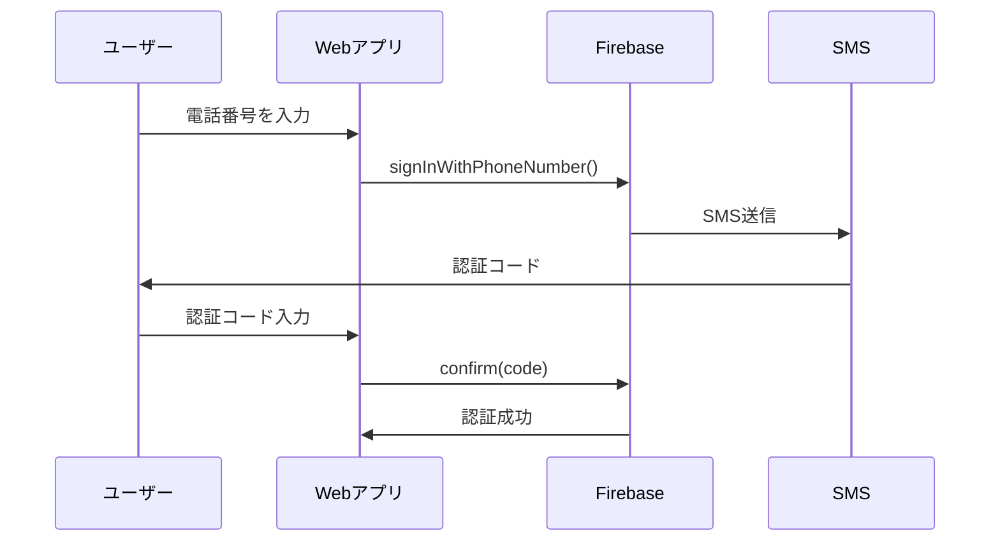

# Firebase電話番号認証完全ガイド：signInWithPhoneNumberとlinkWithCredentialの使い方

Webアプリケーションでユーザー認証を実装する際、電話番号を使った認証は非常に重要な選択肢の一つです。FirebaseのAuthentication機能を使えば、SMS認証を簡単に実装できますが、`signInWithPhoneNumber`と`linkWithCredential`の使い分けに迷う初心者エンジニアも多いのではないでしょうか。

この記事では、Firebase電話番号認証の基本から、実際のコード例、よくあるユースケースまで詳しく解説します。

## 前提条件

この記事のコード例を試すには、以下の準備が必要です：

1. **Firebaseプロジェクトの作成**
   - [Firebase Console](https://console.firebase.google.com/)でプロジェクトを作成
   - Webアプリの登録とFirebase SDKの設定

2. **電話番号認証の有効化**
   - Firebase Console > Authentication > Sign-in method
   - 「電話」プロバイダーを有効化

3. **ドメインの承認**（本番環境の場合）
   - Authentication > Settings > 承認済みドメイン
   - アプリのドメインを追加

詳細な設定手順は[Firebase公式ドキュメント](https://firebase.google.com/docs/web/setup)を参照してください。

## この記事で学べること

- ✅ **Firebase電話番号認証の基本概念と仕組み**
- ✅ **`signInWithPhoneNumber`の詳細な使い方**
- ✅ **`linkWithCredential`でアカウント連携する方法**
- ✅ **`PhoneAuthProvider.credential`の役割と重要性**
- ✅ **実際の開発現場でよくあるユースケースとコード例**

## Firebase電話番号認証とは

Firebase Authenticationは、Googleが提供する認証サービスで、メール、パスワード、SNSログイン、電話番号など様々な認証方法をサポートしています。

電話番号認証について詳しくは、[Firebase公式ドキュメント - 電話番号認証](https://firebase.google.com/docs/auth/web/phone-auth)をご覧ください。

### 電話番号認証の仕組み



1. ユーザーが電話番号を入力
2. Firebase が SMS で認証コードを送信
3. ユーザーが認証コードを入力
4. Firebase が認証を完了

## 基本概念：FirebaseのCredential（認証情報）システム

Firebase認証を理解する上で重要なのが**Credential（認証情報）**の概念です。

### Credentialとは

Credentialは「この人が本当にその認証方法の持ち主である」という証明書のような役割を果たします。

```javascript
// 各認証プロバイダーごとにCredentialを作成
const googleCredential = GoogleAuthProvider.credential(idToken, accessToken);
const githubCredential = GithubAuthProvider.credential(accessToken);
const phoneCredential = PhoneAuthProvider.credential(verificationId, smsCode);
```

### 電話番号認証でのCredential

電話番号認証では、以下の2つの要素でCredentialを作成します：

- **verificationId**: Firebase が SMS 送信時に発行する一時的なID
- **smsCode**: ユーザーが受信した6桁の認証コード

## signInWithPhoneNumber：電話番号でサインイン

`signInWithPhoneNumber`は、電話番号を使って新規ユーザー登録または既存ユーザーのサインインを行う関数です。

### 基本的な実装

```javascript
import { getAuth, signInWithPhoneNumber, RecaptchaVerifier } from "firebase/auth";

const auth = getAuth();

// 1. reCAPTCHA の初期化
const initializeRecaptcha = () => {
  window.recaptchaVerifier = new RecaptchaVerifier(auth, 'recaptcha-container', {
    'size': 'normal',
    'callback': (response) => {
      console.log('reCAPTCHA solved');
    },
    'expired-callback': () => {
      console.log('reCAPTCHA expired');
    }
  });
};

// 2. 電話番号認証の開始
const sendSMSCode = async (phoneNumber) => {
  try {
    // reCAPTCHA初期化
    if (!window.recaptchaVerifier) {
      initializeRecaptcha();
    }

    // SMS送信
    const confirmationResult = await signInWithPhoneNumber(
      auth, 
      phoneNumber, 
      window.recaptchaVerifier
    );
    
    // confirmationResultを保存（後で認証コード確認に使用）
    window.confirmationResult = confirmationResult;
    
    console.log('SMS sent successfully');
    return true;
  } catch (error) {
    console.error('SMS送信エラー:', error);
    return false;
  }
};

// 3. 認証コードの確認
const confirmSMSCode = async (code) => {
  try {
    if (!window.confirmationResult) {
      throw new Error('SMS確認プロセスが開始されていません');
    }

    const result = await window.confirmationResult.confirm(code);
    const user = result.user;
    
    console.log('認証成功:', user);
    return user;
  } catch (error) {
    console.error('認証コード確認エラー:', error);
    return null;
  }
};

// 使用例
const handlePhoneSignIn = async () => {
  const phoneNumber = '+819012345678'; // 国際形式で指定
  
  // SMS送信
  const smsSent = await sendSMSCode(phoneNumber);
  
  if (smsSent) {
    // ユーザーからの入力を待つ
    const code = prompt('SMSで送信された認証コードを入力してください:');
    
    // 認証コード確認
    const user = await confirmSMSCode(code);
    
    if (user) {
      alert('サインイン成功！');
    }
  }
};

// 注意：実際のアプリケーションでは、window.confirmationResultのような
// グローバル変数ではなく、ReactのuseStateやVueのrefなど、
// フレームワークが提供する状態管理を使用することを推奨します。
```

### HTMLテンプレート例

```html
<!DOCTYPE html>
<html>
<head>
    <title>Firebase電話番号認証</title>
</head>
<body>
    <div>
        <h2>電話番号でサインイン</h2>
        <input type="tel" id="phone-number" placeholder="+819012345678">
        <button onclick="sendSMS()">SMS送信</button>
    </div>
    
    <div id="sms-code-section" style="display:none;">
        <h3>認証コードを入力</h3>
        <input type="text" id="sms-code" placeholder="123456">
        <button onclick="confirmCode()">認証</button>
    </div>
    
    <!-- reCAPTCHA用のコンテナ -->
    <div id="recaptcha-container"></div>

    <script type="module">
        // ここに上記のJavaScriptコードを配置
        
        // グローバル関数の定義
        window.sendSMS = async () => {
            const phoneNumber = document.getElementById('phone-number').value;
            const success = await sendSMSCode(phoneNumber);
            
            if (success) {
                document.getElementById('sms-code-section').style.display = 'block';
            }
        };

        window.confirmCode = async () => {
            const code = document.getElementById('sms-code').value;
            const user = await confirmSMSCode(code);
            
            if (user) {
                alert(`サインイン成功: ${user.phoneNumber}`);
            }
        };
    </script>
</body>
</html>
```

## linkWithCredential：既存アカウントに電話番号を追加

`linkWithCredential`は、既にサインイン済みのユーザーアカウントに別の認証方法を追加する際に使用します。

アカウントの連携について詳しくは、[Firebase公式ドキュメント - アカウントのリンク](https://firebase.google.com/docs/auth/web/account-linking)をご覧ください。

### 使用ケース

- Googleアカウントで登録したユーザーに電話番号認証を追加
- メール＋パスワードで登録したユーザーに電話番号認証を追加
- セキュリティ強化のための多要素認証

### 基本的な実装

```javascript
import { 
  getAuth, 
  linkWithCredential, 
  PhoneAuthProvider,
  signInWithPhoneNumber 
} from "firebase/auth";

const auth = getAuth();

// 1. 既存ユーザーに電話番号を追加する関数
const linkPhoneNumber = async (phoneNumber) => {
  try {
    // 現在ログイン中のユーザーを取得
    const currentUser = auth.currentUser;
    
    if (!currentUser) {
      throw new Error('ユーザーがサインインしていません');
    }

    // reCAPTCHA初期化（前の例と同じ）
    if (!window.recaptchaVerifier) {
      initializeRecaptcha();
    }

    // SMS送信（電話番号認証の開始）
    const confirmationResult = await signInWithPhoneNumber(
      auth, 
      phoneNumber, 
      window.recaptchaVerifier
    );

    // ユーザーからSMSコードの入力を受ける
    const smsCode = prompt('SMSで受信した認証コードを入力してください:');

    // PhoneAuthProvider.credentialでCredentialを作成
    const phoneCredential = PhoneAuthProvider.credential(
      confirmationResult.verificationId,
      smsCode
    );

    // 既存アカウントにCredentialをリンク
    const result = await linkWithCredential(currentUser, phoneCredential);
    
    console.log('電話番号の追加成功:', result.user);
    return result.user;

  } catch (error) {
    console.error('電話番号追加エラー:', error);
    
    // よくあるエラーハンドリング
    if (error.code === 'auth/credential-already-in-use') {
      alert('この電話番号は既に他のアカウントで使用されています');
    } else if (error.code === 'auth/invalid-verification-code') {
      alert('認証コードが正しくありません');
    }
    
    return null;
  }
};

// 2. 実際の使用例
const handleAddPhoneNumber = async () => {
  // 現在のユーザー情報を表示
  const currentUser = auth.currentUser;
  if (!currentUser) {
    alert('先にサインインしてください');
    return;
  }

  console.log('現在のユーザー:', {
    uid: currentUser.uid,
    email: currentUser.email,
    phoneNumber: currentUser.phoneNumber,
    providers: currentUser.providerData.map(p => p.providerId)
  });

  // 電話番号追加
  const phoneNumber = prompt('追加する電話番号を入力してください（例: +819012345678）:');
  
  if (phoneNumber) {
    const updatedUser = await linkPhoneNumber(phoneNumber);
    
    if (updatedUser) {
      alert('電話番号の追加が完了しました！');
      
      // 更新後のユーザー情報を表示
      console.log('更新後のユーザー:', {
        uid: updatedUser.uid,
        email: updatedUser.email,
        phoneNumber: updatedUser.phoneNumber,
        providers: updatedUser.providerData.map(p => p.providerId)
      });
    }
  }
};
```

## PhoneAuthProvider.credentialの詳細解説

`PhoneAuthProvider.credential`は、電話番号認証において最も重要な関数の一つです。この関数の役割と仕組みを詳しく見てみましょう。

### なぜCredentialが必要なのか？

Firebase認証システムは、様々な認証プロバイダー（Google、GitHub、Phone等）を統一的に扱うため、それぞれの認証情報を**Credential**という標準形式に変換する必要があります。

```javascript
// 各プロバイダーの認証情報を統一形式に変換
const googleCredential = GoogleAuthProvider.credential(idToken, accessToken);
const phoneCredential = PhoneAuthProvider.credential(verificationId, smsCode);

// どのCredentialも同じように使える
await signInWithCredential(auth, googleCredential);
await signInWithCredential(auth, phoneCredential);
```

### PhoneAuthProvider.credentialの動作原理

```javascript
// PhoneAuthProvider.credentialの使用例
const createPhoneCredential = (confirmationResult, userInputCode) => {
  // confirmationResult.verificationId: Firebase内部で生成される一意のID
  // userInputCode: ユーザーがSMSで受信した6桁のコード
  
  const credential = PhoneAuthProvider.credential(
    confirmationResult.verificationId,
    userInputCode
  );
  
  // このCredentialには以下の情報が含まれる
  console.log('Credential情報:', {
    providerId: credential.providerId,        // 'phone'
    signInMethod: credential.signInMethod     // 'phone'
  });
  
  return credential;
};
```

### verificationIdとは

`verificationId`は、Firebase が SMS 送信時に内部で生成する一意のIDです：

```javascript
// SMS送信時の内部的な流れ
const sendSMSInternally = async (phoneNumber) => {
  // 1. Firebaseが電話番号を検証
  // 2. SMS送信準備
  // 3. 一意のverificationIdを生成
  const verificationId = 'AMbdDl7...' // 実際は長い文字列
  
  // 4. SMSを送信
  // 5. confirmationResultとしてverificationIdを含む結果を返す
  return {
    verificationId: verificationId,
    confirm: async (code) => {
      // ここでPhoneAuthProvider.credentialが内部的に呼ばれる
      const credential = PhoneAuthProvider.credential(verificationId, code);
      return await signInWithCredential(auth, credential);
    }
  };
};
```

### 手動でCredentialを作成するパターン

```javascript
// 手動でCredentialを作成して使用する例
const manualPhoneAuth = async (phoneNumber, smsCode) => {
  try {
    // Step 1: SMS送信
    const confirmationResult = await signInWithPhoneNumber(
      auth, 
      phoneNumber, 
      recaptchaVerifier
    );
    
    // Step 2: 手動でCredentialを作成
    const phoneCredential = PhoneAuthProvider.credential(
      confirmationResult.verificationId,
      smsCode
    );
    
    // Step 3a: 新規サインインの場合
    const signInResult = await signInWithCredential(auth, phoneCredential);
    console.log('サインイン成功:', signInResult.user);
    
    // Step 3b: または、既存アカウントへのリンクの場合
    // const linkResult = await linkWithCredential(auth.currentUser, phoneCredential);
    // console.log('リンク成功:', linkResult.user);
    
  } catch (error) {
    console.error('認証エラー:', error);
  }
};
```

## 実践的なユースケース

### ケース1：電話番号のみでの認証システム

```javascript
// 電話番号専用認証システムの実装
class PhoneOnlyAuth {
  constructor() {
    this.auth = getAuth();
    this.setupRecaptcha();
  }

  setupRecaptcha() {
    this.recaptchaVerifier = new RecaptchaVerifier(this.auth, 'recaptcha-container', {
      'size': 'invisible', // 見えないreCAPTCHA
      'callback': () => console.log('reCAPTCHA solved')
    });
  }

  async signInWithPhone(phoneNumber) {
    try {
      const confirmationResult = await signInWithPhoneNumber(
        this.auth,
        phoneNumber,
        this.recaptchaVerifier
      );

      // 認証結果を保存
      this.pendingConfirmation = confirmationResult;
      return true;
    } catch (error) {
      console.error('電話番号認証開始エラー:', error);
      return false;
    }
  }

  async confirmCode(code) {
    try {
      if (!this.pendingConfirmation) {
        throw new Error('認証プロセスが開始されていません');
      }

      const result = await this.pendingConfirmation.confirm(code);
      const user = result.user;

      // 新規ユーザーの場合の追加処理
      if (result.additionalUserInfo?.isNewUser) {
        await this.setupNewUser(user);
      }

      return user;
    } catch (error) {
      console.error('認証コード確認エラー:', error);
      return null;
    }
  }

  async setupNewUser(user) {
    // 新規ユーザーのプロフィール設定
    try {
      await user.updateProfile({
        displayName: `User_${user.phoneNumber?.slice(-4) || 'Unknown'}`
      });
      console.log('新規ユーザーのセットアップ完了');
    } catch (error) {
      console.error('新規ユーザーセットアップエラー:', error);
    }
  }
}

// 使用例
const phoneAuth = new PhoneOnlyAuth();

// サインインフロー
document.getElementById('send-sms').addEventListener('click', async () => {
  const phoneNumber = document.getElementById('phone-input').value;
  const success = await phoneAuth.signInWithPhone(phoneNumber);
  
  if (success) {
    document.getElementById('code-section').style.display = 'block';
  }
});

document.getElementById('confirm-code').addEventListener('click', async () => {
  const code = document.getElementById('code-input').value;
  const user = await phoneAuth.confirmCode(code);
  
  if (user) {
    window.location.href = '/dashboard';
  }
});
```

### ケース2：マルチプロバイダー認証システム

```javascript
// 複数の認証方法をサポートするシステム
class MultiProviderAuth {
  constructor() {
    this.auth = getAuth();
    this.currentUser = null;
    
    // 認証状態の監視
    this.auth.onAuthStateChanged((user) => {
      this.currentUser = user;
      this.updateUI();
    });
  }

  // Googleサインイン
  async signInWithGoogle() {
    try {
      const provider = new GoogleAuthProvider();
      const result = await signInWithPopup(this.auth, provider);
      return result.user;
    } catch (error) {
      console.error('Googleサインインエラー:', error);
      return null;
    }
  }

  // メール＋パスワードサインイン
  async signInWithEmail(email, password) {
    try {
      const result = await signInWithEmailAndPassword(this.auth, email, password);
      return result.user;
    } catch (error) {
      console.error('メールサインインエラー:', error);
      return null;
    }
  }

  // 既存アカウントに電話番号を追加
  async addPhoneToExistingAccount(phoneNumber) {
    if (!this.currentUser) {
      throw new Error('先にサインインしてください');
    }

    try {
      // 電話番号認証の開始
      const confirmationResult = await signInWithPhoneNumber(
        this.auth,
        phoneNumber,
        this.getRecaptchaVerifier()
      );

      return confirmationResult;
    } catch (error) {
      console.error('電話番号追加開始エラー:', error);
      throw error;
    }
  }

  async confirmPhoneLink(confirmationResult, code) {
    try {
      // Credentialを作成
      const phoneCredential = PhoneAuthProvider.credential(
        confirmationResult.verificationId,
        code
      );

      // 既存アカウントにリンク
      const result = await linkWithCredential(this.currentUser, phoneCredential);
      return result.user;
    } catch (error) {
      console.error('電話番号リンクエラー:', error);
      throw error;
    }
  }

  // 認証プロバイダーの一覧を取得
  getLinkedProviders() {
    if (!this.currentUser) return [];
    
    return this.currentUser.providerData.map(provider => ({
      providerId: provider.providerId,
      email: provider.email,
      phoneNumber: provider.phoneNumber
    }));
  }

  getRecaptchaVerifier() {
    if (!this.recaptchaVerifier) {
      this.recaptchaVerifier = new RecaptchaVerifier(this.auth, 'recaptcha-container', {
        'size': 'normal'
      });
    }
    return this.recaptchaVerifier;
  }

  updateUI() {
    const userInfo = document.getElementById('user-info');
    const authButtons = document.getElementById('auth-buttons');
    
    if (this.currentUser) {
      userInfo.innerHTML = `
        <h3>サインイン済み</h3>
        <p>UID: ${this.currentUser.uid}</p>
        <p>メール: ${this.currentUser.email || 'なし'}</p>
        <p>電話番号: ${this.currentUser.phoneNumber || 'なし'}</p>
        <h4>連携済みプロバイダー:</h4>
        <ul>
          ${this.getLinkedProviders().map(provider => 
            `<li>${provider.providerId}: ${provider.email || provider.phoneNumber || 'データなし'}</li>`
          ).join('')}
        </ul>
      `;
      authButtons.style.display = 'none';
    } else {
      userInfo.innerHTML = '<p>サインインしていません</p>';
      authButtons.style.display = 'block';
    }
  }
}

// 使用例
const multiAuth = new MultiProviderAuth();

// Googleサインイン
document.getElementById('google-signin').addEventListener('click', async () => {
  await multiAuth.signInWithGoogle();
});

// 電話番号追加
document.getElementById('add-phone').addEventListener('click', async () => {
  const phoneNumber = prompt('電話番号を入力:');
  
  try {
    const confirmationResult = await multiAuth.addPhoneToExistingAccount(phoneNumber);
    const code = prompt('SMSコードを入力:');
    
    const user = await multiAuth.confirmPhoneLink(confirmationResult, code);
    alert('電話番号の追加が完了しました！');
  } catch (error) {
    alert('エラーが発生しました: ' + error.message);
  }
});
```

## テスト環境での開発

### テスト用電話番号の設定

開発中に実際のSMSを送信せずにテストを行うには、Firebase Consoleでテスト用電話番号を設定できます：

1. Firebase Console > Authentication > Sign-in method
2. 「電話」プロバイダーの設定画面で「テスト用の電話番号」を追加
3. 電話番号と固定の認証コードを設定

```javascript
// テスト用電話番号の例
const testPhoneNumbers = {
  '+81901234567': '123456',  // テスト用番号：固定コード
  '+81987654321': '654321'   // テスト用番号：固定コード
};

// 開発環境では、これらの番号を使用すると実際のSMS送信なしで認証をテストできます
const handleTestAuth = async () => {
  const testPhone = '+81901234567';
  const testCode = '123456';
  
  try {
    const confirmationResult = await signInWithPhoneNumber(auth, testPhone, recaptchaVerifier);
    const result = await confirmationResult.confirm(testCode);
    console.log('テスト認証成功:', result.user);
  } catch (error) {
    console.error('テスト認証エラー:', error);
  }
};
```

## エラーハンドリングとベストプラクティス

### よくあるエラーとその対処法

```javascript
// 包括的なエラーハンドリングの実装
const handlePhoneAuthError = (error) => {
  console.error('Firebase認証エラー:', error);
  
  switch (error.code) {
    case 'auth/invalid-phone-number':
      return '電話番号の形式が正しくありません。国番号を含めて入力してください。';
      
    case 'auth/missing-phone-number':
      return '電話番号が入力されていません。';
      
    case 'auth/quota-exceeded':
      return 'SMS送信の制限に達しました。しばらく時間をおいてからお試しください。';
      
    case 'auth/user-disabled':
      return 'このアカウントは無効化されています。';
      
    case 'auth/invalid-verification-code':
      return '認証コードが正しくありません。';
      
    case 'auth/code-expired':
      return '認証コードの有効期限が切れています。もう一度SMS送信からやり直してください。';
      
    case 'auth/credential-already-in-use':
      return 'この電話番号は既に他のアカウントで使用されています。';
      
    case 'auth/requires-recent-login':
      return 'セキュリティのため、再度サインインしてください。';
      
    case 'auth/provider-already-linked':
      return 'この認証プロバイダーは既にアカウントに連携されています。';
      
    case 'auth/captcha-check-failed':
      return 'reCAPTCHAの認証に失敗しました。ページを再読み込みしてお試しください。';
      
    default:
      return `認証エラーが発生しました: ${error.message}`;
  }
};

// 使用例
const safePhoneAuth = async (phoneNumber, code) => {
  try {
    const confirmationResult = await signInWithPhoneNumber(auth, phoneNumber, recaptchaVerifier);
    const result = await confirmationResult.confirm(code);
    return { success: true, user: result.user };
  } catch (error) {
    const userFriendlyMessage = handlePhoneAuthError(error);
    return { success: false, error: userFriendlyMessage };
  }
};
```

### セキュリティ考慮事項

```javascript
// セキュリティを考慮した実装例
class SecurePhoneAuth {
  constructor() {
    this.auth = getAuth();
    this.maxRetries = 3;
    this.retryCount = 0;
    this.lastSMSSent = null;
    this.rateLimitDelay = 60000; // 1分
  }

  // レート制限チェック
  canSendSMS() {
    if (!this.lastSMSSent) return true;
    
    const timeSinceLastSMS = Date.now() - this.lastSMSSent;
    return timeSinceLastSMS >= this.rateLimitDelay;
  }

  // 電話番号の形式チェック
  validatePhoneNumber(phoneNumber) {
    // 国際形式かチェック
    const phoneRegex = /^\+[1-9]\d{1,14}$/;
    return phoneRegex.test(phoneNumber);
  }

  async sendSMS(phoneNumber) {
    // 入力値検証
    if (!this.validatePhoneNumber(phoneNumber)) {
      throw new Error('電話番号は国際形式（+81...）で入力してください');
    }

    // レート制限チェック
    if (!this.canSendSMS()) {
      const remainingTime = Math.ceil((this.rateLimitDelay - (Date.now() - this.lastSMSSent)) / 1000);
      throw new Error(`SMS送信は${remainingTime}秒後に可能です`);
    }

    try {
      const confirmationResult = await signInWithPhoneNumber(
        this.auth,
        phoneNumber,
        this.getRecaptchaVerifier()
      );

      this.lastSMSSent = Date.now();
      this.retryCount = 0;
      
      return confirmationResult;
    } catch (error) {
      console.error('SMS送信エラー:', error);
      throw error;
    }
  }

  async confirmCode(confirmationResult, code) {
    // リトライ制限チェック
    if (this.retryCount >= this.maxRetries) {
      throw new Error('認証試行回数の上限に達しました。最初からやり直してください。');
    }

    try {
      const result = await confirmationResult.confirm(code);
      this.retryCount = 0; // 成功時にリセット
      return result;
    } catch (error) {
      this.retryCount++;
      
      if (error.code === 'auth/invalid-verification-code') {
        const remainingTries = this.maxRetries - this.retryCount;
        if (remainingTries > 0) {
          throw new Error(`認証コードが正しくありません。残り${remainingTries}回試行可能です。`);
        }
      }
      
      throw error;
    }
  }

  getRecaptchaVerifier() {
    if (!this.recaptchaVerifier) {
      this.recaptchaVerifier = new RecaptchaVerifier(this.auth, 'recaptcha-container', {
        'size': 'normal',
        'callback': () => {
          console.log('reCAPTCHA認証完了');
        },
        'expired-callback': () => {
          console.log('reCAPTCHA期限切れ');
          this.recaptchaVerifier = null; // 再作成を促す
        }
      });
    }
    return this.recaptchaVerifier;
  }
}
```

## パフォーマンス最適化

### reCAPTCHAの効率的な管理

```javascript
// reCAPTCHAを効率的に管理するクラス
class RecaptchaManager {
  constructor(auth) {
    this.auth = auth;
    this.verifier = null;
    this.isRendered = false;
  }

  getVerifier() {
    if (!this.verifier || this.verifier.destroyed) {
      this.createVerifier();
    }
    return this.verifier;
  }

  createVerifier() {
    this.verifier = new RecaptchaVerifier(this.auth, 'recaptcha-container', {
      'size': 'invisible', // UIを邪魔しない - UX改善のため
      'callback': () => {
        console.log('reCAPTCHA solved');
      },
      'expired-callback': () => {
        console.log('reCAPTCHA expired, recreating...');
        this.cleanup();
        this.createVerifier();
      }
    });
  }

  cleanup() {
    if (this.verifier) {
      this.verifier.clear();
      this.verifier = null;
      this.isRendered = false;
    }
  }

  // コンポーネントのアンマウント時に呼ぶ
  destroy() {
    this.cleanup();
  }
}

// React での使用例
const useFirebasePhoneAuth = () => {
  const [auth] = useState(() => getAuth());
  const [recaptchaManager] = useState(() => new RecaptchaManager(auth));

  useEffect(() => {
    // コンポーネントのクリーンアップ
    return () => {
      recaptchaManager.destroy();
    };
  }, [recaptchaManager]);

  const signInWithPhone = async (phoneNumber) => {
    try {
      const verifier = recaptchaManager.getVerifier();
      const confirmationResult = await signInWithPhoneNumber(auth, phoneNumber, verifier);
      return confirmationResult;
    } catch (error) {
      console.error('Phone auth error:', error);
      throw error;
    }
  };

  return { signInWithPhone };
};
```

## テストとデバッグ

### テスト環境での設定

```javascript
// テスト用の電話番号認証設定
const setupTestPhoneAuth = () => {
  // テスト環境でのみ有効
  if (process.env.NODE_ENV === 'test') {
    const auth = getAuth();
    
    // テスト用の電話番号を設定
    auth.settings.appVerificationDisabledForTesting = true;
    
    // テスト用電話番号の設定
    const testPhoneNumbers = {
      '+819012345678': '123456',
      '+819087654321': '654321'
    };

    // Firebase Admin SDKでテスト用設定
    Object.entries(testPhoneNumbers).forEach(([phoneNumber, code]) => {
      auth.settings.setAutoRetrievalSMSCode(phoneNumber, code);
    });
  }
};

// Jest でのテスト例
describe('Firebase電話番号認証', () => {
  beforeEach(() => {
    setupTestPhoneAuth();
  });

  test('電話番号認証が正常に動作する', async () => {
    const auth = getAuth();
    const testPhone = '+819012345678';
    const testCode = '123456';

    // モックreCAPTCHA
    const mockRecaptcha = {
      verify: jest.fn().mockResolvedValue('mock-token')
    };

    const confirmationResult = await signInWithPhoneNumber(auth, testPhone, mockRecaptcha);
    const result = await confirmationResult.confirm(testCode);

    expect(result.user).toBeDefined();
    expect(result.user.phoneNumber).toBe(testPhone);
  });
});
```

## まとめ

### 重要なポイント

1. **`signInWithPhoneNumber`**: 新規サインインや既存ユーザーの認証に使用
2. **`linkWithCredential`**: 既存アカウントに電話番号認証を追加する際に使用
3. **`PhoneAuthProvider.credential`**: SMS認証コードからFirebase Credentialを作成する重要な橋渡し役
4. **セキュリティ考慮**: レート制限、入力値検証、エラーハンドリングを適切に実装

### ベストプラクティス

- ✅ **適切なエラーハンドリング**を実装する
- ✅ **reCAPTCHA**を適切に管理し、リークを防ぐ  
- ✅ **レート制限**を設けてスパムを防ぐ
- ✅ **電話番号の形式検証**を行う
- ✅ **テスト環境での設定**を適切に行う
- ✅ **状態管理のベストプラクティス**：本番アプリケーションではグローバル変数ではなく、適切な状態管理を使用する
- ✅ **Invisible reCAPTCHA**の採用でUX改善を図る

### 次のステップ

- 実際のアプリケーションに電話番号認証を実装してみる
- マルチファクタ認証（MFA）の実装を検討する
- Firebase Admin SDKを使った管理機能の実装を学ぶ
- セキュリティルールの設定を学習する

Firebase電話番号認証をマスターして、より安全で使いやすいWebアプリケーションを作りましょう！

## 参考リンク

### Firebase公式ドキュメント
- [Firebase Authentication 公式ドキュメント](https://firebase.google.com/docs/auth)
- [Firebase JavaScript SDK - 電話番号認証](https://firebase.google.com/docs/auth/web/phone-auth)
- [FirebaseをJavaScriptプロジェクトに追加する](https://firebase.google.com/docs/web/setup)
- [ユーザー アカウントのリンク](https://firebase.google.com/docs/auth/web/account-linking)
- [Firebase セキュリティルール](https://firebase.google.com/docs/rules)
- [Firebase Admin SDK](https://firebase.google.com/docs/admin/setup)

### 関連技術
- [reCAPTCHA v3 ドキュメント](https://developers.google.com/recaptcha/docs/v3)
- [国際電話番号フォーマット (E.164)](https://en.wikipedia.org/wiki/E.164)