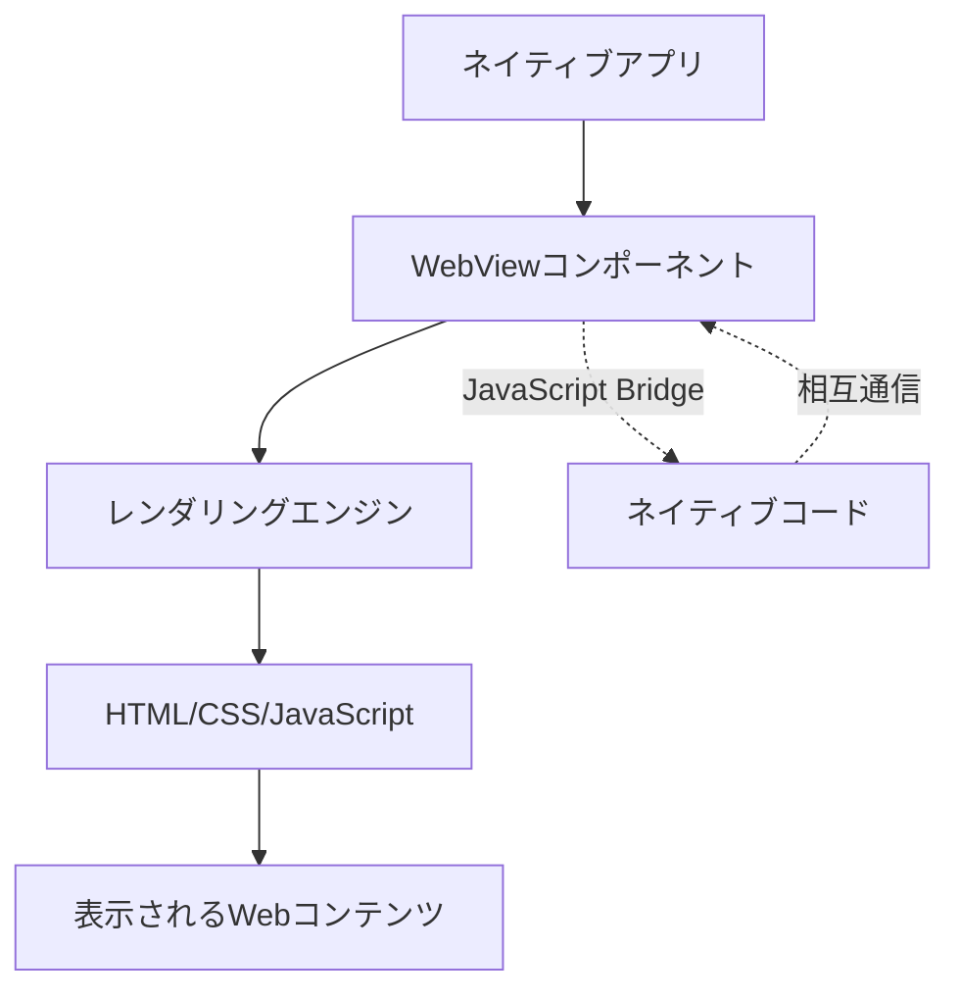

# WebView完全ガイド：アプリ開発でWebViewを採用するメリット・デメリット

モバイルアプリ開発において、「WebView」という言葉を聞いたことがあるでしょうか？WebViewは、ネイティブアプリの中でWebコンテンツを表示するための重要な技術です。しかし、初心者エンジニアにとっては「そもそもWebViewって何？」「どんな時に使うの？」という疑問が浮かぶかもしれません。

この記事では、WebViewの基本概念から実装方法、そしてアプリ開発でWebViewを採用するメリット・デメリットまで、初心者エンジニアにも分かりやすく解説します。

## この記事で学べること

- ✅ **WebViewの基本概念と仕組み**
- ✅ **WebView採用のメリット・デメリット**
- ✅ **各プラットフォームでの実装方法**
- ✅ **パフォーマンス最適化とセキュリティ対策**
- ✅ **実際のアプリでの活用例と選択基準**

## WebViewとは何か？

### WebViewの定義

**WebView**とは、ネイティブアプリケーションの中にWebブラウザの機能を組み込んで、HTMLやCSS、JavaScriptで作られたWebコンテンツを表示できるコンポーネントのことです。

簡単に言うと、「アプリの中に小さなブラウザを埋め込む技術」と考えることができます。

### 分かりやすい例え

WebViewを理解するために、以下のような例えを考えてみましょう：

```
通常のアプリ = テレビ番組
WebView = テレビの中で流れるCM

テレビ番組（ネイティブアプリ）の途中で、
別の制作会社が作ったCM（Webコンテンツ）が流れるイメージです。
```

### WebViewの仕組み



WebViewは以下の要素で構成されています：

1. **レンダリングエンジン**：HTMLやCSSを解析して画面に描画
2. **JavaScriptエンジン**：JavaScriptコードを実行
3. **ブリッジ機能**：ネイティブコードとJavaScriptの相互通信

## ネイティブアプリ vs Webアプリ vs ハイブリッドアプリ

WebViewの位置づけを理解するために、アプリの種類を整理しましょう：

| 種類 | 説明 | 技術 | WebView使用 |
|------|------|------|-------------|
| **ネイティブアプリ** | プラットフォーム専用言語で開発 | Swift(iOS)、Kotlin(Android) | 部分的に使用可能 |
| **Webアプリ** | ブラウザで動作するアプリ | HTML、CSS、JavaScript | 使用しない |
| **ハイブリッドアプリ** | WebViewを主体としたアプリ | Cordova、Ionic | 全体的に使用 |
| **クロスプラットフォーム** | 一つのコードで複数OS対応 | React Native、Flutter | 部分的に使用可能 |

## WebView採用のメリット

### 1. 開発効率の大幅な向上

```javascript
// 例：同じWebコンテンツを複数のプラットフォームで使用
// Web、iOS、Android すべてで同じHTMLコードが動作

const sharedWebContent = `
<!DOCTYPE html>
<html>
<head>
    <title>共通コンテンツ</title>
    <style>
        body { font-family: sans-serif; padding: 20px; }
        .button { background: #007AFF; color: white; padding: 10px; }
    </style>
</head>
<body>
    <h1>このコンテンツはすべてのプラットフォームで共通です</h1>
    <button class="button" onclick="handleClick()">クリック</button>
    <script>
        function handleClick() {
            alert('どのプラットフォームでも同じ動作をします');
        }
    </script>
</body>
</html>
`;
```

**メリット**：
- 一度の開発で複数プラットフォーム対応
- Web開発の知識をそのまま活用可能
- 開発チームの学習コスト削減

### 2. コンテンツ更新の柔軟性

```javascript
// アプリストアの審査なしで更新可能
class ContentManager {
    constructor() {
        this.contentUrl = 'https://example.com/app-content/';
    }
    
    // サーバー側でコンテンツを更新すれば、
    // アプリ側は自動的に最新のコンテンツを表示
    loadLatestContent() {
        return fetch(this.contentUrl + 'latest.html')
            .then(response => response.text())
            .then(html => {
                // WebViewに最新のHTMLを表示
                webView.loadHTML(html);
            });
    }
    
    // A/Bテストも簡単に実施可能
    loadABTestContent(variant) {
        const url = `${this.contentUrl}variant-${variant}.html`;
        webView.loadUrl(url);
    }
}
```

**メリット**：
- アプリの再配布なしでコンテンツ更新
- リアルタイムでのバグ修正
- A/Bテストの柔軟な実施

### 3. 既存Webアセットの活用

```javascript
// 既存のWebサイトやWebアプリをそのまま活用
const existingWebServices = {
    // ECサイトの商品ページ
    productPage: 'https://shop.example.com/products/',
    
    // ブログ記事
    blogContent: 'https://blog.example.com/articles/',
    
    // ヘルプセンター
    helpCenter: 'https://help.example.com/',
    
    // 決済システム
    paymentGateway: 'https://payment.example.com/checkout/'
};

// アプリ内で既存のWebサービスを表示
function showExistingWebContent(service, id) {
    const url = existingWebServices[service] + id;
    webView.loadUrl(url);
}
```

**メリット**：
- 既存のWeb資産を無駄にしない
- 開発期間の大幅短縮
- Webとアプリで統一された体験

### 4. クロスプラットフォーム対応

```javascript
// 一つのHTMLコードが複数のプラットフォームで動作
class CrossPlatformWebView {
    constructor() {
        this.platform = this.detectPlatform();
    }
    
    detectPlatform() {
        if (typeof Android !== 'undefined') return 'android';
        if (window.webkit && window.webkit.messageHandlers) return 'ios';
        if (window.ReactNativeWebView) return 'react-native';
        return 'web';
    }
    
    // プラットフォーム共通のコード
    showContent(html) {
        // iOS、Android、React Native すべてで動作
        document.body.innerHTML = html;
    }
    
    // プラットフォーム固有の処理も可能
    sendMessageToNative(message) {
        switch(this.platform) {
            case 'android':
                Android.receiveMessage(message);
                break;
            case 'ios':
                window.webkit.messageHandlers.native.postMessage(message);
                break;
            case 'react-native':
                window.ReactNativeWebView.postMessage(message);
                break;
        }
    }
}
```

### 5. コスト削減

| 項目 | ネイティブ開発 | WebView活用 | 削減率 |
|------|----------------|-------------|--------|
| 開発人員 | iOS + Android 各2名 | Web開発者 2名 | 50% |
| 開発期間 | 6ヶ月 | 3ヶ月 | 50% |
| メンテナンス | 2つのコードベース | 1つのコードベース | 50% |
| テスト工数 | 各プラットフォーム個別 | 主にWeb側のテスト | 40% |

## WebView採用のデメリット

### 1. パフォーマンスの課題

```javascript
// パフォーマンス比較の例
class PerformanceComparison {
    // ネイティブ実装（高速）
    nativeListRendering(items) {
        // ネイティブのUITableView/RecyclerViewは
        // 仮想スクロールで効率的に描画
        // 1000件のアイテムでも60fps維持可能
    }
    
    // WebView実装（やや遅い）
    webViewListRendering(items) {
        // DOMの操作はコストが高い
        const html = items.map(item => `
            <div class="list-item">
                
                <h3>${item.title}</h3>
                <p>${item.description}</p>
            </div>
        `).join('');
        
        // 大量のDOM要素でパフォーマンス低下
        // 100件を超えるとスクロールがカクつく可能性
        document.getElementById('list').innerHTML = html;
    }
}

// パフォーマンス測定例
console.time('WebView rendering');
webView.loadHtml(largeHtmlContent); // 約500ms
console.timeEnd('WebView rendering');

console.time('Native rendering');
nativeView.setData(largeDataSet);   // 約50ms
console.timeEnd('Native rendering');
```

**デメリット**：
- アニメーションの滑らかさが劣る
- 起動時間が長い
- メモリ使用量が多い
- バッテリー消費が増える

### 2. ユーザー体験（UX）の制約

```javascript
// ネイティブUIとWebViewの違い
class UXComparison {
    // ネイティブUI：プラットフォーム標準の動作
    nativeUI() {
        // iOS: スワイプで戻る、慣性スクロール
        // Android: マテリアルデザインのアニメーション
        // プラットフォーム固有のジェスチャーが自然に動作
    }
    
    // WebView UI：制約がある
    webViewUI() {
        // スワイプジェスチャーの実装が困難
        document.addEventListener('touchstart', handleTouchStart);
        document.addEventListener('touchmove', handleTouchMove);
        // カスタム実装が必要で、ネイティブほど滑らかでない
        
        // プラットフォーム固有のUIコンポーネントが使えない
        // - iOS: UIPickerView, UIAlertController
        // - Android: BottomSheet, Snackbar
    }
}
```

**デメリット**：
- プラットフォーム標準のUI/UXから外れる
- ネイティブのジェスチャーが使えない
- アプリらしい操作感が失われる

### 3. デバッグの難しさ

```javascript
// デバッグの複雑さ
class DebuggingChallenges {
    // 問題1: エラーの原因特定が困難
    handleWebViewError(error) {
        // エラーがどこで発生したか分かりにくい
        console.error('WebView Error:', {
            message: error.message,
            // ネイティブ側のエラー？
            nativeStack: error.nativeStack,
            // JavaScript側のエラー？
            jsStack: error.jsStack,
            // 通信エラー？
            bridgeError: error.bridgeError
        });
    }
    
    // 問題2: 開発ツールの制限
    debuggingTools() {
        // Chrome DevToolsは使えるが制限あり
        // - ブレークポイントが効かない場合がある
        // - ネットワークタブが正確でない
        // - メモリプロファイリングが困難
    }
    
    // 問題3: プラットフォーム間の差異
    crossPlatformIssues() {
        // 同じコードでも動作が異なる
        if (isAndroid) {
            // Android WebViewの独自の問題
            // - バージョンによる挙動の違い
            // - メーカーごとのカスタマイズ
        } else if (isiOS) {
            // iOS WKWebViewの制限
            // - LocalStorageの制限
            // - Cookie の扱いが特殊
        }
    }
}
```

### 4. セキュリティリスク

```javascript
// セキュリティの脆弱性例
class SecurityRisks {
    // 危険: 信頼できないコンテンツの読み込み
    loadUnsafeContent(userInputUrl) {
        // ❌ 悪い例：ユーザー入力をそのまま使用
        webView.loadUrl(userInputUrl);
        // XSS攻撃やフィッシングサイトのリスク
    }
    
    // 危険: JavaScriptインジェクション
    executeUnsafeScript(userInput) {
        // ❌ 悪い例：サニタイズなしで実行
        webView.evaluateJavascript(`
            document.body.innerHTML = '${userInput}';
        `);
        // 悪意のあるスクリプトが実行される可能性
    }
    
    // 危険: 機密データの露出
    exposeSenitiveData() {
        // ❌ 悪い例：トークンをJavaScriptに渡す
        webView.evaluateJavascript(`
            window.authToken = '${secretToken}';
        `);
        // WebView内のすべてのスクリプトからアクセス可能に
    }
}

// セキュリティ対策の実装
class SecureWebView {
    constructor() {
        // ✅ 良い例：ホワイトリスト方式
        this.allowedDomains = [
            'https://app.example.com',
            'https://api.example.com'
        ];
    }
    
    loadSecureContent(url) {
        // URLの検証
        const urlObj = new URL(url);
        if (!this.allowedDomains.includes(urlObj.origin)) {
            throw new Error('Unauthorized domain');
        }
        
        // HTTPSの強制
        if (urlObj.protocol !== 'https:') {
            throw new Error('HTTPS required');
        }
        
        webView.loadUrl(url);
    }
}
```

### 5. プラットフォーム固有機能へのアクセス制限

```javascript
// ネイティブ機能へのアクセス制限
class PlatformLimitations {
    // WebViewから直接アクセスできない機能
    unavailableFeatures() {
        return [
            'Bluetooth',
            'NFC',
            'プッシュ通知（制限あり）',
            'バックグラウンド処理',
            'ウィジェット',
            'App Shortcuts',
            '生体認証（Face ID/Touch ID）',
            'ARKit/ARCore',
            'HealthKit/Google Fit'
        ];
    }
    
    // ブリッジ実装が必要な機能
    needsBridge() {
        // JavaScript側
        function requestCameraAccess() {
            // WebViewから直接カメラにアクセスできない
            window.nativeBridge.requestCamera();
        }
        
        // ネイティブ側（Android）
        /*
        @JavascriptInterface
        public void requestCamera() {
            // ネイティブのカメラAPIを使用
            Intent intent = new Intent(MediaStore.ACTION_IMAGE_CAPTURE);
            startActivityForResult(intent, REQUEST_CAMERA);
        }
        */
    }
}
```

## 各プラットフォームでの実装方法

### Android での WebView実装

```kotlin
// Android (Kotlin) での実装例
class WebViewActivity : AppCompatActivity() {
    private lateinit var webView: WebView
    
    override fun onCreate(savedInstanceState: Bundle?) {
        super.onCreate(savedInstanceState)
        setContentView(R.layout.activity_webview)
        
        webView = findViewById(R.id.webview)
        setupWebView()
        loadContent()
    }
    
    private fun setupWebView() {
        webView.settings.apply {
            // JavaScriptを有効化
            javaScriptEnabled = true
            
            // ローカルストレージを有効化
            domStorageEnabled = true
            
            // ズームを無効化
            setSupportZoom(false)
            
            // キャッシュ設定
            cacheMode = WebSettings.LOAD_DEFAULT
        }
        
        // WebViewClientの設定
        webView.webViewClient = object : WebViewClient() {
            override fun shouldOverrideUrlLoading(
                view: WebView?,
                request: WebResourceRequest?
            ): Boolean {
                // アプリ内でURLを開く
                return false
            }
            
            override fun onPageFinished(view: WebView?, url: String?) {
                super.onPageFinished(view, url)
                // ページ読み込み完了
                Log.d("WebView", "Page loaded: $url")
            }
            
            override fun onReceivedError(
                view: WebView?,
                request: WebResourceRequest?,
                error: WebResourceError?
            ) {
                super.onReceivedError(view, request, error)
                // エラーハンドリング
                showErrorPage()
            }
        }
        
        // JavaScriptインターフェースの追加
        webView.addJavascriptInterface(
            WebAppInterface(this),
            "AndroidBridge"
        )
    }
    
    private fun loadContent() {
        // URLを読み込む
        webView.loadUrl("https://example.com")
        
        // または、HTMLを直接読み込む
        val html = """
            <html>
            <body>
                <h1>Android WebView</h1>
                <button onclick="AndroidBridge.showToast('Hello from WebView')">
                    Show Toast
                </button>
            </body>
            </html>
        """.trimIndent()
        webView.loadData(html, "text/html", "UTF-8")
    }
    
    // JavaScriptから呼び出せるインターフェース
    inner class WebAppInterface(private val context: Context) {
        @JavascriptInterface
        fun showToast(message: String) {
            Toast.makeText(context, message, Toast.LENGTH_SHORT).show()
        }
        
        @JavascriptInterface
        fun getDeviceInfo(): String {
            return JSONObject().apply {
                put("platform", "Android")
                put("version", Build.VERSION.SDK_INT)
                put("model", Build.MODEL)
            }.toString()
        }
    }
    
    // 戻るボタンの処理
    override fun onBackPressed() {
        if (webView.canGoBack()) {
            webView.goBack()
        } else {
            super.onBackPressed()
        }
    }
}
```

**AndroidManifest.xml の設定：**
```xml
<!-- インターネット権限 -->
<uses-permission android:name="android.permission.INTERNET" />

<!-- ハードウェアアクセラレーションを有効化 -->
<application
    android:hardwareAccelerated="true"
    ...>
</application>
```

### iOS での WKWebView実装

```swift
// iOS (Swift) での実装例
import UIKit
import WebKit

class WebViewController: UIViewController {
    private var webView: WKWebView!
    private var progressView: UIProgressView!
    
    override func viewDidLoad() {
        super.viewDidLoad()
        setupWebView()
        setupProgressView()
        loadContent()
    }
    
    private func setupWebView() {
        // WKWebViewの設定
        let configuration = WKWebViewConfiguration()
        
        // JavaScriptの有効化
        configuration.preferences.javaScriptEnabled = true
        
        // メディア再生の設定
        configuration.allowsInlineMediaPlayback = true
        configuration.mediaTypesRequiringUserActionForPlayback = []
        
        // ユーザースクリプトの追加
        let userScript = WKUserScript(
            source: getInjectedJavaScript(),
            injectionTime: .atDocumentEnd,
            forMainFrameOnly: true
        )
        configuration.userContentController.addUserScript(userScript)
        
        // メッセージハンドラーの追加
        configuration.userContentController.add(
            self,
            name: "iosBridge"
        )
        
        // WebViewの作成
        webView = WKWebView(frame: view.bounds, configuration: configuration)
        webView.navigationDelegate = self
        webView.uiDelegate = self
        webView.autoresizingMask = [.flexibleWidth, .flexibleHeight]
        
        // KVO for プログレス監視
        webView.addObserver(
            self,
            forKeyPath: #keyPath(WKWebView.estimatedProgress),
            options: .new,
            context: nil
        )
        
        view.addSubview(webView)
    }
    
    private func setupProgressView() {
        progressView = UIProgressView(progressViewStyle: .default)
        progressView.translatesAutoresizingMaskIntoConstraints = false
        view.addSubview(progressView)
        
        NSLayoutConstraint.activate([
            progressView.leadingAnchor.constraint(equalTo: view.leadingAnchor),
            progressView.trailingAnchor.constraint(equalTo: view.trailingAnchor),
            progressView.topAnchor.constraint(
                equalTo: view.safeAreaLayoutGuide.topAnchor
            ),
            progressView.heightAnchor.constraint(equalToConstant: 2)
        ])
    }
    
    private func loadContent() {
        // URLを読み込む
        if let url = URL(string: "https://example.com") {
            let request = URLRequest(url: url)
            webView.load(request)
        }
        
        // または、ローカルHTMLを読み込む
        let html = """
        <html>
        <head>
            <meta name="viewport" content="width=device-width, initial-scale=1.0">
            <style>
                body { font-family: -apple-system; padding: 20px; }
                button { 
                    background: #007AFF; 
                    color: white; 
                    padding: 10px 20px;
                    border: none;
                    border-radius: 8px;
                }
            </style>
        </head>
        <body>
            <h1>iOS WKWebView</h1>
            <button onclick="sendToNative()">Send to Native</button>
            <script>
                function sendToNative() {
                    window.webkit.messageHandlers.iosBridge.postMessage({
                        action: 'showAlert',
                        message: 'Hello from WebView'
                    });
                }
            </script>
        </body>
        </html>
        """
        webView.loadHTMLString(html, baseURL: nil)
    }
    
    private func getInjectedJavaScript() -> String {
        return """
        // iOSデバイス情報を提供
        window.iosDevice = {
            platform: 'iOS',
            version: '\(UIDevice.current.systemVersion)',
            model: '\(UIDevice.current.model)'
        };
        """
    }
    
    // プログレス監視
    override func observeValue(
        forKeyPath keyPath: String?,
        of object: Any?,
        change: [NSKeyValueChangeKey : Any]?,
        context: UnsafeMutableRawPointer?
    ) {
        if keyPath == #keyPath(WKWebView.estimatedProgress) {
            progressView.progress = Float(webView.estimatedProgress)
            progressView.isHidden = webView.estimatedProgress >= 1.0
        }
    }
    
    deinit {
        webView.removeObserver(self, forKeyPath: #keyPath(WKWebView.estimatedProgress))
    }
}

// MARK: - WKNavigationDelegate
extension WebViewController: WKNavigationDelegate {
    func webView(
        _ webView: WKWebView,
        didFinish navigation: WKNavigation!
    ) {
        print("Page loaded: \(webView.url?.absoluteString ?? "")")
    }
    
    func webView(
        _ webView: WKWebView,
        didFail navigation: WKNavigation!,
        withError error: Error
    ) {
        print("Loading failed: \(error.localizedDescription)")
        showErrorAlert(error: error)
    }
    
    func webView(
        _ webView: WKWebView,
        decidePolicyFor navigationAction: WKNavigationAction,
        decisionHandler: @escaping (WKNavigationActionPolicy) -> Void
    ) {
        // URL制御
        if let url = navigationAction.request.url {
            if url.scheme == "tel" || url.scheme == "mailto" {
                UIApplication.shared.open(url)
                decisionHandler(.cancel)
                return
            }
        }
        decisionHandler(.allow)
    }
}

// MARK: - WKUIDelegate
extension WebViewController: WKUIDelegate {
    func webView(
        _ webView: WKWebView,
        runJavaScriptAlertPanelWithMessage message: String,
        initiatedByFrame frame: WKFrameInfo,
        completionHandler: @escaping () -> Void
    ) {
        let alert = UIAlertController(
            title: nil,
            message: message,
            preferredStyle: .alert
        )
        alert.addAction(UIAlertAction(title: "OK", style: .default) { _ in
            completionHandler()
        })
        present(alert, animated: true)
    }
}

// MARK: - WKScriptMessageHandler
extension WebViewController: WKScriptMessageHandler {
    func userContentController(
        _ userContentController: WKUserContentController,
        didReceive message: WKScriptMessage
    ) {
        guard message.name == "iosBridge" else { return }
        
        if let body = message.body as? [String: Any],
           let action = body["action"] as? String {
            
            switch action {
            case "showAlert":
                if let msg = body["message"] as? String {
                    showAlert(message: msg)
                }
            case "share":
                if let text = body["text"] as? String {
                    shareContent(text: text)
                }
            default:
                break
            }
        }
    }
    
    private func showAlert(message: String) {
        let alert = UIAlertController(
            title: "Message from WebView",
            message: message,
            preferredStyle: .alert
        )
        alert.addAction(UIAlertAction(title: "OK", style: .default))
        present(alert, animated: true)
    }
    
    private func shareContent(text: String) {
        let activityVC = UIActivityViewController(
            activityItems: [text],
            applicationActivities: nil
        )
        present(activityVC, animated: true)
    }
}
```

### React Native での WebView実装

```jsx
// React Native での実装例
import React, { useRef, useState } from 'react';
import {
  SafeAreaView,
  StyleSheet,
  View,
  Button,
  Alert,
  ActivityIndicator
} from 'react-native';
import { WebView } from 'react-native-webview';

const App = () => {
  const webViewRef = useRef(null);
  const [loading, setLoading] = useState(true);
  const [canGoBack, setCanGoBack] = useState(false);

  // HTMLコンテンツ
  const htmlContent = `
    <!DOCTYPE html>
    <html>
    <head>
      <meta name="viewport" content="width=device-width, initial-scale=1.0">
      <style>
        body {
          font-family: -apple-system, BlinkMacSystemFont, sans-serif;
          padding: 20px;
          margin: 0;
        }
        .button {
          background: #007AFF;
          color: white;
          padding: 12px 24px;
          border: none;
          border-radius: 8px;
          font-size: 16px;
          margin: 10px 0;
          display: block;
          width: 100%;
        }
        .info {
          background: #f0f0f0;
          padding: 15px;
          border-radius: 8px;
          margin: 20px 0;
        }
      </style>
    </head>
    <body>
      <h1>React Native WebView</h1>
      <div class="info">
        <p>This is a WebView running inside React Native app</p>
      </div>
      
      <button class="button" onclick="sendToReactNative('Hello from WebView!')">
        Send Message to React Native
      </button>
      
      <button class="button" onclick="requestDeviceInfo()">
        Get Device Info
      </button>
      
      <div id="device-info"></div>
      
      <script>
        // React Nativeにメッセージを送信
        function sendToReactNative(message) {
          window.ReactNativeWebView.postMessage(JSON.stringify({
            type: 'message',
            data: message
          }));
        }
        
        // デバイス情報をリクエスト
        function requestDeviceInfo() {
          window.ReactNativeWebView.postMessage(JSON.stringify({
            type: 'getDeviceInfo'
          }));
        }
        
        // React Nativeからメッセージを受信
        window.addEventListener('message', function(event) {
          const data = JSON.parse(event.data);
          if (data.type === 'deviceInfo') {
            document.getElementById('device-info').innerHTML = 
              '<div class="info">' +
              '<h3>Device Information:</h3>' +
              '<p>Platform: ' + data.platform + '</p>' +
              '<p>Version: ' + data.version + '</p>' +
              '</div>';
          }
        });
      </script>
    </body>
    </html>
  `;

  // JavaScriptインジェクションコード
  const injectedJavaScript = `
    (function() {
      // 初期化処理
      console.log('WebView initialized');
      
      // React Native環境であることを示すフラグ
      window.isReactNative = true;
      
      // カスタムログ関数
      window.customLog = function(message) {
        window.ReactNativeWebView.postMessage(JSON.stringify({
          type: 'log',
          data: message
        }));
      };
      
      true; // 注意: これは必須
    })();
  `;

  // WebViewからのメッセージを処理
  const handleMessage = (event) => {
    try {
      const message = JSON.parse(event.nativeEvent.data);
      
      switch (message.type) {
        case 'message':
          Alert.alert('Message from WebView', message.data);
          break;
          
        case 'getDeviceInfo':
          sendDeviceInfoToWebView();
          break;
          
        case 'log':
          console.log('WebView Log:', message.data);
          break;
          
        default:
          console.log('Unknown message type:', message.type);
      }
    } catch (error) {
      console.error('Error handling message:', error);
    }
  };

  // デバイス情報をWebViewに送信
  const sendDeviceInfoToWebView = () => {
    const deviceInfo = {
      type: 'deviceInfo',
      platform: Platform.OS,
      version: Platform.Version,
    };
    
    const script = `
      window.postMessage('${JSON.stringify(deviceInfo)}', '*');
      true;
    `;
    
    webViewRef.current?.injectJavaScript(script);
  };

  // JavaScriptを実行
  const executeJavaScript = () => {
    const script = `
      alert('This alert is triggered from React Native!');
      true;
    `;
    webViewRef.current?.injectJavaScript(script);
  };

  // URLを開く
  const loadUrl = () => {
    webViewRef.current?.loadUrl('https://reactnative.dev');
  };

  // リロード
  const reload = () => {
    webViewRef.current?.reload();
  };

  // 戻る
  const goBack = () => {
    if (canGoBack) {
      webViewRef.current?.goBack();
    }
  };

  return (
    <SafeAreaView style={styles.container}>
      <View style={styles.toolbar}>
        <Button title="Back" onPress={goBack} disabled={!canGoBack} />
        <Button title="Reload" onPress={reload} />
        <Button title="Execute JS" onPress={executeJavaScript} />
        <Button title="Load URL" onPress={loadUrl} />
      </View>
      
      {loading && (
        <View style={styles.loading}>
          <ActivityIndicator size="large" color="#007AFF" />
        </View>
      )}
      
      <WebView
        ref={webViewRef}
        style={styles.webview}
        source={{ html: htmlContent }}
        // source={{ uri: 'https://example.com' }} // URLを読み込む場合
        
        // イベントハンドラー
        onMessage={handleMessage}
        onLoadStart={() => setLoading(true)}
        onLoadEnd={() => setLoading(false)}
        onNavigationStateChange={(navState) => {
          setCanGoBack(navState.canGoBack);
        }}
        onError={(syntheticEvent) => {
          const { nativeEvent } = syntheticEvent;
          console.error('WebView error:', nativeEvent);
        }}
        
        // 設定
        javaScriptEnabled={true}
        domStorageEnabled={true}
        startInLoadingState={true}
        scalesPageToFit={true}
        injectedJavaScript={injectedJavaScript}
        
        // iOS固有の設定
        allowsInlineMediaPlayback={true}
        allowsFullscreenVideo={true}
        
        // Android固有の設定
        mixedContentMode="compatibility"
        androidHardwareAccelerationDisabled={false}
      />
    </SafeAreaView>
  );
};

const styles = StyleSheet.create({
  container: {
    flex: 1,
    backgroundColor: '#fff',
  },
  toolbar: {
    flexDirection: 'row',
    justifyContent: 'space-around',
    padding: 10,
    backgroundColor: '#f0f0f0',
  },
  webview: {
    flex: 1,
  },
  loading: {
    position: 'absolute',
    top: '50%',
    left: '50%',
    marginLeft: -20,
    marginTop: -20,
    zIndex: 1,
  },
});

export default App;
```

### Flutter での WebView実装

```dart
// Flutter での実装例
import 'package:flutter/material.dart';
import 'package:webview_flutter/webview_flutter.dart';
import 'dart:convert';

class WebViewScreen extends StatefulWidget {
  @override
  _WebViewScreenState createState() => _WebViewScreenState();
}

class _WebViewScreenState extends State<WebViewScreen> {
  late WebViewController _controller;
  bool _isLoading = true;
  double _progress = 0;

  @override
  void initState() {
    super.initState();
    // iOS でのWebView設定
    if (Platform.isIOS) {
      WebView.platform = CupertinoWebView();
    }
  }

  // HTMLコンテンツ
  String get htmlContent => '''
    <!DOCTYPE html>
    <html>
    <head>
      <meta name="viewport" content="width=device-width, initial-scale=1.0">
      <style>
        body {
          font-family: -apple-system, system-ui, sans-serif;
          padding: 20px;
          margin: 0;
        }
        .button {
          background: #2196F3;
          color: white;
          padding: 12px 24px;
          border: none;
          border-radius: 4px;
          font-size: 16px;
          margin: 10px 0;
          width: 100%;
        }
        .card {
          background: #f5f5f5;
          padding: 15px;
          border-radius: 8px;
          margin: 20px 0;
        }
      </style>
    </head>
    <body>
      <h1>Flutter WebView</h1>
      <div class="card">
        <p>This WebView is running inside a Flutter app</p>
      </div>
      
      <button class="button" onclick="sendToFlutter('Hello from WebView!')">
        Send Message to Flutter
      </button>
      
      <button class="button" onclick="requestData()">
        Request Data from Flutter
      </button>
      
      <div id="flutter-data"></div>
      
      <script>
        // Flutterにメッセージを送信
        function sendToFlutter(message) {
          FlutterChannel.postMessage(JSON.stringify({
            type: 'message',
            data: message
          }));
        }
        
        // Flutterからデータをリクエスト
        function requestData() {
          FlutterChannel.postMessage(JSON.stringify({
            type: 'getData'
          }));
        }
        
        // Flutterからのメッセージを受信
        function receiveFromFlutter(data) {
          const parsed = JSON.parse(data);
          if (parsed.type === 'data') {
            document.getElementById('flutter-data').innerHTML = 
              '<div class="card">' +
              '<h3>Data from Flutter:</h3>' +
              '<pre>' + JSON.stringify(parsed.data, null, 2) + '</pre>' +
              '</div>';
          }
        }
      </script>
    </body>
    </html>
  ''';

  @override
  Widget build(BuildContext context) {
    return Scaffold(
      appBar: AppBar(
        title: Text('Flutter WebView'),
        actions: [
          IconButton(
            icon: Icon(Icons.refresh),
            onPressed: () => _controller.reload(),
          ),
        ],
      ),
      body: Stack(
        children: [
          WebView(
            initialUrl: 'about:blank',
            javascriptMode: JavascriptMode.unrestricted,
            onWebViewCreated: (WebViewController controller) {
              _controller = controller;
              _loadHtmlContent();
            },
            onProgress: (int progress) {
              setState(() {
                _progress = progress / 100;
              });
            },
            onPageStarted: (String url) {
              setState(() {
                _isLoading = true;
              });
            },
            onPageFinished: (String url) {
              setState(() {
                _isLoading = false;
              });
              _injectJavaScript();
            },
            javascriptChannels: <JavascriptChannel>{
              _createJavascriptChannel(),
            },
            navigationDelegate: (NavigationRequest request) {
              // URL制御
              if (request.url.startsWith('mailto:') ||
                  request.url.startsWith('tel:')) {
                // メールや電話のリンクを外部で開く
                _launchURL(request.url);
                return NavigationDecision.prevent;
              }
              return NavigationDecision.navigate;
            },
          ),
          if (_isLoading)
            LinearProgressIndicator(
              value: _progress,
              backgroundColor: Colors.grey[200],
              valueColor: AlwaysStoppedAnimation<Color>(Colors.blue),
            ),
        ],
      ),
      floatingActionButton: FloatingActionButton(
        onPressed: _sendMessageToWebView,
        child: Icon(Icons.send),
        tooltip: 'Send message to WebView',
      ),
    );
  }

  // HTMLコンテンツを読み込む
  void _loadHtmlContent() {
    _controller.loadUrl(
      Uri.dataFromString(
        htmlContent,
        mimeType: 'text/html',
        encoding: Encoding.getByName('utf-8'),
      ).toString(),
    );
  }

  // JavaScriptチャンネルを作成
  JavascriptChannel _createJavascriptChannel() {
    return JavascriptChannel(
      name: 'FlutterChannel',
      onMessageReceived: (JavascriptMessage message) {
        _handleMessageFromWebView(message.message);
      },
    );
  }

  // WebViewからのメッセージを処理
  void _handleMessageFromWebView(String message) {
    try {
      final Map<String, dynamic> data = json.decode(message);
      
      switch (data['type']) {
        case 'message':
          _showMessage(data['data']);
          break;
        case 'getData':
          _sendDataToWebView();
          break;
        default:
          print('Unknown message type: ${data['type']}');
      }
    } catch (e) {
      print('Error handling message: $e');
    }
  }

  // メッセージを表示
  void _showMessage(String message) {
    showDialog(
      context: context,
      builder: (context) => AlertDialog(
        title: Text('Message from WebView'),
        content: Text(message),
        actions: [
          TextButton(
            onPressed: () => Navigator.pop(context),
            child: Text('OK'),
          ),
        ],
      ),
    );
  }

  // WebViewにメッセージを送信
  void _sendMessageToWebView() {
    final message = {
      'type': 'message',
      'data': 'Hello from Flutter!',
      'timestamp': DateTime.now().toIso8601String(),
    };
    
    _controller.evaluateJavascript('''
      alert('Message from Flutter: ${json.encode(message)}');
    ''');
  }

  // WebViewにデータを送信
  void _sendDataToWebView() {
    final data = {
      'type': 'data',
      'data': {
        'platform': Platform.operatingSystem,
        'version': Platform.version,
        'timestamp': DateTime.now().toIso8601String(),
        'randomNumber': DateTime.now().millisecondsSinceEpoch,
      },
    };
    
    _controller.evaluateJavascript('''
      receiveFromFlutter('${json.encode(data)}');
    ''');
  }

  // JavaScriptを注入
  void _injectJavaScript() {
    _controller.evaluateJavascript('''
      console.log('Flutter WebView initialized');
      window.flutterReady = true;
    ''');
  }

  // URLを外部ブラウザで開く
  void _launchURL(String url) async {
    if (await canLaunch(url)) {
      await launch(url);
    }
  }
}

// pubspec.yaml に追加する依存関係
/*
dependencies:
  flutter:
    sdk: flutter
  webview_flutter: ^4.0.0
  url_launcher: ^6.1.0
*/
```

## パフォーマンス最適化のテクニック

### 1. 読み込み速度の改善

```javascript
// パフォーマンス最適化のテクニック
class WebViewOptimization {
    // 1. プリロードとキャッシュ戦略
    preloadContent() {
        // 重要なリソースを事前に読み込む
        const criticalResources = [
            '/css/main.css',
            '/js/app.js',
            '/data/initial.json'
        ];
        
        criticalResources.forEach(resource => {
            const link = document.createElement('link');
            link.rel = 'preload';
            link.href = resource;
            link.as = resource.endsWith('.css') ? 'style' : 
                     resource.endsWith('.js') ? 'script' : 'fetch';
            document.head.appendChild(link);
        });
    }
    
    // 2. 遅延読み込み
    lazyLoadImages() {
        const images = document.querySelectorAll('img[data-src]');
        const imageObserver = new IntersectionObserver((entries) => {
            entries.forEach(entry => {
                if (entry.isIntersecting) {
                    const img = entry.target;
                    img.src = img.dataset.src;
                    img.removeAttribute('data-src');
                    imageObserver.unobserve(img);
                }
            });
        });
        
        images.forEach(img => imageObserver.observe(img));
    }
    
    // 3. コンテンツの最適化
    optimizeContent() {
        // 不要な空白を削除
        const minifyHTML = (html) => {
            return html.replace(/\s+/g, ' ')
                      .replace(/> </g, '><')
                      .trim();
        };
        
        // CSSの最適化
        const optimizeCSS = () => {
            // 使用されていないCSSを削除
            const usedSelectors = new Set();
            document.querySelectorAll('*').forEach(el => {
                usedSelectors.add(el.tagName.toLowerCase());
                if (el.id) usedSelectors.add(`#${el.id}`);
                if (el.className) {
                    el.classList.forEach(cls => usedSelectors.add(`.${cls}`));
                }
            });
            // 実際の削除処理はビルド時に行う
        };
    }
    
    // 4. ネットワークリクエストの最適化
    optimizeNetworkRequests() {
        // バッチリクエスト
        class BatchRequest {
            constructor() {
                this.queue = [];
                this.timer = null;
            }
            
            add(request) {
                this.queue.push(request);
                
                if (!this.timer) {
                    this.timer = setTimeout(() => {
                        this.flush();
                    }, 100); // 100ms待ってバッチ処理
                }
            }
            
            async flush() {
                if (this.queue.length === 0) return;
                
                const batch = this.queue.splice(0);
                const response = await fetch('/api/batch', {
                    method: 'POST',
                    body: JSON.stringify(batch)
                });
                
                const results = await response.json();
                // 各リクエストに結果を返す
                batch.forEach((req, index) => {
                    req.resolve(results[index]);
                });
                
                this.timer = null;
            }
        }
    }
}
```

### 2. メモリ管理

```javascript
// メモリ管理の最適化
class MemoryManagement {
    constructor() {
        this.cache = new Map();
        this.maxCacheSize = 50; // 最大キャッシュサイズ
    }
    
    // 1. DOM要素の効率的な管理
    virtualScroll() {
        class VirtualList {
            constructor(container, items, itemHeight) {
                this.container = container;
                this.items = items;
                this.itemHeight = itemHeight;
                this.visibleItems = Math.ceil(container.clientHeight / itemHeight);
                this.startIndex = 0;
                
                this.render();
                this.attachScrollListener();
            }
            
            render() {
                const fragment = document.createDocumentFragment();
                const endIndex = Math.min(
                    this.startIndex + this.visibleItems + 5, // バッファ
                    this.items.length
                );
                
                for (let i = this.startIndex; i < endIndex; i++) {
                    const item = this.createItemElement(this.items[i]);
                    fragment.appendChild(item);
                }
                
                this.container.innerHTML = '';
                this.container.appendChild(fragment);
            }
            
            attachScrollListener() {
                this.container.addEventListener('scroll', () => {
                    const scrollTop = this.container.scrollTop;
                    const newStartIndex = Math.floor(scrollTop / this.itemHeight);
                    
                    if (newStartIndex !== this.startIndex) {
                        this.startIndex = newStartIndex;
                        this.render();
                    }
                });
            }
        }
    }
    
    // 2. 画像の最適化
    optimizeImages() {
        // WebP対応チェック
        const supportsWebP = () => {
            const canvas = document.createElement('canvas');
            canvas.width = canvas.height = 1;
            return canvas.toDataURL('image/webp').indexOf('image/webp') === 0;
        };
        
        // 適切な画像フォーマットを選択
        const getOptimalImageUrl = (baseUrl) => {
            if (supportsWebP()) {
                return baseUrl.replace(/\.(jpg|png)$/, '.webp');
            }
            return baseUrl;
        };
        
        // 画像のリサイズ
        const resizeImage = (img, maxWidth, maxHeight) => {
            const canvas = document.createElement('canvas');
            const ctx = canvas.getContext('2d');
            
            let width = img.width;
            let height = img.height;
            
            if (width > maxWidth) {
                height = (maxWidth / width) * height;
                width = maxWidth;
            }
            
            if (height > maxHeight) {
                width = (maxHeight / height) * width;
                height = maxHeight;
            }
            
            canvas.width = width;
            canvas.height = height;
            ctx.drawImage(img, 0, 0, width, height);
            
            return canvas.toDataURL('image/jpeg', 0.8);
        };
    }
    
    // 3. メモリリークの防止
    preventMemoryLeaks() {
        class ComponentManager {
            constructor() {
                this.components = new WeakMap();
                this.eventListeners = new Map();
            }
            
            registerComponent(element, component) {
                // WeakMapを使用して自動的にガベージコレクション
                this.components.set(element, component);
            }
            
            addEventListener(element, event, handler) {
                const key = `${element.id}_${event}`;
                this.eventListeners.set(key, { element, event, handler });
                element.addEventListener(event, handler);
            }
            
            cleanup() {
                // すべてのイベントリスナーを削除
                this.eventListeners.forEach(({ element, event, handler }) => {
                    element.removeEventListener(event, handler);
                });
                this.eventListeners.clear();
            }
        }
    }
}
```

## セキュリティ対策

### セキュアなWebView実装

```javascript
// セキュリティ対策の実装
class SecureWebView {
    constructor() {
        this.trustedDomains = [
            'https://app.example.com',
            'https://api.example.com'
        ];
        this.setupSecurityPolicies();
    }
    
    // 1. Content Security Policy の設定
    setupSecurityPolicies() {
        const csp = [
            "default-src 'self'",
            "script-src 'self' 'unsafe-inline' https://trusted-cdn.com",
            "style-src 'self' 'unsafe-inline'",
            "img-src 'self' data: https:",
            "connect-src 'self' https://api.example.com",
            "font-src 'self'",
            "object-src 'none'",
            "frame-ancestors 'none'"
        ].join('; ');
        
        // メタタグでCSPを設定
        const meta = document.createElement('meta');
        meta.httpEquiv = 'Content-Security-Policy';
        meta.content = csp;
        document.head.appendChild(meta);
    }
    
    // 2. 入力のサニタイゼーション
    sanitizeInput(input) {
        // HTMLエスケープ
        const escapeHtml = (text) => {
            const map = {
                '&': '&amp;',
                '<': '&lt;',
                '>': '&gt;',
                '"': '&quot;',
                "'": '&#039;'
            };
            return text.replace(/[&<>"']/g, m => map[m]);
        };
        
        // SQLインジェクション対策
        const escapeSql = (text) => {
            return text.replace(/['";\\]/g, '\\$&');
        };
        
        // XSS対策
        const removeScripts = (html) => {
            const div = document.createElement('div');
            div.innerHTML = html;
            
            // script タグを削除
            const scripts = div.getElementsByTagName('script');
            for (let i = scripts.length - 1; i >= 0; i--) {
                scripts[i].parentNode.removeChild(scripts[i]);
            }
            
            // イベントハンドラーを削除
            const elements = div.getElementsByTagName('*');
            for (let element of elements) {
                for (let attr of element.attributes) {
                    if (attr.name.startsWith('on')) {
                        element.removeAttribute(attr.name);
                    }
                }
            }
            
            return div.innerHTML;
        };
        
        return {
            html: escapeHtml(input),
            sql: escapeSql(input),
            safe: removeScripts(input)
        };
    }
    
    // 3. 安全な通信
    secureConnection() {
        // HTTPS強制
        if (location.protocol !== 'https:' && location.hostname !== 'localhost') {
            location.protocol = 'https:';
        }
        
        // 証明書のピンニング（ネイティブ側で実装）
        /*
        Android:
        CertificatePinner certificatePinner = new CertificatePinner.Builder()
            .add("api.example.com", "sha256/AAAAAAAAAAAAAAAAAAAAAAAAAAAAAAAAAAAAAAAAAAA=")
            .build();
            
        iOS:
        let pinnedCertificates = [
            "api.example.com": "sha256/AAAAAAAAAAAAAAAAAAAAAAAAAAAAAAAAAAAAAAAAAAA="
        ]
        */
    }
    
    // 4. 認証トークンの安全な管理
    secureTokenManagement() {
        class TokenManager {
            constructor() {
                // トークンをメモリ内でのみ保持
                this.token = null;
            }
            
            setToken(token) {
                // トークンを暗号化して保存
                this.token = this.encrypt(token);
            }
            
            getToken() {
                return this.decrypt(this.token);
            }
            
            encrypt(data) {
                // 実際の暗号化処理（簡略化）
                return btoa(data);
            }
            
            decrypt(data) {
                // 実際の復号化処理（簡略化）
                return atob(data);
            }
            
            clearToken() {
                this.token = null;
            }
        }
    }
    
    // 5. URL検証
    validateUrl(url) {
        try {
            const urlObj = new URL(url);
            
            // HTTPSチェック
            if (urlObj.protocol !== 'https:') {
                throw new Error('HTTPS required');
            }
            
            // ドメインホワイトリスト
            const isValidDomain = this.trustedDomains.some(domain => {
                const trustedUrl = new URL(domain);
                return urlObj.hostname === trustedUrl.hostname;
            });
            
            if (!isValidDomain) {
                throw new Error('Untrusted domain');
            }
            
            return true;
        } catch (error) {
            console.error('Invalid URL:', error);
            return false;
        }
    }
}
```

## 実践的な活用例

### 1. ニュースアプリでの活用

```javascript
// ニュース記事の表示
class NewsWebView {
    constructor() {
        this.articleCache = new Map();
    }
    
    // 記事の読み込みと表示
    async loadArticle(articleId) {
        // キャッシュチェック
        if (this.articleCache.has(articleId)) {
            return this.displayArticle(this.articleCache.get(articleId));
        }
        
        // APIから記事データを取得
        const response = await fetch(`/api/articles/${articleId}`);
        const article = await response.json();
        
        // HTMLテンプレートに記事を埋め込む
        const html = `
            <!DOCTYPE html>
            <html>
            <head>
                <meta name="viewport" content="width=device-width, initial-scale=1.0">
                <style>
                    body { 
                        font-family: -apple-system, sans-serif;
                        padding: 20px;
                        line-height: 1.6;
                    }
                    h1 { 
                        font-size: 24px;
                        margin-bottom: 10px;
                    }
                    .meta {
                        color: #666;
                        font-size: 14px;
                        margin-bottom: 20px;
                    }
                    img {
                        max-width: 100%;
                        height: auto;
                        border-radius: 8px;
                    }
                    .content {
                        font-size: 16px;
                    }
                </style>
            </head>
            <body>
                <article>
                    <h1>${article.title}</h1>
                    <div class="meta">
                        <span>${article.author}</span> • 
                        <span>${new Date(article.publishedAt).toLocaleDateString()}</span>
                    </div>
                    ${article.featuredImage ? 
                        `` : ''}
                    <div class="content">
                        ${article.content}
                    </div>
                </article>
            </body>
            </html>
        `;
        
        // キャッシュに保存
        this.articleCache.set(articleId, html);
        
        // WebViewに表示
        this.displayArticle(html);
    }
    
    displayArticle(html) {
        // プラットフォーム別の表示処理
        if (window.Android) {
            Android.loadHtml(html);
        } else if (window.webkit) {
            window.webkit.messageHandlers.loadHtml.postMessage(html);
        } else {
            document.body.innerHTML = html;
        }
    }
}
```

### 2. ECアプリでの商品詳細ページ

```javascript
// 商品詳細ページの実装
class ProductWebView {
    constructor() {
        this.cart = [];
    }
    
    // 商品詳細の表示
    renderProduct(product) {
        const html = `
            <div class="product-detail">
                <div class="image-gallery">
                    ${product.images.map((img, index) => `
                        
                    `).join('')}
                </div>
                
                <h1>${product.name}</h1>
                <div class="price">¥${product.price.toLocaleString()}</div>
                
                <div class="description">
                    ${product.description}
                </div>
                
                <div class="options">
                    <select id="size">
                        ${product.sizes.map(size => 
                            `<option value="${size}">${size}</option>`
                        ).join('')}
                    </select>
                    
                    <input type="number" id="quantity" value="1" min="1">
                </div>
                
                <button class="add-to-cart" onclick="addToCart('${product.id}')">
                    カートに追加
                </button>
                
                <div class="reviews">
                    <h2>レビュー</h2>
                    ${this.renderReviews(product.reviews)}
                </div>
            </div>
        `;
        
        return html;
    }
    
    // カートに追加
    addToCart(productId) {
        const size = document.getElementById('size').value;
        const quantity = parseInt(document.getElementById('quantity').value);
        
        const cartItem = {
            productId,
            size,
            quantity,
            timestamp: Date.now()
        };
        
        // ネイティブ側に通知
        this.sendToNative({
            action: 'addToCart',
            data: cartItem
        });
        
        // アニメーション表示
        this.showCartAnimation();
    }
    
    sendToNative(message) {
        if (window.ReactNativeWebView) {
            window.ReactNativeWebView.postMessage(JSON.stringify(message));
        } else if (window.Android) {
            Android.handleMessage(JSON.stringify(message));
        } else if (window.webkit) {
            window.webkit.messageHandlers.app.postMessage(message);
        }
    }
}
```

## WebView採用の判断基準

### WebViewが適している場合

| ケース | 理由 | 例 |
|--------|------|-----|
| **コンテンツ中心のアプリ** | 頻繁な更新が必要 | ニュースアプリ、ブログアプリ |
| **既存Webサービスの移植** | 開発コスト削減 | ECサイトのアプリ化 |
| **プロトタイプ開発** | 素早い開発が必要 | MVP、PoC |
| **管理画面・設定画面** | 複雑なフォーム | 設定ページ、プロフィール編集 |
| **外部サービス連携** | 外部のWebページ表示 | OAuth認証、決済画面 |

### ネイティブ実装が適している場合

| ケース | 理由 | 例 |
|--------|------|-----|
| **高パフォーマンスが必要** | 描画速度が重要 | ゲーム、動画編集アプリ |
| **複雑なアニメーション** | 滑らかな動きが必要 | 地図アプリ、3Dビューア |
| **デバイス機能の活用** | ネイティブAPI必須 | カメラアプリ、フィットネスアプリ |
| **オフライン動作** | ネット接続不要 | メモアプリ、電卓 |
| **プラットフォーム準拠** | OS標準UI/UX | システムアプリ、ユーティリティ |

## まとめ

### WebViewの重要ポイント

WebViewは、アプリ開発において非常に強力なツールですが、適切に使用することが重要です：

**✅ メリットを最大限に活用**
- 開発効率の向上
- クロスプラットフォーム対応
- 柔軟なコンテンツ更新
- 既存Web資産の活用

**⚠️ デメリットを理解して対策**
- パフォーマンスの最適化
- セキュリティ対策の徹底
- ユーザー体験の向上
- プラットフォーム差異への対応

### ベストプラクティス

1. **適材適所での使用**：すべてをWebViewにせず、必要な部分だけに使用
2. **パフォーマンス最適化**：遅延読み込み、キャッシュ戦略を実装
3. **セキュリティ重視**：HTTPS必須、入力検証、CSP設定
4. **ユーザー体験**：ネイティブらしさを意識した実装
5. **テスト**：複数のデバイス、OSバージョンでのテスト

### 今後の展望

WebView技術は今後も進化を続けます：

- **PWA（Progressive Web Apps）**の普及
- **WebAssembly**によるパフォーマンス向上
- **Web Components**による再利用性向上
- **新しいWeb API**の追加

WebViewを適切に活用することで、効率的で柔軟なアプリ開発が可能になります。プロジェクトの要件に応じて、最適な選択をすることが成功への鍵となります。

## 参考リンク

### 公式ドキュメント
- [Android WebView ドキュメント](https://developer.android.com/guide/webapps/webview)
- [iOS WKWebView ドキュメント](https://developer.apple.com/documentation/webkit/wkwebview)
- [React Native WebView](https://github.com/react-native-webview/react-native-webview)
- [Flutter WebView](https://pub.dev/packages/webview_flutter)

### セキュリティガイド
- [OWASP Mobile Security](https://owasp.org/www-project-mobile-security/)
- [Content Security Policy (CSP)](https://developer.mozilla.org/en-US/docs/Web/HTTP/CSP)

### パフォーマンス最適化
- [Web Performance Best Practices](https://web.dev/performance/)
- [Chrome DevTools](https://developers.google.com/web/tools/chrome-devtools)

### 関連技術
- [Progressive Web Apps](https://web.dev/progressive-web-apps/)
- [Capacitor](https://capacitorjs.com/)
- [Apache Cordova](https://cordova.apache.org/)