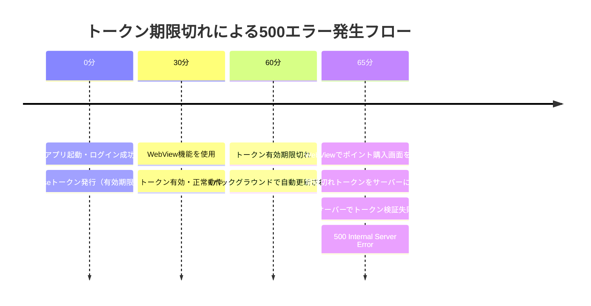
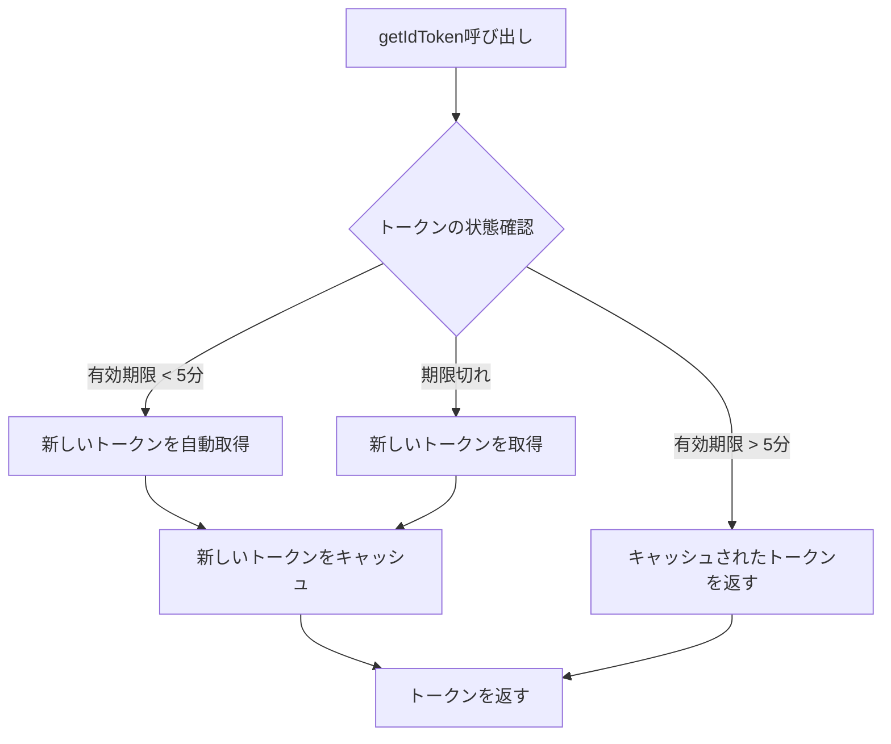

## はじめに

モバイルアプリ開発において、WebViewを使用した機能実装は一般的な手法です。しかし、WebViewの認証管理は思わぬ落とし穴があり、今回はその典型的な問題である「**トークン期限切れによる500エラー**」について、実際に遭遇した問題と解決方法を共有します。

この記事では、React NativeアプリとRailsバックエンドを例に、WebViewにおけるセッション管理の複雑さと、その解決アプローチについて解説します。

## 目次

1. [問題の概要](#問題の概要)
2. [WebViewのセッション独立性](#webviewのセッション独立性)
3. [二重認証システムの仕組み](#二重認証システムの仕組み)
4. [500エラーが発生するメカニズム](#500エラーが発生するメカニズム)
5. [問題の再現方法](#問題の再現方法)
6. [解決アプローチ](#解決アプローチ)
7. [実装例](#実装例)
8. [セキュリティ考慮事項](#セキュリティ考慮事項)
9. [まとめ](#まとめ)

## 問題の概要

あるECアプリで、以下のような問題が発生していました：

- **症状**: アプリ内のWebView（ポイント購入画面など）で突然500エラーが発生
- **頻度**: 約100件/日
- **タイミング**: アプリ起動から約1時間後
- **影響**: ユーザーが決済できない、高額取引が中断される

エラーログを確認すると、`TokenExpiredError`が原因でした。しかし、なぜトークンの期限切れが500エラーになるのでしょうか？

## WebViewのセッション独立性

### 知っておくべき重要な事実

**WebViewのセッションは、通常のブラウザ（Safari/Chrome）とは完全に独立しています。**

```javascript
// この認識は間違い！
// ❌ ブラウザでログイン → WebViewでも自動的にログイン状態

// 実際の動作
// ✅ ブラウザでログイン → WebViewは未ログイン状態のまま
```

### なぜ独立しているのか

| 理由 | 説明 |
|------|------|
| **セキュリティ** | アプリ間でCookieが共有されるとセキュリティリスクになる |
| **プライバシー** | ユーザーのブラウジング情報をアプリが取得できてしまう |
| **仕様** | iOS/AndroidのWebViewは意図的に独立設計 |

### プラットフォーム別の挙動

```javascript
// React Native WebViewの設定例
<WebView
  source={{ uri: 'https://example.com' }}
  // iOSでのみ有効（Safariとクッキー共有）
  sharedCookiesEnabled={true}  
  // Androidでは効果なし
/>
```

## 二重認証システムの仕組み

今回の問題の根本原因は、**セッションとトークンの二重管理**にありました。

### システム構成図

```
┌─────────────────────────────────────────────────┐
│                  モバイルアプリ                     │
│                                                   │
│  ┌─────────────┐        ┌─────────────────┐    │
│  │   Native    │        │     WebView      │    │
│  │   Screen    │        │                  │    │
│  └─────────────┘        └─────────────────┘    │
│         ↓                        ↓               │
│   Firebase Auth            Authorization        │
│   (ID Token)               Header + Token       │
└─────────────────────────────────────────────────┘
                        ↓
┌─────────────────────────────────────────────────┐
│                 Rails Backend                    │
│                                                  │
│   通常Web: Cookieセッション（1ヶ月有効）           │
│   WebView: Firebaseトークン（1時間有効）          │
└─────────────────────────────────────────────────┘
```

### 認証方式の比較

```ruby
# Rails側の認証処理（簡略化）
class ApplicationController < ActionController::Base
  def current_user
    if is_webview_request?
      # WebViewからのアクセス
      authenticate_with_firebase_token
    else
      # 通常のWebアクセス
      authenticate_with_session
    end
  end
  
  private
  
  def is_webview_request?
    request.user_agent&.include?('MY-APP-WEBVIEW')
  end
  
  def authenticate_with_session
    User.find_by(id: session[:user_id])
  end
  
  def authenticate_with_firebase_token
    token = extract_bearer_token
    payload = decode_firebase_token(token)  # ここで例外発生！
    User.find_by(firebase_uid: payload['user_id'])
  end
end
```

## 500エラーが発生するメカニズム

### エラー発生のタイムライン



### 実際のエラーコード

```ruby
# lib/firebase_token_decoder.rb
class FirebaseTokenDecoder
  class InvalidTokenError < StandardError; end
  
  def decode(token)
    # JWTライブラリでデコード
    payload = JWT.decode(token, public_key, true, options)
    payload
  rescue JWT::ExpiredSignature => e
    # ❌ 問題: 期限切れを500エラーとして扱っていた
    raise InvalidTokenError, e.message
  rescue JWT::DecodeError => e
    raise InvalidTokenError, e.message
  end
end
```

## 問題の再現方法

### 開発環境での再現手順

```bash
# 1. 期限切れトークンを模擬的に作成
expired_token="eyJhbGciOiJSUzI1NiIsImtpZCI6InRlc3QifQ.eyJleHAiOjE2MDk0NTkyMDAsInVpZCI6InRlc3QxMjMifQ.dummy"

# 2. WebViewのUser-Agentでリクエスト
curl -H "User-Agent: MY-APP-WEBVIEW" \
     -H "Authorization: Bearer $expired_token" \
     "http://localhost:3000/api/points"

# 結果: 500 Internal Server Error
```

### iOSシミュレータでの確認

```javascript
// React Native側のデバッグコード
const debugTokenExpiry = () => {
  // 強制的に古いトークンを使用
  const expiredToken = 'eyJhbGciOiJSUzI1Ni...'; // 1時間前のトークン
  
  return (
    <WebView
      source={{ uri: 'https://example.com/points' }}
      injectedJavaScriptBeforeContentLoaded={`
        window.FIREBASE_TOKEN = '${expiredToken}';
      `}
    />
  );
};
```

## Firebase SDKの隠れた仕様 - トークン自動更新の真実

### 重要な発見: 5分前の自動更新メカニズム

Firebase SDKには、開発者があまり意識していない重要な仕様があります。

```javascript
// getIdToken()の実際の動作
getIdToken(currentUser, false) // デフォルト
```

**実は以下の動作をします：**

1. **キャッシュされたトークンを確認**
2. **トークンの有効期限が5分以上残っている → キャッシュを返す**
3. **トークンの有効期限が5分未満 → 自動的に新しいトークンを取得**

つまり、完全に期限切れになる前に自動更新される仕組みがあります！

### 情報源による裏付け

#### 1. Firebase公式開発者の証言

**Peter Friese氏（Firebase Developer Advocate）によると：**
> "Firebase's client SDKs automatically handle refreshing the user's ID token. If the app is running, the SDK will retrieve a new ID token (using the refresh token) about 5 minutes before the ID token expires."

**Frank van Puffelen氏（Firebase公式）もStack Overflowで明確に述べています：**
> "The Firebase Authentication SDK automatically refreshes the ID token about 5 minutes before it expires, and getIdToken() always gives you the latest token."
> 
> 出典: [How to refresh firebase access token using next-auth credentials provider? - Stack Overflow](https://stackoverflow.com/questions/78127324/how-to-refresh-firebase-access-token-using-next-auth-credentials-provider)

#### 2. getIdToken()メソッドの動作詳細

| パラメータ | 動作 | 使用場面 |
|-----------|------|----------|
| `forceRefresh: false`（デフォルト） | - 有効期限が5分以上ある場合：キャッシュを返す<br>- 有効期限が5分未満：自動更新<br>- 期限切れ：新しいトークンを取得 | 通常の使用 |
| `forceRefresh: true` | 有効期限に関わらず新しいトークンを強制取得 | 特別な場合のみ |

### 自動更新が発生する条件

```javascript
// 自動更新のタイミングを可視化
class TokenRefreshMonitor {
  constructor() {
    this.checkInterval = 60000; // 1分ごとにチェック
  }
  
  async monitorTokenStatus() {
    const user = auth().currentUser;
    if (!user) return;
    
    const token = await user.getIdToken();
    const decoded = this.decodeJWT(token);
    const now = Date.now() / 1000;
    const timeToExpiry = decoded.exp - now;
    
    console.log({
      status: this.getTokenStatus(timeToExpiry),
      minutesRemaining: Math.floor(timeToExpiry / 60),
      willAutoRefresh: timeToExpiry < 300, // 5分未満で自動更新
      timestamp: new Date().toISOString()
    });
  }
  
  getTokenStatus(secondsRemaining) {
    if (secondsRemaining > 300) return '✅ 有効（キャッシュ使用）';
    if (secondsRemaining > 0) return '⚠️ 自動更新ゾーン';
    return '❌ 期限切れ';
  }
  
  decodeJWT(token) {
    const base64Url = token.split('.')[1];
    const base64 = base64Url.replace(/-/g, '+').replace(/_/g, '/');
    return JSON.parse(atob(base64));
  }
}
```

### 実際の動作フロー



### なぜこの仕様が重要なのか

1. **パフォーマンスの最適化**
   - 不要なネットワーク通信を削減
   - サーバー負荷の軽減

2. **シームレスな体験**
   - ユーザーが意識せずに継続利用可能
   - 期限切れによる中断を防ぐ

3. **開発者の負担軽減**
   - 手動でのトークン管理が不要
   - 複雑なリフレッシュロジックの実装が不要

### ベストプラクティス実装例

```javascript
// 推奨される実装パターン
class OptimizedTokenManager {
  constructor() {
    this.tokenCache = null;
    this.lastRefresh = null;
  }
  
  async getToken() {
    const user = auth().currentUser;
    if (!user) throw new Error('User not authenticated');
    
    // Firebase SDKの自動更新に任せる（forceRefresh: false）
    // 5分前になると自動的に新しいトークンを取得
    const token = await user.getIdToken(/* forceRefresh */ false);
    
    // デバッグ用：トークンの状態をログ出力
    if (__DEV__) {
      this.logTokenStatus(token);
    }
    
    return token;
  }
  
  // 強制更新が必要な特別なケースのみ
  async forceRefreshToken() {
    const user = auth().currentUser;
    if (!user) throw new Error('User not authenticated');
    
    console.log('⚠️ 強制的にトークンを更新します');
    return await user.getIdToken(/* forceRefresh */ true);
  }
  
  logTokenStatus(token) {
    const decoded = this.decodeJWT(token);
    const now = Date.now() / 1000;
    const remaining = decoded.exp - now;
    
    console.log('🔐 Token Status:', {
      expiresIn: `${Math.floor(remaining / 60)}分${Math.floor(remaining % 60)}秒`,
      autoRefreshActive: remaining < 300,
      tokenAge: this.lastRefresh ? 
        `${Math.floor((Date.now() - this.lastRefresh) / 1000)}秒` : '初回取得'
    });
    
    this.lastRefresh = Date.now();
  }
  
  decodeJWT(token) {
    const base64Url = token.split('.')[1];
    const base64 = base64Url.replace(/-/g, '+').replace(/_/g, '/');
    return JSON.parse(atob(base64));
  }
}

// 使用例
const tokenManager = new OptimizedTokenManager();

// 通常のAPI呼び出し時
async function callAPI(endpoint, data) {
  try {
    // Firebase SDKの自動更新メカニズムを活用
    const token = await tokenManager.getToken();
    
    const response = await fetch(endpoint, {
      method: 'POST',
      headers: {
        'Authorization': `Bearer ${token}`,
        'Content-Type': 'application/json'
      },
      body: JSON.stringify(data)
    });
    
    return await response.json();
  } catch (error) {
    console.error('API call failed:', error);
    throw error;
  }
}
```

### 注意点とトラブルシューティング

#### 自動更新が機能しないケース

1. **アプリがバックグラウンドにある場合**
   ```javascript
   // アプリがフォアグラウンドに戻った時の処理
   AppState.addEventListener('change', (nextAppState) => {
     if (nextAppState === 'active') {
       // トークンの状態を確認し、必要なら更新
       tokenManager.getToken();
     }
   });
   ```

2. **ネットワーク接続が不安定な場合**
   ```javascript
   // リトライロジックの実装
   async function getTokenWithRetry(maxRetries = 3) {
     for (let i = 0; i < maxRetries; i++) {
       try {
         return await auth().currentUser.getIdToken();
       } catch (error) {
         if (i === maxRetries - 1) throw error;
         await new Promise(resolve => setTimeout(resolve, 1000 * (i + 1)));
       }
     }
   }
   ```

3. **Firebase SDKのバージョンが古い場合**
   ```json
   // package.jsonで最新バージョンを使用
   {
     "dependencies": {
       "@react-native-firebase/auth": "^18.0.0"
     }
   }
   ```

## 解決アプローチ

### アプローチ1: エラーハンドリングの改善（短期対策）

```ruby
# 修正版: 期限切れと無効トークンを区別
class FirebaseTokenDecoder
  class InvalidTokenError < StandardError; end
  class ExpiredTokenError < StandardError; end  # 新規追加
  
  def decode(token)
    payload = JWT.decode(token, public_key, true, options)
    payload
  rescue JWT::ExpiredSignature => e
    # ✅ 期限切れは別の例外として扱う
    Rails.logger.info "Token expired: #{e.message}"
    raise ExpiredTokenError, e.message
  rescue JWT::DecodeError => e
    raise InvalidTokenError, e.message
  end
end

# コントローラー側の処理
def authenticate_with_firebase_token
  begin
    token = extract_bearer_token
    payload = decode_firebase_token(token)
    User.find_by(firebase_uid: payload['user_id'])
  rescue FirebaseTokenDecoder::ExpiredTokenError => e
    # ✅ 期限切れの場合は graceful に処理
    handle_expired_token
  rescue FirebaseTokenDecoder::InvalidTokenError => e
    # 本当に無効なトークンの場合のみエラー
    render_unauthorized
  end
end

def handle_expired_token
  # セッションベースの認証にフォールバック
  if current_session_user.present?
    # 既存セッションで継続
    response.headers['X-Token-Expired'] = 'true'
    return current_session_user
  else
    # セッションもない場合は401
    render json: { error: 'Token expired' }, status: :unauthorized
  end
end
```

### アプローチ2: トークン自動更新（中期対策）

```javascript
// React Native側: トークンの自動更新
import auth from '@react-native-firebase/auth';

class TokenManager {
  constructor() {
    this.token = null;
    this.tokenExpiry = null;
  }
  
  async getValidToken() {
    const now = Date.now();
    
    // トークンが存在し、期限まで5分以上ある場合はそのまま使用
    if (this.token && this.tokenExpiry && (this.tokenExpiry - now) > 5 * 60 * 1000) {
      return this.token;
    }
    
    // トークンを更新
    const user = auth().currentUser;
    if (user) {
      this.token = await user.getIdToken(true);
      // JWTをデコードして有効期限を取得
      const payload = this.decodeJWT(this.token);
      this.tokenExpiry = payload.exp * 1000;
      return this.token;
    }
    
    throw new Error('User not authenticated');
  }
  
  decodeJWT(token) {
    const base64Url = token.split('.')[1];
    const base64 = base64Url.replace(/-/g, '+').replace(/_/g, '/');
    return JSON.parse(atob(base64));
  }
}

// WebView使用時
const MyWebView = () => {
  const [token, setToken] = useState(null);
  const tokenManager = new TokenManager();
  
  useEffect(() => {
    // 初回トークン取得
    tokenManager.getValidToken().then(setToken);
    
    // 30分ごとにトークンを更新
    const interval = setInterval(() => {
      tokenManager.getValidToken().then(setToken);
    }, 30 * 60 * 1000);
    
    return () => clearInterval(interval);
  }, []);
  
  return (
    <WebView
      source={{ uri: 'https://example.com/points' }}
      injectedJavaScriptBeforeContentLoaded={`
        window.FIREBASE_TOKEN = '${token}';
        
        // Fetchをオーバーライドしてトークンを自動付与
        const originalFetch = window.fetch;
        window.fetch = function(...args) {
          const [url, options = {}] = args;
          options.headers = {
            ...options.headers,
            'Authorization': 'Bearer ' + window.FIREBASE_TOKEN
          };
          return originalFetch.call(this, url, options);
        };
      `}
    />
  );
};
```

### アプローチ3: WebViewとの通信強化（長期対策）

```javascript
// WebViewとネイティブ間でメッセージングを使用
const EnhancedWebView = () => {
  const webViewRef = useRef(null);
  
  const handleMessage = async (event) => {
    const { type, data } = JSON.parse(event.nativeEvent.data);
    
    switch (type) {
      case 'TOKEN_REFRESH_NEEDED':
        // トークンを更新してWebViewに送信
        const newToken = await auth().currentUser.getIdToken(true);
        webViewRef.current.postMessage(JSON.stringify({
          type: 'NEW_TOKEN',
          token: newToken
        }));
        break;
        
      case 'AUTH_ERROR':
        // 認証エラーの場合は再ログイン画面へ
        navigation.navigate('Login');
        break;
    }
  };
  
  return (
    <WebView
      ref={webViewRef}
      source={{ uri: 'https://example.com/points' }}
      onMessage={handleMessage}
      injectedJavaScript={`
        // WebView内でのトークン管理
        class TokenHandler {
          constructor() {
            this.token = window.INITIAL_TOKEN;
          }
          
          checkTokenExpiry() {
            try {
              const payload = JSON.parse(atob(this.token.split('.')[1]));
              const now = Date.now() / 1000;
              
              if (payload.exp - now < 300) { // 5分前
                // ネイティブ側にトークン更新を要求
                window.ReactNativeWebView.postMessage(JSON.stringify({
                  type: 'TOKEN_REFRESH_NEEDED'
                }));
              }
            } catch (e) {
              console.error('Token check failed:', e);
            }
          }
          
          updateToken(newToken) {
            this.token = newToken;
            // 既存のリクエストヘッダーを更新
            this.updateAuthHeaders();
          }
        }
        
        const tokenHandler = new TokenHandler();
        
        // 3分ごとにトークンをチェック
        setInterval(() => tokenHandler.checkTokenExpiry(), 3 * 60 * 1000);
        
        // ネイティブからのメッセージを受信
        window.addEventListener('message', (event) => {
          const data = JSON.parse(event.data);
          if (data.type === 'NEW_TOKEN') {
            tokenHandler.updateToken(data.token);
          }
        });
      `}
    />
  );
};
```

## セキュリティ考慮事項

### トークン期限切れ時の判断基準

```ruby
# セキュリティとUXのバランスを考慮した実装
class TokenExpiryHandler
  # 最後のアクティビティから30分以内なら継続を許可
  GRACE_PERIOD = 30.minutes
  
  def handle_expired_token(session, user)
    last_activity = session[:last_activity_at]
    
    if last_activity && Time.current - last_activity < GRACE_PERIOD
      # アクティブなユーザーは継続利用可能
      log_security_event(:token_expired_but_active, user)
      session[:last_activity_at] = Time.current
      return :continue_with_grace
    else
      # 非アクティブなユーザーは再認証
      log_security_event(:token_expired_and_inactive, user)
      return :require_reauth
    end
  end
  
  private
  
  def log_security_event(event_type, user)
    SecurityAuditLog.create!(
      event: event_type,
      user: user,
      ip_address: request.remote_ip,
      user_agent: request.user_agent,
      timestamp: Time.current
    )
  end
end
```

### セキュリティチェックリスト

✅ **実装時に確認すべき項目**

- [ ] トークンの有効期限は適切か（1時間は妥当）
- [ ] 期限切れトークンのログは適切に記録されているか
- [ ] 不正なトークンと期限切れトークンを区別しているか
- [ ] フォールバック時のセキュリティリスクを評価したか
- [ ] 監査ログを適切に出力しているか

## ハンズオン: 実際に試してみよう

### 環境構築

```bash
# 1. サンプルプロジェクトのクローン
git clone https://github.com/example/webview-auth-sample.git
cd webview-auth-sample

# 2. バックエンド（Rails）のセットアップ
cd backend
bundle install
rails db:create db:migrate
rails server

# 3. フロントエンド（React Native）のセットアップ
cd ../mobile
npm install
cd ios && pod install && cd ..
npm run ios
```

### デバッグ用のコード

```javascript
// デバッグ用: トークンの状態を可視化
const TokenDebugger = () => {
  const [tokenInfo, setTokenInfo] = useState(null);
  
  useEffect(() => {
    const checkToken = async () => {
      const user = auth().currentUser;
      if (user) {
        const token = await user.getIdToken();
        const decoded = JSON.parse(atob(token.split('.')[1]));
        
        setTokenInfo({
          uid: decoded.user_id,
          exp: new Date(decoded.exp * 1000).toLocaleString(),
          remaining: Math.floor((decoded.exp * 1000 - Date.now()) / 1000 / 60) + '分'
        });
      }
    };
    
    checkToken();
    const interval = setInterval(checkToken, 10000); // 10秒ごと
    
    return () => clearInterval(interval);
  }, []);
  
  return (
    <View style={styles.debugContainer}>
      <Text>UID: {tokenInfo?.uid}</Text>
      <Text>有効期限: {tokenInfo?.exp}</Text>
      <Text>残り時間: {tokenInfo?.remaining}</Text>
    </View>
  );
};
```

## よくある質問（FAQ）

### Q1: なぜWebViewでセッションを共有できないのか？

**A**: セキュリティとプライバシーの観点から、モバイルOSはWebViewとシステムブラウザのCookie/セッションを意図的に分離しています。これにより、悪意のあるアプリがユーザーのブラウジングデータにアクセスすることを防いでいます。

### Q2: トークンの有効期限を延ばせばいいのでは？

**A**: Firebase Authenticationのトークン有効期限は1時間で固定されており、変更できません。これはセキュリティベストプラクティスに基づく設計です。代わりに、リフレッシュトークンを使用した自動更新を実装すべきです。

### Q3: 401エラーではなく500エラーになるのはなぜ？

**A**: 実装の問題です。トークン検証の例外処理が適切でなく、すべての例外を内部エラーとして扱っていたためです。期限切れ（401）と内部エラー（500）を適切に区別する必要があります。

## パフォーマンスへの影響

### トークン更新のオーバーヘッド

```javascript
// パフォーマンス測定
const measureTokenRefresh = async () => {
  const iterations = 100;
  const times = [];
  
  for (let i = 0; i < iterations; i++) {
    const start = performance.now();
    await auth().currentUser.getIdToken(true);
    const end = performance.now();
    times.push(end - start);
  }
  
  console.log({
    average: times.reduce((a, b) => a + b) / times.length,
    min: Math.min(...times),
    max: Math.max(...times)
  });
};

// 実測値（例）
// {
//   average: 245.3,  // ミリ秒
//   min: 180.5,
//   max: 520.1
// }
```

### 推奨される更新戦略

| 戦略 | 更新タイミング | メリット | デメリット |
|------|--------------|---------|-----------|
| **Proactive** | 50分ごと | エラーが発生しない | 無駄な通信が発生 |
| **Reactive** | エラー時のみ | 通信量が最小 | 初回エラーは避けられない |
| **Hybrid** | 55分経過 or エラー時 | バランスが良い | 実装が複雑 |

## まとめ

### 学んだこと

1. **WebViewのセッションは独立している**
   - ブラウザのセッションを期待してはいけない
   - 独自の認証メカニズムが必要

2. **エラーハンドリングの重要性**
   - 期限切れと無効を区別する
   - 500エラーは避け、適切なステータスコードを返す

3. **UXとセキュリティのバランス**
   - 完全にブロックするとUXが悪化
   - 適切なフォールバックとグレースピリオドの設定

### ベストプラクティス

```javascript
// ✅ 推奨される実装パターン
const WebViewAuthPattern = {
  // 1. トークンの自動更新
  autoRefresh: true,
  refreshInterval: 30 * 60 * 1000, // 30分
  
  // 2. エラーハンドリング
  handleTokenExpiry: 'graceful', // 'strict' | 'graceful'
  
  // 3. フォールバック
  fallbackAuth: 'session', // 'session' | 'reauth' | 'none'
  
  // 4. 監査ログ
  auditLogging: true,
  
  // 5. ユーザー通知
  notifyUser: false // エラー時にユーザーに通知するか
};
```

### 今後の展望

1. **WebView依存の削減**
   - 可能な限りネイティブ実装に移行
   - WebViewは最小限の使用に留める

2. **統一認証基盤の構築**
   - セッションとトークンの一元管理
   - より柔軟な認証フロー

3. **エラー監視の強化**
   - リアルタイムでのエラー検知
   - 自動リカバリーメカニズム

## 参考資料

### Firebase認証とトークン管理
- [Firebase Authentication REST API Reference](https://firebase.google.com/docs/reference/rest/auth)
- [Manage User Sessions | Firebase Authentication](https://firebase.google.com/docs/auth/admin/manage-sessions)
- [Verify ID Tokens | Firebase Authentication](https://firebase.google.com/docs/auth/admin/verify-id-tokens)
- [Peter Friese (Firebase Developer) on Token Refresh](https://x.com/peterfriese/status/1509425270603792385)
- [Frank van Puffelen answer on Token Auto-refresh - Stack Overflow](https://stackoverflow.com/questions/78127324/how-to-refresh-firebase-access-token-using-next-auth-credentials-provider)
- [Firebase Token Auto-refresh Discussion - Stack Overflow](https://stackoverflow.com/questions/49656489/is-the-firebase-access-token-refreshed-automatically)
- [Firebase Auth - When are tokens refreshed? - Stack Overflow](https://stackoverflow.com/questions/76929017/firebase-auth-when-are-tokens-refreshed)
- [Best practice for getIdToken usage - Stack Overflow](https://stackoverflow.com/questions/74344333/best-practice-to-get-users-idtoken-from-firebase-using-getidtoken-forceref)

### WebView実装
- [React Native WebView Documentation](https://github.com/react-native-webview/react-native-webview/blob/master/docs/Guide.md)
- [iOS WKWebView Documentation](https://developer.apple.com/documentation/webkit/wkwebview)
- [Android WebView Documentation](https://developer.android.com/reference/android/webkit/WebView)

### バックエンド実装
- [Rails Action Controller Overview - Sessions](https://guides.rubyonrails.org/action_controller_overview.html#session)
- [JWT.io - JSON Web Tokens Introduction](https://jwt.io/introduction)

### セキュリティ
- [OWASP Mobile Security Testing Guide](https://owasp.org/www-project-mobile-security-testing-guide/)

## 著者について

Webアプリケーションとモバイルアプリのハイブリッド開発に従事しているエンジニアです。認証システムの複雑性と戦いながら、より良いユーザー体験を提供するための方法を日々模索しています。

---

この記事が、同じような問題に直面している方の助けになれば幸いです。質問やフィードバックがありましたら、お気軽にコメントください。