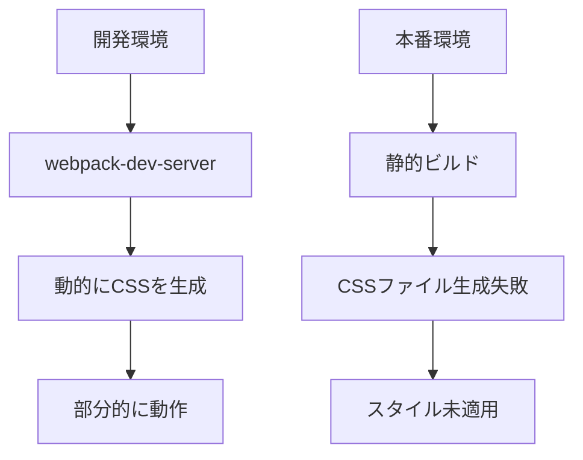
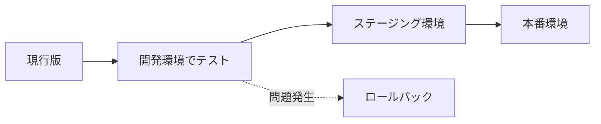

# Tailwind CSS v4からv3へのダウングレード完全ガイド

## はじめに：なぜこの記事を書いたのか

最新技術を使いたい気持ちは開発者なら誰でも持っています。しかし、「最新＝最良」とは限りません。今回、Tailwind CSS v4を導入したプロジェクトで発生した問題と、その解決過程を共有します。

この記事は、以下のような方に役立ちます：
- Tailwind CSSのバージョン問題に直面している方
- ライブラリのダウングレード方法を学びたい初心者エンジニア
- 本番環境と開発環境で異なる挙動に悩んでいる方

## 発生した問題：症状の詳細

### 環境による挙動の違い

私のNext.jsプロジェクトで、以下の症状が発生しました：

**ローカル環境（開発環境）**
- ✅ Tailwind CSSの基本スタイル（色、レイアウトなど）は適用される
- ❌ Markdownコンテンツの`prose`クラスが効かない
- ❌ ブログ記事のスタイルが崩れる

**GitHub Pages（本番環境）**
- ❌ Tailwind CSS自体が全く適用されない
- ❌ サイト全体のスタイルが崩れる

### なぜ環境によって違いが出たのか？



開発環境では動的にCSSが生成されるため部分的に動作していましたが、本番ビルドでは静的ファイル生成時に問題が発生していました。

## 問題の原因：Tailwind CSS v4の互換性

### 1. Tailwind CSS v4の変更点

Tailwind CSS v4は2024年にリリースされた大幅アップデートで、以下の変更がありました：

```css
/* v3の書き方 */
@tailwind base;
@tailwind components;
@tailwind utilities;

/* v4の新しい書き方 */
@import "tailwindcss";
```

### 2. プラグインの互換性問題

特に問題となったのは`@tailwindcss/typography`プラグインです：

```json
{
  "devDependencies": {
    "tailwindcss": "^4.0.0",           // 最新版
    "@tailwindcss/typography": "^0.5.16" // v4未対応
  }
}
```

このプラグインはMarkdownコンテンツに`prose`クラスでスタイルを適用しますが、v4との互換性がまだ完全ではありませんでした。

### 3. PostCSS設定の変更

v4では新しいPostCSS設定方法が導入されました：

```javascript
// v4の新しい設定（問題あり）
const config = {
  plugins: ["@tailwindcss/postcss"],
};

// v3の従来の設定（安定）
export default {
  plugins: {
    tailwindcss: {},
    autoprefixer: {},
  },
}
```

## 解決策の検討：3つの選択肢

### 選択肢1：Tailwind CSS v3へのダウングレード（採用）

**メリット**
- ✅ 安定性が高い
- ✅ プラグインの互換性が保証されている
- ✅ ドキュメントが充実
- ✅ コミュニティサポートが豊富

**デメリット**
- ❌ 最新機能が使えない
- ❌ 将来的に再度アップグレードが必要

### 選択肢2：v4を維持して手動でスタイル追加

**メリット**
- ✅ 最新版を使い続けられる
- ✅ 新機能を活用できる

**デメリット**
- ❌ 大量のカスタムCSSが必要
- ❌ メンテナンスコストが高い
- ❌ プラグインの恩恵を受けられない

### 選択肢3：v4対応を待つ

**メリット**
- ✅ 将来的に最良の解決策になる可能性

**デメリット**
- ❌ いつ対応されるか不明
- ❌ 現在の問題が解決しない
- ❌ プロジェクトの進行に影響

### なぜダウングレードを選んだか

プロジェクトの要件と状況を考慮した結果：
1. **安定性重視**：ブログサイトは安定稼働が最優先
2. **時間的制約**：すぐに問題を解決する必要があった
3. **リスク最小化**：v3は実績があり、問題が少ない

## 実装手順：ステップバイステップガイド

### Step 1：パッケージのアンインストール

```bash
# v4関連パッケージを削除
npm uninstall tailwindcss @tailwindcss/postcss
```

### Step 2：v3系パッケージのインストール

```bash
# v3系と必要な依存関係をインストール
npm install -D tailwindcss@^3.4.0 postcss autoprefixer
```

**ポイント**：`^3.4.0`のように範囲指定することで、v3系の最新パッチは受け取れます。

### Step 3：PostCSS設定の更新

```javascript
// postcss.config.mjs
export default {
  plugins: {
    tailwindcss: {},
    autoprefixer: {},
  },
}
```

### Step 4：Tailwind設定ファイルの確認

```typescript
// tailwind.config.ts
import { type Config } from 'tailwindcss'
import typography from '@tailwindcss/typography'

const config: Config = {
  content: ['./src/**/*.{js,ts,jsx,tsx,mdx}'],
  darkMode: 'class',
  theme: {
    extend: {
      // カスタマイズ設定
    },
  },
  plugins: [typography], // プラグインが正常に動作
}

export default config
```

### Step 5：CSSファイルの修正

```css
/* src/app/globals.css */
@tailwind base;
@tailwind components;
@tailwind utilities;

/* カスタムスタイル */
body {
  @apply bg-black text-white;
}
```

### Step 6：ビルドとテスト

```bash
# ビルドを実行
npm run build

# 開発サーバーで確認
npm run dev

# 本番ビルドのプレビュー
npm run start
```

## 実務で役立つTips：ダウングレード時の注意点

### 1. バージョン管理の重要性

```json
// package.json
{
  "devDependencies": {
    // NG: 最新版を自動的に取得
    "tailwindcss": "latest",
    
    // OK: メジャーバージョンを固定
    "tailwindcss": "^3.4.0",
    
    // BEST: 完全にバージョンを固定（重要なプロジェクト）
    "tailwindcss": "3.4.17"
  }
}
```

### 2. 変更前のバックアップ

```bash
# ブランチを作成して作業
git checkout -b fix/downgrade-tailwind

# 重要ファイルのバックアップ
cp package.json package.json.backup
cp package-lock.json package-lock.json.backup
```

### 3. 段階的な確認

```bash
# 1. 依存関係の確認
npm list tailwindcss

# 2. ビルドエラーの確認
npm run build 2>&1 | tee build.log

# 3. 実際の表示確認
# - 開発環境
# - ステージング環境
# - 本番環境
```

### 4. チーム内での情報共有

```markdown
## 変更内容
- Tailwind CSS: v4.0.0 → v3.4.17
- 理由：v4とtypographyプラグインの互換性問題
- 影響：なし（v3で全機能カバー）
- TODO：v4対応完了後に再アップグレード検討
```

## よくあるトラブルと解決方法

### Q1：ダウングレード後もスタイルが適用されない

**確認ポイント**
1. `node_modules`を削除して再インストール
```bash
rm -rf node_modules package-lock.json
npm install
```

2. キャッシュのクリア
```bash
npm cache clean --force
```

### Q2：ビルド時に警告が出る

**対処法**
```bash
# PostCSSの設定ファイル名を確認
# .mjs, .js, .cjs のいずれかに統一
mv postcss.config.js postcss.config.mjs
```

### Q3：特定の機能が使えなくなった

**解決策**
```javascript
// v4の新機能を使っていた場合
// 代替手段を検討

// 例：v4の新しいユーティリティ
// → カスタムCSSクラスで対応
.custom-class {
  /* v3でサポートされていないスタイル */
}
```

## ダウングレードの判断基準

### ダウングレードすべき時

- ✅ プラグインの互換性問題がある
- ✅ 本番環境で重大な問題が発生
- ✅ 早急な対応が必要
- ✅ 安定性が最優先

### アップグレードを待つべき時

- ⏸ 新機能が必須要件
- ⏸ 開発環境のみの使用
- ⏸ 時間的余裕がある
- ⏸ カスタム実装で対応可能

## まとめ：学んだこと

### 1. 最新版＝最良ではない

新しいバージョンには以下のリスクがあります：
- プラグインの未対応
- ドキュメントの不足
- バグの存在
- コミュニティサポートの不足

### 2. 段階的なアップグレードの重要性



### 3. バージョン管理の重要性

- `package-lock.json`を必ずコミット
- バージョン範囲を適切に設定
- 変更履歴を記録

## 実務での応用：今後のために

### プロジェクト開始時のチェックリスト

```markdown
- [ ] 使用するライブラリのバージョン確認
- [ ] 依存関係の互換性チェック
- [ ] LTS（長期サポート）版の検討
- [ ] アップグレードパスの確認
```

### CI/CDパイプラインでの対策

```yaml
# GitHub Actionsの例
- name: Version Check
  run: |
    npm list tailwindcss
    npm audit
    npm run build
```

### ドキュメント化

```markdown
# 技術スタック
| ライブラリ | バージョン | 理由 | 更新予定 |
|----------|----------|------|---------|
| Tailwind CSS | 3.4.17 | 安定性重視 | v4対応待ち |
| Next.js | 15.3.3 | 最新安定版 | 継続更新 |
```

## さいごに

バージョン管理は開発者にとって避けて通れない課題です。今回の経験から学んだのは：

1. **問題を正確に把握する**：環境による違いを理解
2. **選択肢を比較検討する**：メリット・デメリットを整理
3. **適切な判断をする**：プロジェクトの要件に合わせて選択
4. **知見を共有する**：チームや コミュニティに還元

この記事が、同じような問題に直面した方の助けになれば幸いです。

## 参考リンク

- [Tailwind CSS v3 Documentation](https://v3.tailwindcss.com/)
- [Tailwind CSS v4 Breaking Changes](https://tailwindcss.com/docs/v4)
- [npm Semantic Versioning](https://docs.npmjs.com/about-semantic-versioning)
- [Git Branching Strategies](https://www.atlassian.com/git/tutorials/comparing-workflows)